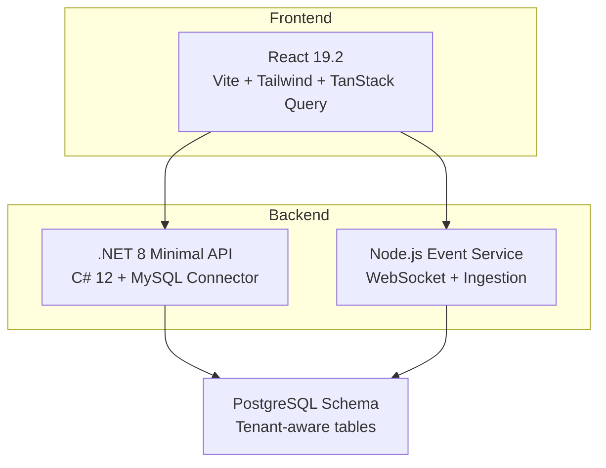
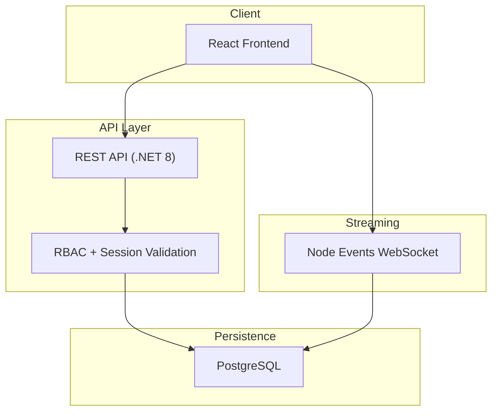
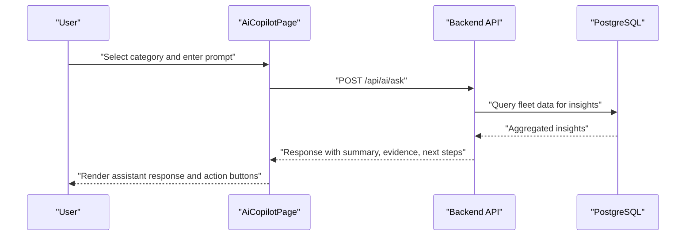
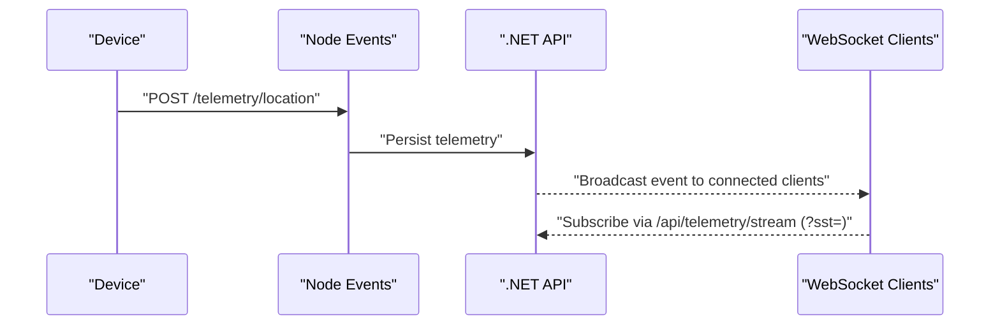
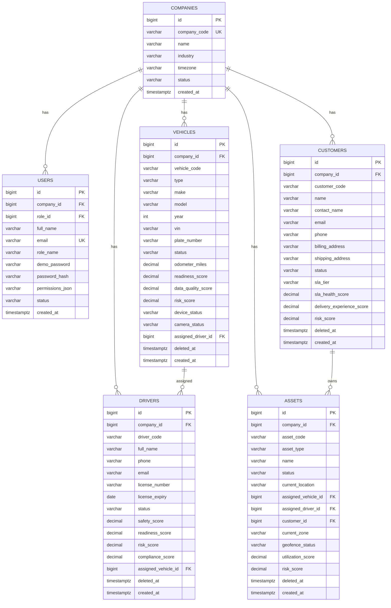
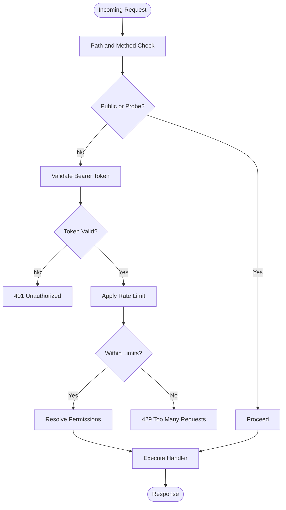
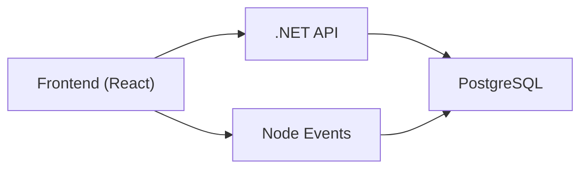

# Project Overview

<cite>
**Referenced Files in This Document**
- [README.md](file://README.md)
- [ARCHITECTURE.md](file://docs/ARCHITECTURE.md)
- [PRODUCT_MODULES.md](file://docs/PRODUCT_MODULES.md)
- [API_ENDPOINTS.md](file://docs/API_ENDPOINTS.md)
- [docker-compose.yml](file://docker-compose.yml)
- [Program.cs](file://backend-dotnet/Program.cs)
- [app.ts](file://backend/src/app.ts)
- [compliance.registry.ts](file://backend/src/modules/compliance/compliance.registry.ts)
- [device.registry.ts](file://backend/src/modules/devices/device.registry.ts)
- [moduleConfig.ts](file://frontend/src/modules/moduleConfig.ts)
- [I18nProvider.tsx](file://frontend/src/i18n/I18nProvider.tsx)
- [AiCopilotPage.tsx](file://frontend/src/pages/AiCopilotPage.tsx)
- [rbacConfig.ts](file://frontend/src/auth/rbacConfig.ts)
- [001_schema.sql](file://database/init/001_schema.sql)
</cite>

## Table of Contents
1. [Introduction](#introduction)
2. [Project Structure](#project-structure)
3. [Core Components](#core-components)
4. [Architecture Overview](#architecture-overview)
5. [Detailed Component Analysis](#detailed-component-analysis)
6. [Dependency Analysis](#dependency-analysis)
7. [Performance Considerations](#performance-considerations)
8. [Troubleshooting Guide](#troubleshooting-guide)
9. [Conclusion](#conclusion)
10. [Appendices](#appendices)

## Introduction
OpsTrax is an enterprise-grade, connected operations platform designed to unify fleet, dispatch, driver, asset, maintenance, safety, compliance, cost intelligence, and AI-powered decision support. It provides a comprehensive command center for modern transport organizations, enabling real-time visibility, intelligent insights, and auditable workflows across borders and languages.

Key platform goals:
- Connected operations: centralized control and live telemetry
- Regulatory readiness: modular compliance packs for multiple jurisdictions
- Multilingual and localized experiences: regional languages and formats
- AI copilot: natural language query interface for operations
- Enterprise-grade security and scalability: containerized microservices architecture

**Section sources**
- [README.md:1-166](file://README.md#L1-L166)

## Project Structure
The repository is organized into layered services:
- Frontend (React 19.2 + TypeScript + Vite + Tailwind)
- Backend (.NET 8 minimal API in C#)
- Node.js event service (WebSocket streaming and telemetry ingestion)
- Database (PostgreSQL schema with tenant-aware tables)
- Docker orchestration (compose for local dev/demo)

**Diagram sources**
- [docker-compose.yml:1-45](file://docker-compose.yml#L1-L45)
- [README.md:24-34](file://README.md#L24-L34)

**Section sources**
- [README.md:24-34](file://README.md#L24-L34)
- [docker-compose.yml:1-45](file://docker-compose.yml#L1-L45)

## Core Components
- Command Center and Control Tower: consolidated dashboards for live operations
- Dispatch and Routing: jobs, orders, route plans, and dispatch boards
- Fleet Management: vehicles, drivers, assets, and assignments
- Telematics & IoT: GPS, OBD/J1939, sensors, dashcams, and device health
- Safety & Compliance: incidents, DVIR, HOS/ELD, driver coaching, and evidence packages
- Maintenance: work orders, preventive schedules, and downtime tracking
- Finance: fuel/idling, expenses, invoices, payments, and profitability
- Intelligence: reports/analytics, predictive insights, carbon tracking, and AI Copilot
- Platform: integrations, user/role management, audit logs, settings, and governance

**Section sources**
- [README.md:37-49](file://README.md#L37-L49)
- [PRODUCT_MODULES.md:1-66](file://docs/PRODUCT_MODULES.md#L1-L66)

## Architecture Overview
OpsTrax employs a layered, tenant-aware architecture with clear separation of concerns:
- Frontend: enterprise command center UI with module navigation, dashboards, and AI insights
- Backend API: REST endpoints for core business domains, tenant-aware data access, and RBAC
- Node Events: real-time telemetry and event broadcasting via WebSocket
- Database: multi-tenant schema supporting fleet, safety, compliance, and AI insights

**Diagram sources**
- [ARCHITECTURE.md:1-69](file://docs/ARCHITECTURE.md#L1-L69)
- [README.md:117-142](file://README.md#L117-L142)

**Section sources**
- [ARCHITECTURE.md:1-69](file://docs/ARCHITECTURE.md#L1-L69)
- [README.md:117-142](file://README.md#L117-L142)

## Detailed Component Analysis

### Enterprise Modules and Capabilities
The platform organizes functionality into 37+ modules grouped by domain:
- Command and Control: Command Center, Live Control Tower
- Dispatch: Dispatch Board, Jobs & Orders, Route Planning, Customer ETA Portal, Carrier Management
- Fleet: Vehicles, Drivers, Assets, Maintenance, Work Orders, Inspections
- Safety and Compliance: Safety, AI Dashcam, Driver Coaching, Incidents, Evidence, DVIR-ready, HOS/ELD
- Finance: Fuel & Idling, Expenses, Contracts/Rates
- Intelligence: Reports & Analytics, SLA/KPI Center, Predictive Cost/Margin, ROI/Cost Leakage, Audit Logs, AI Copilot
- Platform: Integrations, User Management, Settings, Billing, Companies/Tenants, White Label/Reseller, About

Practical examples:
- Dispatch operators use the Dispatch Board to match jobs to drivers and vehicles, monitor exceptions, and adjust route plans.
- Safety managers review dashcam events, manage incidents, and track driver coaching outcomes.
- Finance teams analyze fuel transactions, idling costs, and profitability while generating SLA/KPI reports.
- Fleet managers monitor vehicle readiness, driver HOS posture, and maintenance schedules.

**Section sources**
- [README.md:37-49](file://README.md#L37-L49)
- [PRODUCT_MODULES.md:1-66](file://docs/PRODUCT_MODULES.md#L1-L66)

### Compliance Frameworks and Localization
OpsTrax includes jurisdiction-aware compliance packs and localization:
- USA: FMCSA ELD/HOS rules, DVIR, driver logs, DOT-ready reporting
- Canada: Transport Canada HOS, bilingual configuration, inspection exports
- Saudi Arabia: TGA/WASL-ready, CST device approval tracking, PDPL privacy controls
- UAE: Transport-Ready, Arabic/English configuration, authority-specific customization
- Pakistan: NTRC transport rules, Urdu language support

Device capability registry defines telemetry and identity capabilities for integrations:
- OBD-II, J1939/CAN, GPS tracker, AI dashcam, temperature sensor, fuel sensor, BLE/RFID driver ID, tire pressure sensor

**Section sources**
- [compliance.registry.ts:1-142](file://backend/src/modules/compliance/compliance.registry.ts#L1-L142)
- [device.registry.ts:1-61](file://backend/src/modules/devices/device.registry.ts#L1-L61)
- [README.md:85-108](file://README.md#L85-L108)

### Multi-Language and Internationalization
The frontend supports five locales with direction-aware rendering:
- English (US), French (Canada), Arabic (Saudi Arabia), Arabic (UAE), Urdu (Pakistan)

The i18n provider synchronizes user preferences with the backend, persists locale in local storage, and sets HTML attributes for accessibility.

**Section sources**
- [README.md:99-108](file://README.md#L99-L108)
- [I18nProvider.tsx:1-66](file://frontend/src/i18n/I18nProvider.tsx#L1-L66)

### Role-Based Access Control (RBAC)
The frontend defines granular permissions and role matrices:
- Permissions include fleet, dispatch, safety, maintenance, compliance, reports, users, settings, and telematics scopes
- Roles include tenant admin, fleet manager, dispatcher, safety manager, maintenance manager, driver, customer, and read-only auditor
- Permission variants normalize punctuation differences to support flexible matching

**Section sources**
- [rbacConfig.ts:1-404](file://frontend/src/auth/rbacConfig.ts#L1-L404)

### AI Copilot and Decision Support
The AI Copilot enables natural language queries across operations:
- Quick starters for dispatch risk, cost leakage, driver coaching, maintenance planning, safety review, customer SLA, executive brief, and compliance audit
- Live evidence feed pulls insights from fleet data
- Action buttons integrate with platform workflows (e.g., dispatch review, ETA updates, maintenance scheduling)

**Diagram sources**
- [AiCopilotPage.tsx:134-358](file://frontend/src/pages/AiCopilotPage.tsx#L134-L358)
- [API_ENDPOINTS.md:15-16](file://docs/API_ENDPOINTS.md#L15-L16)
- [Program.cs:379-381](file://backend-dotnet/Program.cs#L379-L381)

**Section sources**
- [AiCopilotPage.tsx:1-358](file://frontend/src/pages/AiCopilotPage.tsx#L1-L358)
- [API_ENDPOINTS.md:15-16](file://docs/API_ENDPOINTS.md#L15-L16)

### Telemetry and Real-Time Streaming
The Node event service ingests telemetry and safety events and broadcasts them via WebSocket. The .NET API enforces authentication for streaming endpoints using short-lived stream tickets (SST) and validates bearer tokens for protected routes.

**Diagram sources**
- [API_ENDPOINTS.md:23-26](file://docs/API_ENDPOINTS.md#L23-L26)
- [Program.cs:149-172](file://backend-dotnet/Program.cs#L149-L172)

**Section sources**
- [API_ENDPOINTS.md:18-27](file://docs/API_ENDPOINTS.md#L18-L27)
- [Program.cs:149-172](file://backend-dotnet/Program.cs#L149-L172)

### Tenant-Aware Data Model
The database schema supports multi-tenant isolation with tables for companies, users, roles, drivers, vehicles, customers, contracts, assets, and documents. Tenant context is enforced in the backend to ensure data segregation.

**Diagram sources**
- [001_schema.sql:1-200](file://database/init/001_schema.sql#L1-L200)

**Section sources**
- [001_schema.sql:1-200](file://database/init/001_schema.sql#L1-L200)

### API Surface and Authentication
- Health and readiness endpoints for Kubernetes and load balancers
- Tenant-aware RBAC enforcement with bearer token validation
- Rate limiting and security headers applied across endpoints
- Swagger UI available for endpoint discovery

**Diagram sources**
- [Program.cs:92-245](file://backend-dotnet/Program.cs#L92-L245)
- [app.ts:42-72](file://backend/src/app.ts#L42-L72)

**Section sources**
- [Program.cs:257-378](file://backend-dotnet/Program.cs#L257-L378)
- [app.ts:16-97](file://backend/src/app.ts#L16-L97)

## Dependency Analysis
The platform’s runtime dependencies emphasize modern web and cloud-native stacks:
- Frontend: React 19.2, Vite, TanStack Query, React Router, Tailwind CSS, Recharts, Axios
- Backend: ASP.NET Core 8, C# 12, MySQL connector, Swagger/OpenAPI
- Node Events: Node.js 20, Express, ws (WebSocket)
- Database: PostgreSQL schema with JSONB and timestamptz
- Containerization: Docker Compose for local development

**Diagram sources**
- [README.md:24-34](file://README.md#L24-L34)
- [docker-compose.yml:1-45](file://docker-compose.yml#L1-L45)

**Section sources**
- [README.md:24-34](file://README.md#L24-L34)
- [docker-compose.yml:1-45](file://docker-compose.yml#L1-L45)

## Performance Considerations
- Real-time streaming: WebSocket connections reduce polling overhead; short-lived stream tickets mitigate long-lived session exposure.
- Rate limiting: Per-IP windows prevent abuse and protect downstream services.
- Caching: Redis caching for live vehicle state is planned for production enhancements.
- Scalability: Queue/event bus (e.g., RabbitMQ/Kafka) and object storage are future enhancements.

[No sources needed since this section provides general guidance]

## Troubleshooting Guide
Common operational checks:
- Health probes: /health, /health/live, /health/ready, /health/deep
- Readiness: /ready verifies database connectivity
- Swagger: /swagger for endpoint discovery
- Rate limiting: 429 responses indicate window-based throttling
- Authentication: 401 responses for missing or invalid bearer tokens; ensure token validity and user status

**Section sources**
- [Program.cs:257-378](file://backend-dotnet/Program.cs#L257-L378)
- [app.ts:74-89](file://backend/src/app.ts#L74-L89)

## Conclusion
OpsTrax delivers a comprehensive, enterprise-grade platform for connected transport operations. Its modular architecture, robust compliance frameworks, multilingual support, and AI-driven insights enable organizations to optimize dispatch, safety, maintenance, and financial performance while meeting regional regulations and scalability needs.

[No sources needed since this section summarizes without analyzing specific files]

## Appendices

### Target Users and Use Cases
- Fleet operators: real-time visibility, maintenance planning, and cost control
- Dispatchers: dynamic dispatch boards, route optimization, and exception handling
- Safety and compliance managers: incident tracking, DVIR workflows, and regulatory audits
- Finance teams: fuel/idling analytics, profitability, and SLA/KPI reporting
- Drivers: personal HOS tracking, coaching, and POD workflows
- Customers: self-service portals for ETA and shipment tracking

Deployment Scenarios:
- Local development: Docker Compose with ports for frontend, API, and Node events
- Demo environments: pre-seeded data and standardized credentials
- Production: containerized deployments with ingress, SSL termination, and persistent storage

**Section sources**
- [README.md:53-81](file://README.md#L53-L81)
- [README.md:117-142](file://README.md#L117-L142)