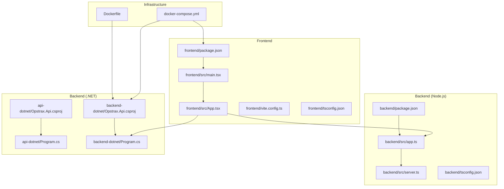
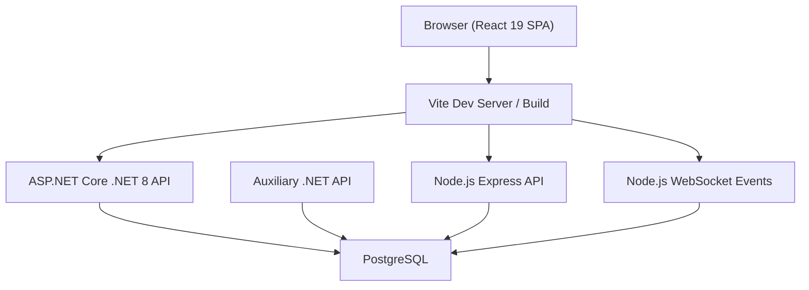
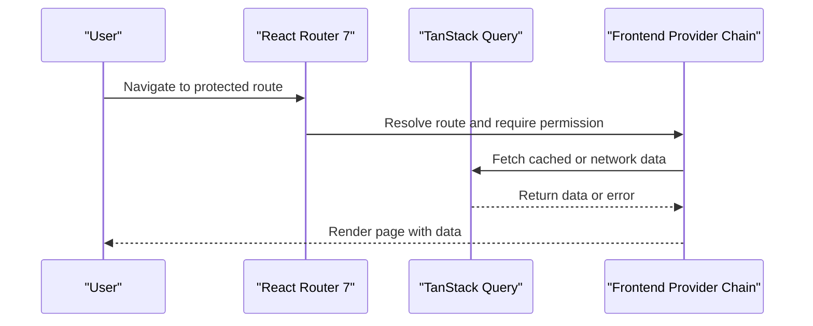
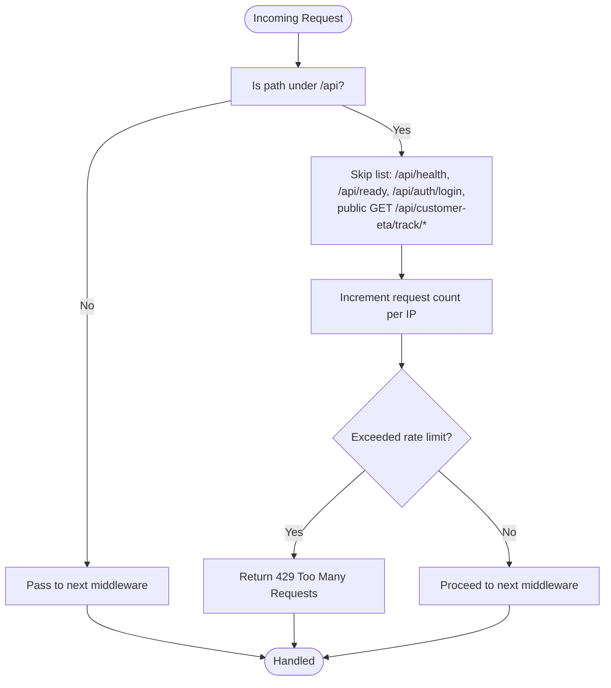
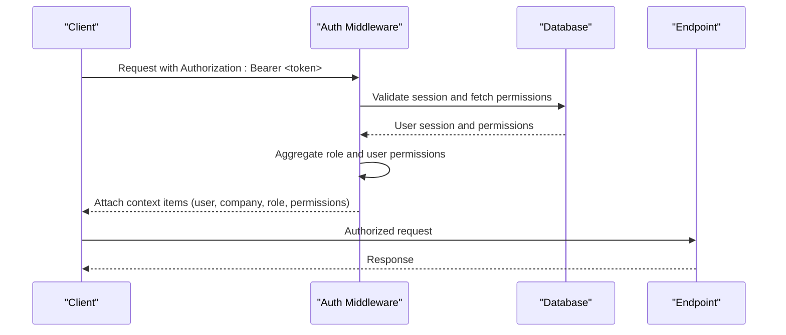
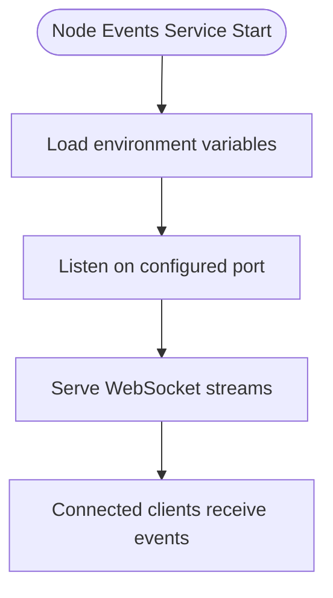
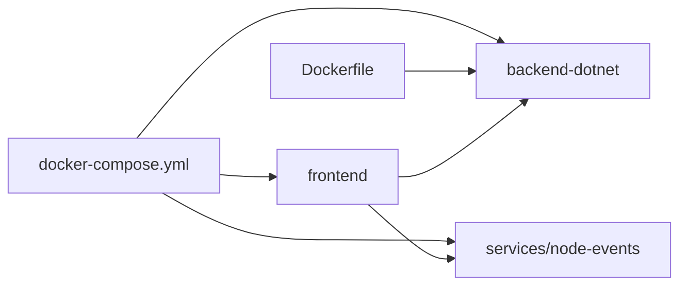
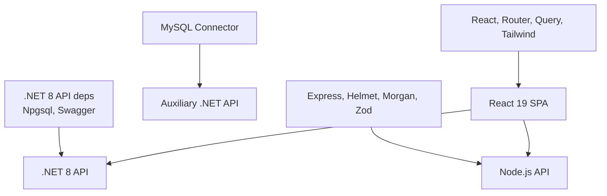

# Technology Stack

<cite>
**Referenced Files in This Document**
- [package.json](file://package.json)
- [frontend/package.json](file://frontend/package.json)
- [backend/package.json](file://backend/package.json)
- [api-dotnet/Opstrax.Api.csproj](file://api-dotnet/Opstrax.Api.csproj)
- [backend-dotnet/Opstrax.Api.csproj](file://backend-dotnet/Opstrax.Api.csproj)
- [docker-compose.yml](file://docker-compose.yml)
- [Dockerfile](file://Dockerfile)
- [frontend/vite.config.ts](file://frontend/vite.config.ts)
- [frontend/src/main.tsx](file://frontend/src/main.tsx)
- [frontend/src/App.tsx](file://frontend/src/App.tsx)
- [frontend/tsconfig.json](file://frontend/tsconfig.json)
- [backend/src/app.ts](file://backend/src/app.ts)
- [backend/src/server.ts](file://backend/src/server.ts)
- [backend/tsconfig.json](file://backend/tsconfig.json)
- [api-dotnet/Program.cs](file://api-dotnet/Program.cs)
- [backend-dotnet/Program.cs](file://backend-dotnet/Program.cs)
</cite>

## Table of Contents
1. [Introduction](#introduction)
2. [Project Structure](#project-structure)
3. [Core Components](#core-components)
4. [Architecture Overview](#architecture-overview)
5. [Detailed Component Analysis](#detailed-component-analysis)
6. [Dependency Analysis](#dependency-analysis)
7. [Performance Considerations](#performance-considerations)
8. [Troubleshooting Guide](#troubleshooting-guide)
9. [Conclusion](#conclusion)
10. [Appendices](#appendices)

## Introduction
This document provides a comprehensive technology stack overview for OpsTrax, a modern full-stack enterprise transport management solution. It covers the frontend built with React 19 and Vite, dual backend implementations (Node.js Express with TypeScript and .NET 8), PostgreSQL-backed persistence, WebSocket event streaming, and Docker containerization. It also explains the rationale behind technology choices, version requirements, compatibility matrices, and development versus production configurations.

## Project Structure
The repository is organized into modular directories representing distinct layers and services:
- Frontend: React 19 with Vite, TypeScript, TanStack Query, React Router 7, TailwindCSS
- Backend (Node.js): Express.js with TypeScript, Helmet, Morgan, Zod
- Backend (.NET): .NET 8 APIs with Npgsql, Swagger, CORS, CSRF, and rate limiting
- Supporting services: WebSocket event server (Node.js)
- Infrastructure: Docker Compose for local orchestration, PostgreSQL init scripts

**Diagram sources**
- [frontend/package.json:1-42](file://frontend/package.json#L1-L42)
- [frontend/src/main.tsx:1-35](file://frontend/src/main.tsx#L1-L35)
- [frontend/src/App.tsx:1-322](file://frontend/src/App.tsx#L1-L322)
- [frontend/vite.config.ts:1-13](file://frontend/vite.config.ts#L1-L13)
- [frontend/tsconfig.json:1-26](file://frontend/tsconfig.json#L1-L26)
- [backend/package.json:1-39](file://backend/package.json#L1-L39)
- [backend/src/app.ts:1-97](file://backend/src/app.ts#L1-L97)
- [backend/src/server.ts:1-11](file://backend/src/server.ts#L1-L11)
- [backend/tsconfig.json:1-16](file://backend/tsconfig.json#L1-L16)
- [api-dotnet/Opstrax.Api.csproj:1-12](file://api-dotnet/Opstrax.Api.csproj#L1-L12)
- [backend-dotnet/Opstrax.Api.csproj:1-17](file://backend-dotnet/Opstrax.Api.csproj#L1-L17)
- [api-dotnet/Program.cs:1-38](file://api-dotnet/Program.cs#L1-L38)
- [backend-dotnet/Program.cs:1-452](file://backend-dotnet/Program.cs#L1-L452)
- [docker-compose.yml:1-45](file://docker-compose.yml#L1-L45)
- [Dockerfile:1-14](file://Dockerfile#L1-L14)

**Section sources**
- [docker-compose.yml:1-45](file://docker-compose.yml#L1-L45)
- [frontend/package.json:1-42](file://frontend/package.json#L1-L42)
- [backend/package.json:1-39](file://backend/package.json#L1-L39)
- [backend-dotnet/Opstrax.Api.csproj:1-17](file://backend-dotnet/Opstrax.Api.csproj#L1-L17)
- [api-dotnet/Opstrax.Api.csproj:1-12](file://api-dotnet/Opstrax.Api.csproj#L1-L12)

## Core Components
- Frontend (React 19 + Vite)
  - React 19.2.0, React Router 7.11.0, TanStack Query 5.x, TailwindCSS 4.x
  - Vite 7.x with React plugin and TailwindCSS Vite plugin
  - TypeScript strict mode, ES2022 target, ESNext module resolution
- Backend (Node.js Express + TypeScript)
  - Express 4.x, Helmet 7.x, Morgan 1.x, Zod 3.x
  - TypeScript with CommonJS output, strict mode
- Backend (.NET 8)
  - ASP.NET Core web API, Npgsql 8.0.5, Swashbuckle 6.6.2
  - CORS policies, CSRF protection middleware, rate limiting
- WebSocket Events (Node.js)
  - Dedicated service for real-time telemetry/event streaming
- Containerization
  - Docker Compose orchestrates frontend, .NET API, Node.js events service
  - Multi-stage Dockerfile for .NET backend publishing

**Section sources**
- [frontend/package.json:15-28](file://frontend/package.json#L15-L28)
- [frontend/package.json:29-40](file://frontend/package.json#L29-L40)
- [frontend/vite.config.ts:1-13](file://frontend/vite.config.ts#L1-L13)
- [frontend/tsconfig.json:2-22](file://frontend/tsconfig.json#L2-L22)
- [backend/package.json:22-29](file://backend/package.json#L22-L29)
- [backend/package.json:30-37](file://backend/package.json#L30-L37)
- [backend/tsconfig.json:2-12](file://backend/tsconfig.json#L2-L12)
- [backend-dotnet/Opstrax.Api.csproj:8-10](file://backend-dotnet/Opstrax.Api.csproj#L8-L10)
- [api-dotnet/Opstrax.Api.csproj:9-9](file://api-dotnet/Opstrax.Api.csproj#L9-L9)
- [docker-compose.yml:1-45](file://docker-compose.yml#L1-L45)
- [Dockerfile:1-14](file://Dockerfile#L1-L14)

## Architecture Overview
OpsTrax employs a polyglot backend architecture with two complementary backend implementations:
- .NET 8 API (backend-dotnet): primary business logic, schema bootstrapping, health probes, Swagger, and comprehensive endpoint coverage
- .NET API (api-dotnet): auxiliary API focused on schema and seed initialization
- Node.js Express backend (backend): lightweight tenant and compliance endpoints
- Frontend (React 19/Vite): SPA with route-based lazy loading, RBAC-driven navigation, TanStack Query caching, and TailwindCSS styling
- WebSocket events (Node.js): real-time telemetry streaming with stream tickets (SST) authentication

**Diagram sources**
- [frontend/src/main.tsx:1-35](file://frontend/src/main.tsx#L1-L35)
- [frontend/src/App.tsx:1-322](file://frontend/src/App.tsx#L1-L322)
- [backend-dotnet/Program.cs:1-452](file://backend-dotnet/Program.cs#L1-L452)
- [api-dotnet/Program.cs:1-38](file://api-dotnet/Program.cs#L1-L38)
- [backend/src/app.ts:1-97](file://backend/src/app.ts#L1-L97)
- [docker-compose.yml:1-45](file://docker-compose.yml#L1-L45)

## Detailed Component Analysis

### Frontend (React 19 + Vite + TanStack Query + React Router 7 + TailwindCSS)
- Bootstrapping and providers
  - Root renders QueryClientProvider, I18nProvider, BrowserRouter, ErrorBoundary, AuthProvider
  - Global TanStack Query defaults configured with retry and window focus behavior
- Routing and permissions
  - Route definitions per product module with permission guards
  - Dynamic module routing from moduleConfig
  - Mobile-first driver portal under /driver/*
- Styling and tooling
  - TailwindCSS v4 with Vite plugin
  - Vite aliases (@/*) and React Fast Refresh
  - TypeScript strictness and ES2022 target

**Diagram sources**
- [frontend/src/App.tsx:119-321](file://frontend/src/App.tsx#L119-L321)
- [frontend/src/main.tsx:11-18](file://frontend/src/main.tsx#L11-L18)

**Section sources**
- [frontend/src/main.tsx:1-35](file://frontend/src/main.tsx#L1-L35)
- [frontend/src/App.tsx:1-322](file://frontend/src/App.tsx#L1-L322)
- [frontend/vite.config.ts:1-13](file://frontend/vite.config.ts#L1-L13)
- [frontend/tsconfig.json:1-26](file://frontend/tsconfig.json#L1-L26)

### Backend (Node.js Express + TypeScript)
- Application setup
  - Helmet, CORS with configurable origins, Morgan logging, JSON body parsing
  - Centralized rate limiter per IP with configurable window and max requests
- Routing
  - Health, tenant-config, compliance, devices, industry-modules, telemetry
  - Ready endpoint returns service readiness status
- Error handling
  - Central error handler middleware

**Diagram sources**
- [backend/src/app.ts:42-72](file://backend/src/app.ts#L42-L72)

**Section sources**
- [backend/src/app.ts:1-97](file://backend/src/app.ts#L1-L97)
- [backend/src/server.ts:1-11](file://backend/src/server.ts#L1-L11)
- [backend/package.json:1-39](file://backend/package.json#L1-L39)
- [backend/tsconfig.json:1-16](file://backend/tsconfig.json#L1-L16)

### Backend (.NET 8)
- Initialization and schema bootstrapping
  - Schema services for batches 1–7, telemetry, safety, trips, maintenance, dispatch, customer visibility, driver, notification, reporting, observability, and security
  - Runtime-safe schema initialization during app startup
- Security and middleware
  - CORS policy with configurable allowed origins
  - CSRF protection middleware
  - Error handling middleware
  - Rate limiting per IP with 1-minute windows and 240-request limit
- Authentication and authorization
  - Bearer token validation against sessions table
  - Permission aggregation from user and role scopes
  - Special handling for SSE stream tickets (SST) without session tokens
- Health and diagnostics
  - /health, /health/live, /ready, /health/ready, /health/deep with database connectivity and service heartbeat checks
- API exposure
  - Swagger UI enabled
  - Mapped OpsTrax endpoints across multiple modules

**Diagram sources**
- [backend-dotnet/Program.cs:101-244](file://backend-dotnet/Program.cs#L101-L244)

**Section sources**
- [backend-dotnet/Program.cs:1-452](file://backend-dotnet/Program.cs#L1-L452)
- [backend-dotnet/Opstrax.Api.csproj:1-17](file://backend-dotnet/Opstrax.Api.csproj#L1-L17)
- [api-dotnet/Program.cs:1-38](file://api-dotnet/Program.cs#L1-L38)
- [api-dotnet/Opstrax.Api.csproj:1-12](file://api-dotnet/Opstrax.Api.csproj#L1-L12)

### WebSocket Events (Node.js)
- Purpose: Real-time telemetry/event streaming
- Environment configuration includes port, base URL, and CORS origin
- Integrated into Docker Compose and front-end Vite environment variables

**Diagram sources**
- [docker-compose.yml:32-43](file://docker-compose.yml#L32-L43)

**Section sources**
- [docker-compose.yml:32-43](file://docker-compose.yml#L32-L43)

### Containerization and Orchestration
- Docker Compose
  - Frontend service builds from ./frontend, exposing port 80 mapped to host 10000
  - .NET API service builds from ./backend-dotnet, exposing 8080 mapped to 8088
  - Node.js events service builds from ./services/node-events, exposing 8090
  - Environment variables for API base URLs and CORS origins
- Multi-stage Dockerfile for .NET 8
  - SDK stage restores and publishes artifacts
  - Runtime stage runs published DLL with exposed port 10000

**Diagram sources**
- [docker-compose.yml:1-45](file://docker-compose.yml#L1-L45)
- [Dockerfile:1-14](file://Dockerfile#L1-L14)

**Section sources**
- [docker-compose.yml:1-45](file://docker-compose.yml#L1-L45)
- [Dockerfile:1-14](file://Dockerfile#L1-L14)

## Dependency Analysis
- Frontend dependencies
  - React 19, React Router 7, TanStack Query 5, TailwindCSS 4, Axios, Recharts, Leaflet
  - Vite 7, TypeScript 5, ESLint 10
- Backend (Node.js) dependencies
  - Express 4, Helmet 7, Morgan 1, Zod 3, dotenv, cors
  - TypeScript dev dependencies, TSX for dev/watch
- Backend (.NET) dependencies
  - Npgsql 8.0.5, Swashbuckle.AspNetCore 6.6.2, MySQL connector in api-dotnet
- Infrastructure
  - Docker Compose orchestrates services and environment variables

**Diagram sources**
- [backend-dotnet/Opstrax.Api.csproj:8-10](file://backend-dotnet/Opstrax.Api.csproj#L8-L10)
- [api-dotnet/Opstrax.Api.csproj:9-9](file://api-dotnet/Opstrax.Api.csproj#L9-L9)
- [backend/package.json:22-29](file://backend/package.json#L22-L29)
- [frontend/package.json:15-28](file://frontend/package.json#L15-L28)

**Section sources**
- [frontend/package.json:15-40](file://frontend/package.json#L15-L40)
- [backend/package.json:22-37](file://backend/package.json#L22-L37)
- [backend-dotnet/Opstrax.Api.csproj:8-10](file://backend-dotnet/Opstrax.Api.csproj#L8-L10)
- [api-dotnet/Opstrax.Api.csproj:9-9](file://api-dotnet/Opstrax.Api.csproj#L9-L9)

## Performance Considerations
- Frontend
  - TanStack Query with retry and controlled refetch behavior reduces redundant network calls
  - Route-based lazy loading minimizes initial bundle size
  - TailwindCSS v4 provides efficient styling without heavy runtime overhead
- Backend
  - Rate limiting per IP prevents abuse and protects downstream systems
  - Centralized middleware ensures consistent security headers and policies
- .NET API
  - Concurrency-safe rate windows and structured error handling improve resilience
  - Health endpoints enable proactive monitoring and scaling decisions
- Containerization
  - Multi-stage Docker builds optimize image sizes and reduce attack surface
  - Port mapping and environment variables streamline deployment flexibility

[No sources needed since this section provides general guidance]

## Troubleshooting Guide
- Frontend
  - Verify Vite dev server port and strict port settings
  - Confirm TailwindCSS plugin and alias configuration
- Backend (Node.js)
  - Check CORS origins and rate-limit thresholds
  - Validate environment variables for PORT and FRONTEND_URL
- Backend (.NET)
  - Inspect Swagger UI for endpoint availability
  - Review health endpoints (/health, /ready, /health/ready) for readiness
  - Validate bearer token and session expiration
- WebSocket Events
  - Confirm port binding and CORS origin alignment with frontend
- Containerization
  - Ensure Docker Compose services start in the correct order
  - Verify environment variable substitution for API base URLs and connection strings

**Section sources**
- [frontend/vite.config.ts:1-13](file://frontend/vite.config.ts#L1-L13)
- [backend/src/app.ts:18-23](file://backend/src/app.ts#L18-L23)
- [backend/src/server.ts:6-10](file://backend/src/server.ts#L6-L10)
- [backend-dotnet/Program.cs:257-294](file://backend-dotnet/Program.cs#L257-L294)
- [docker-compose.yml:25-43](file://docker-compose.yml#L25-L43)

## Conclusion
OpsTrax leverages a modern, scalable full-stack architecture combining React 19 with Vite, dual backend implementations (Node.js Express and .NET 8), robust security and rate limiting, real-time WebSocket events, and containerized deployment. The stack emphasizes developer productivity, maintainability, and operational reliability through standardized tooling, strict typing, and comprehensive health and diagnostic endpoints.

[No sources needed since this section summarizes without analyzing specific files]

## Appendices

### Version Requirements and Compatibility Matrix
- Node.js
  - Engine requirement: Node >= 22 (applies to root and frontend)
- Frontend
  - React: 19.x, React Router: 7.x, TanStack Query: 5.x, TailwindCSS: 4.x, Vite: 7.x, TypeScript: 5.x
- Backend (Node.js)
  - Express: 4.x, Helmet: 7.x, Morgan: 1.x, Zod: 3.x, TypeScript: 5.x
- Backend (.NET)
  - Target framework: net8.0 (backend-dotnet), net10.0 (api-dotnet)
  - Npgsql: 8.0.5, Swashbuckle: 6.6.2, MySQL connector: 2.*
- Infrastructure
  - Docker Compose for local orchestration
  - Multi-stage Dockerfile for .NET 8 runtime

**Section sources**
- [package.json:3-5](file://package.json#L3-L5)
- [frontend/package.json:6-8](file://frontend/package.json#L6-L8)
- [frontend/package.json:15-28](file://frontend/package.json#L15-L28)
- [frontend/package.json:29-40](file://frontend/package.json#L29-L40)
- [backend/package.json:22-29](file://backend/package.json#L22-L29)
- [backend/package.json:30-37](file://backend/package.json#L30-L37)
- [backend-dotnet/Opstrax.Api.csproj:2-6](file://backend-dotnet/Opstrax.Api.csproj#L2-L6)
- [api-dotnet/Opstrax.Api.csproj:2-6](file://api-dotnet/Opstrax.Api.csproj#L2-L6)
- [backend-dotnet/Opstrax.Api.csproj:8-10](file://backend-dotnet/Opstrax.Api.csproj#L8-L10)
- [api-dotnet/Opstrax.Api.csproj:9-9](file://api-dotnet/Opstrax.Api.csproj#L9-L9)
- [docker-compose.yml:1-45](file://docker-compose.yml#L1-L45)
- [Dockerfile:1-14](file://Dockerfile#L1-L14)