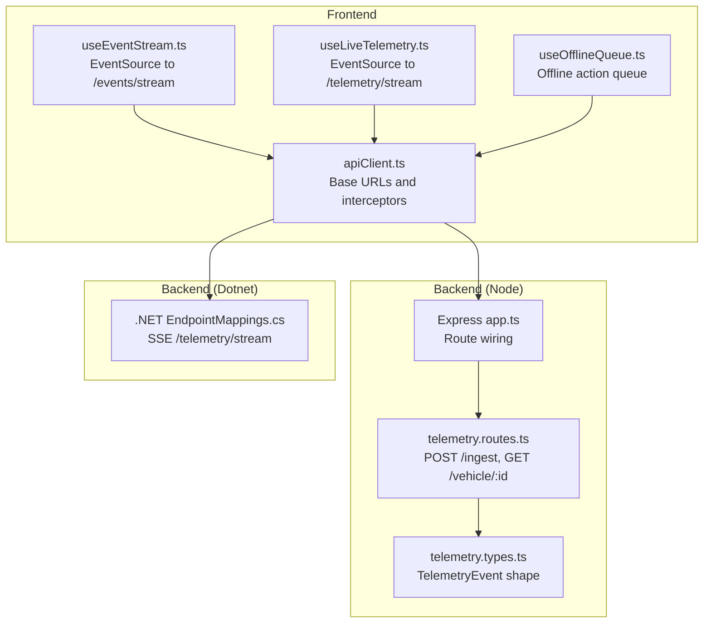
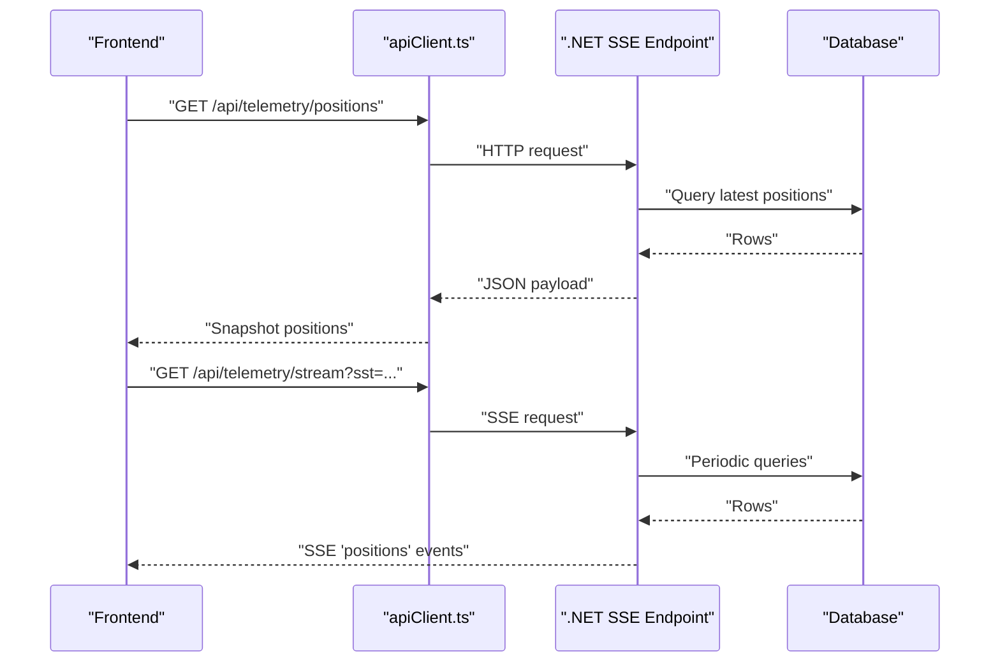
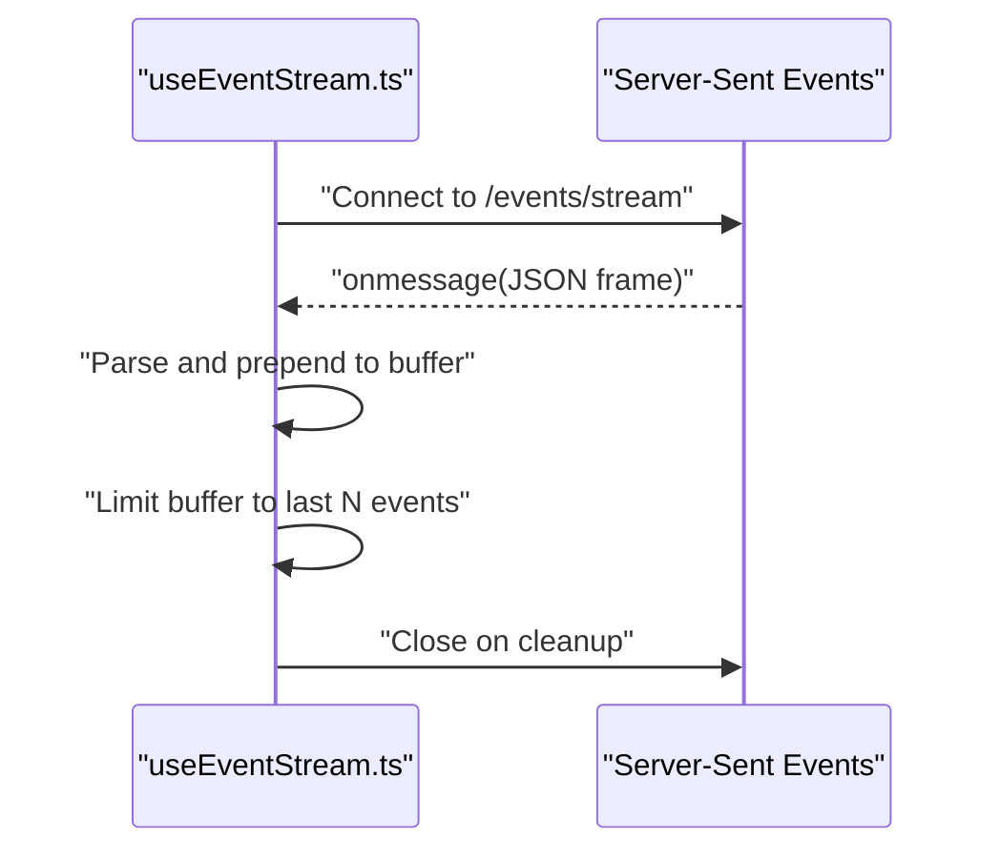
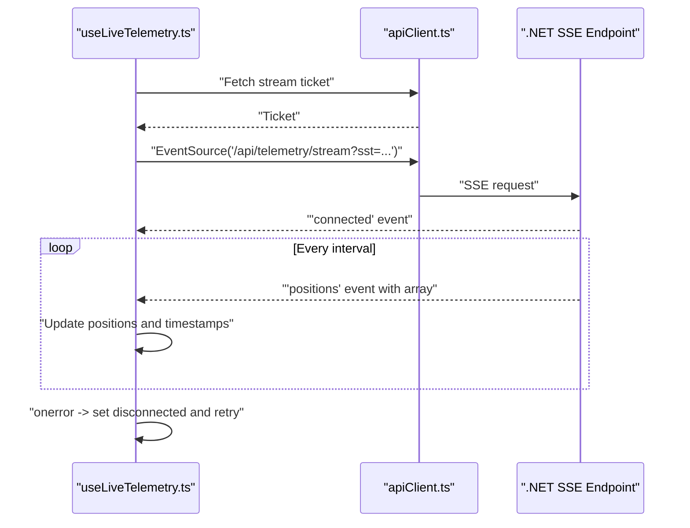
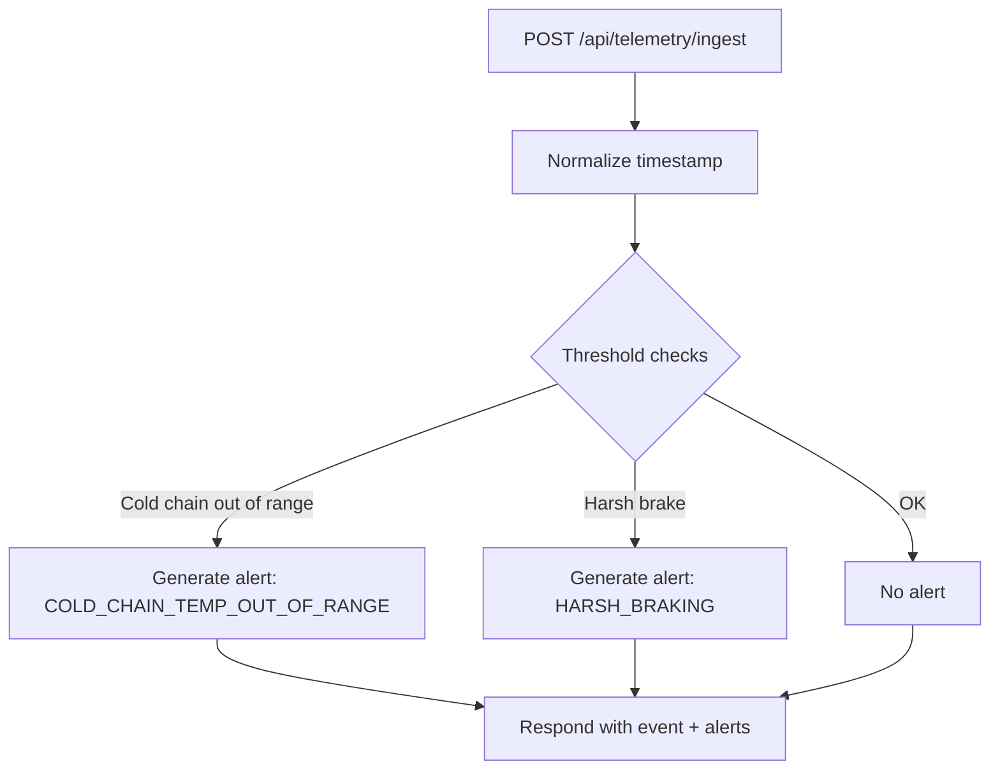
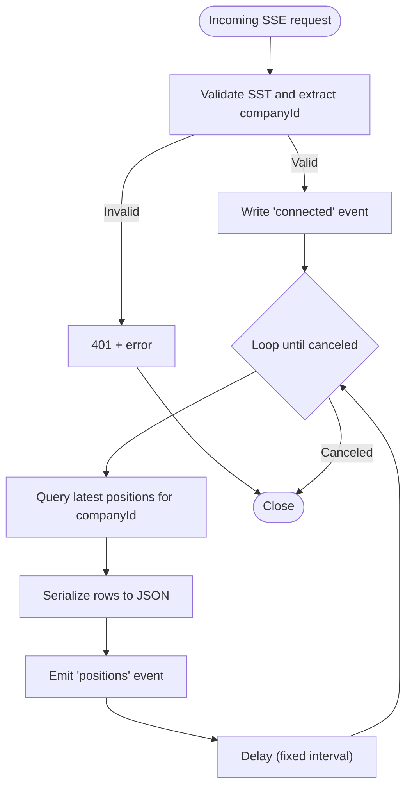
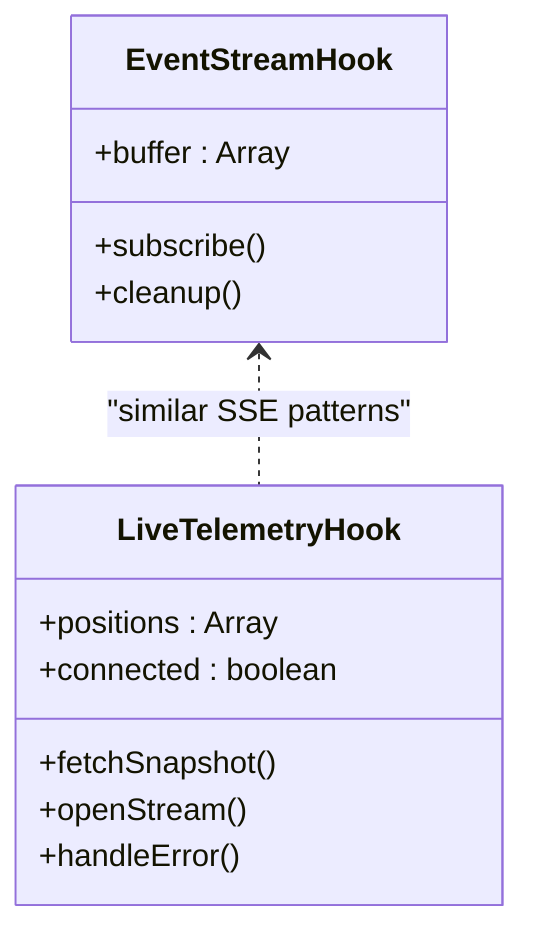
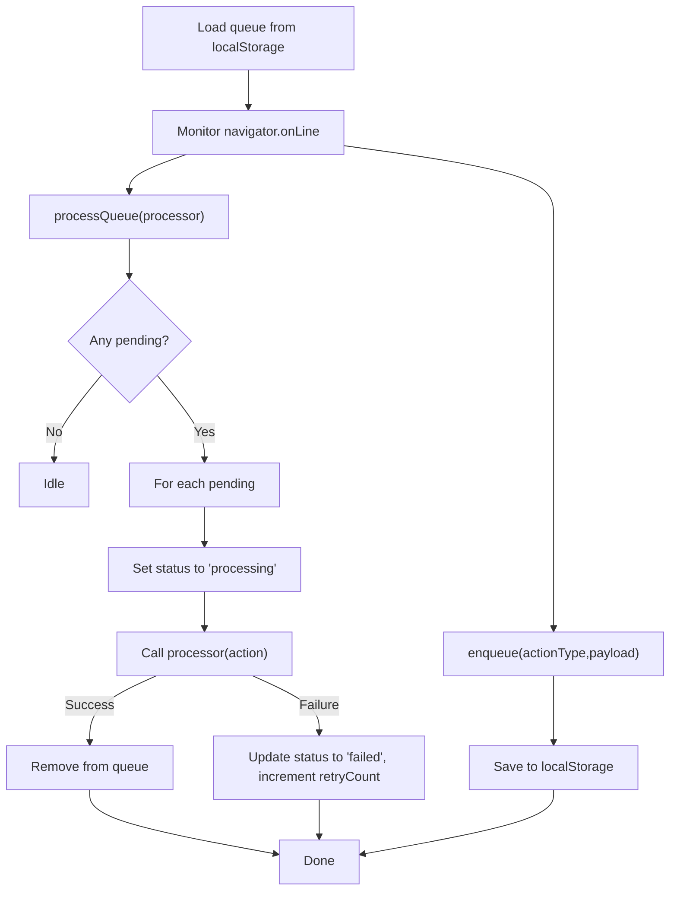
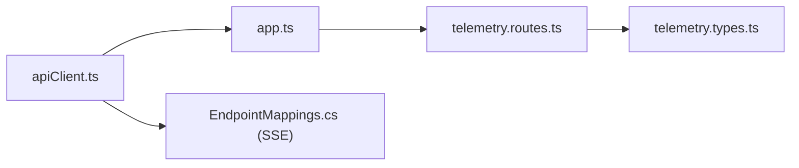
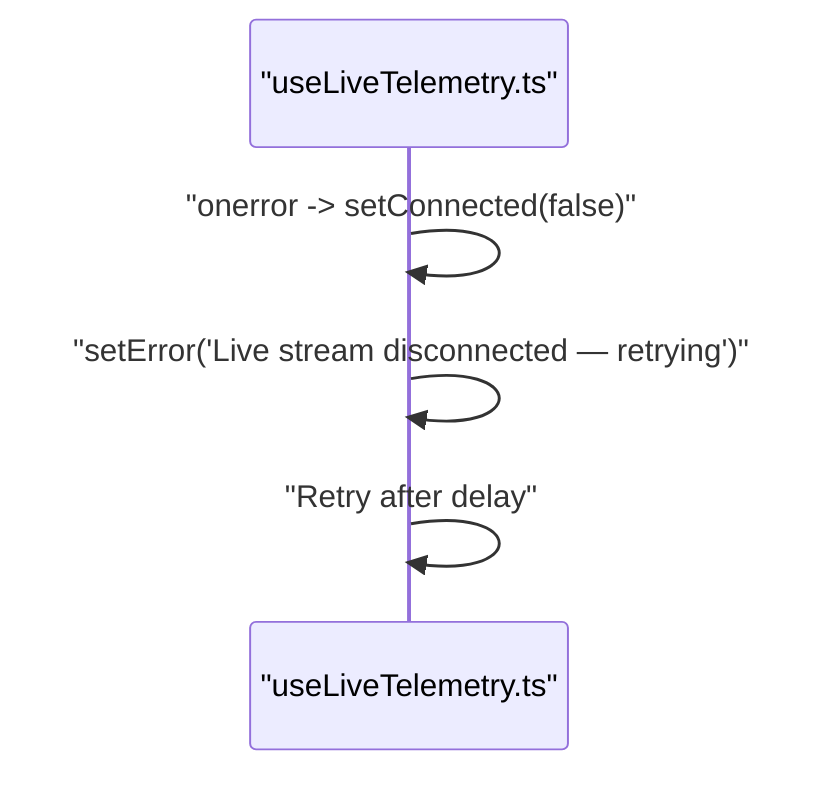

# Real-time Communication

<cite>
**Referenced Files in This Document**
- [useEventStream.ts](file://frontend/src/hooks/useEventStream.ts)
- [useLiveTelemetry.ts](file://frontend/src/hooks/useLiveTelemetry.ts)
- [apiClient.ts](file://frontend/src/services/apiClient.ts)
- [telemetry.routes.ts](file://backend/src/modules/telemetry/telemetry.routes.ts)
- [telemetry.types.ts](file://backend/src/modules/telemetry/telemetry.types.ts)
- [app.ts](file://backend/src/app.ts)
- [server.ts](file://backend/src/server.ts)
- [EndpointMappings.cs](file://backend-dotnet/Controllers/EndpointMappings.cs)
- [useOfflineQueue.ts](file://frontend/src/hooks/useOfflineQueue.ts)
</cite>

## Table of Contents
1. [Introduction](#introduction)
2. [Project Structure](#project-structure)
3. [Core Components](#core-components)
4. [Architecture Overview](#architecture-overview)
5. [Detailed Component Analysis](#detailed-component-analysis)
6. [Dependency Analysis](#dependency-analysis)
7. [Performance Considerations](#performance-considerations)
8. [Troubleshooting Guide](#troubleshooting-guide)
9. [Conclusion](#conclusion)

## Introduction
This document explains the real-time communication architecture for OpsTrax, focusing on the event streaming and live telemetry systems. It covers the backend streaming endpoints, frontend event handlers, message formats, and client-side synchronization patterns. It also addresses offline queue management, connection resilience, performance tuning, and security controls.

## Project Structure
The real-time stack spans:
- Frontend React hooks for SSE consumption and offline queue management
- Backend Express route for ingestion and historical queries
- Backend .NET SSE endpoint for live position streams with tenant scoping and short-lived tickets

**Diagram sources**
- [apiClient.ts:1-79](file://frontend/src/services/apiClient.ts#L1-L79)
- [useEventStream.ts:1-23](file://frontend/src/hooks/useEventStream.ts#L1-L23)
- [useLiveTelemetry.ts:65-149](file://frontend/src/hooks/useLiveTelemetry.ts#L65-L149)
- [useOfflineQueue.ts:1-143](file://frontend/src/hooks/useOfflineQueue.ts#L1-L143)
- [app.ts:1-97](file://backend/src/app.ts#L1-L97)
- [telemetry.routes.ts:1-59](file://backend/src/modules/telemetry/telemetry.routes.ts#L1-L59)
- [telemetry.types.ts:1-50](file://backend/src/modules/telemetry/telemetry.types.ts#L1-L50)
- [EndpointMappings.cs:7050-7249](file://backend-dotnet/Controllers/EndpointMappings.cs#L7050-L7249)

**Section sources**
- [apiClient.ts:1-79](file://frontend/src/services/apiClient.ts#L1-L79)
- [useEventStream.ts:1-23](file://frontend/src/hooks/useEventStream.ts#L1-L23)
- [useLiveTelemetry.ts:65-149](file://frontend/src/hooks/useLiveTelemetry.ts#L65-L149)
- [useOfflineQueue.ts:1-143](file://frontend/src/hooks/useOfflineQueue.ts#L1-L143)
- [app.ts:1-97](file://backend/src/app.ts#L1-L97)
- [telemetry.routes.ts:1-59](file://backend/src/modules/telemetry/telemetry.routes.ts#L1-L59)
- [telemetry.types.ts:1-50](file://backend/src/modules/telemetry/telemetry.types.ts#L1-L50)
- [EndpointMappings.cs:7050-7249](file://backend-dotnet/Controllers/EndpointMappings.cs#L7050-L7249)

## Core Components
- EventSource-based live streams:
  - General events: frontend hook connects to a server-sent events endpoint and buffers recent events.
  - Live telemetry: frontend obtains a short-lived ticket, opens an SSE stream, and listens for position batches.
- Telemetry ingestion and storage:
  - Express route accepts telemetry payloads and generates alert records when thresholds are exceeded.
  - Historical queries filter by vehicle ID.
- SSE endpoint (Dotnet):
  - Tenant-scoped SSE stream emitting periodic position batches with structured events.
- Offline queue:
  - Persistent, idempotent action queue stored in local storage with retry and failure tracking.

**Section sources**
- [useEventStream.ts:1-23](file://frontend/src/hooks/useEventStream.ts#L1-L23)
- [useLiveTelemetry.ts:65-149](file://frontend/src/hooks/useLiveTelemetry.ts#L65-L149)
- [telemetry.routes.ts:1-59](file://backend/src/modules/telemetry/telemetry.routes.ts#L1-L59)
- [EndpointMappings.cs:7050-7249](file://backend-dotnet/Controllers/EndpointMappings.cs#L7050-L7249)
- [useOfflineQueue.ts:1-143](file://frontend/src/hooks/useOfflineQueue.ts#L1-L143)

## Architecture Overview
The system uses two complementary real-time mechanisms:
- Server-Sent Events (SSE): persistent, unidirectional server-to-client streams for live fleet positions and operational events.
- HTTP ingestion: POST endpoints for telemetry payloads and REST snapshots for current positions.

**Diagram sources**
- [useLiveTelemetry.ts:78-149](file://frontend/src/hooks/useLiveTelemetry.ts#L78-L149)
- [EndpointMappings.cs:7050-7131](file://backend-dotnet/Controllers/EndpointMappings.cs#L7050-L7131)

## Detailed Component Analysis

### EventSource Stream for General Events
- Endpoint: constructed from a base URL constant plus a path for the event stream.
- Behavior: opens an EventSource, parses incoming JSON frames, and maintains a bounded buffer of recent events.
- Lifecycle: closes the stream on component unmount.

**Diagram sources**
- [useEventStream.ts:8-19](file://frontend/src/hooks/useEventStream.ts#L8-L19)

**Section sources**
- [useEventStream.ts:1-23](file://frontend/src/hooks/useEventStream.ts#L1-L23)
- [apiClient.ts:10-12](file://frontend/src/services/apiClient.ts#L10-L12)

### Live Telemetry Stream (SSE)
- Ticketing: obtains a short-lived, HMAC-signed ticket from the backend before opening the stream.
- Stream URL: includes the ticket as a query parameter; session tokens are not exposed in URLs.
- Events: emits a "connected" initial event, followed by "positions" events containing arrays of position records.
- Resilience: handles connection loss by setting a flag and displaying a retry message; reconnects after a delay.
- Snapshot fallback: performs an initial HTTP snapshot to populate state quickly.

**Diagram sources**
- [useLiveTelemetry.ts:96-149](file://frontend/src/hooks/useLiveTelemetry.ts#L96-L149)
- [EndpointMappings.cs:7061-7101](file://backend-dotnet/Controllers/EndpointMappings.cs#L7061-L7101)

**Section sources**
- [useLiveTelemetry.ts:65-149](file://frontend/src/hooks/useLiveTelemetry.ts#L65-L149)
- [apiClient.ts:14-19](file://frontend/src/services/apiClient.ts#L14-L19)
- [EndpointMappings.cs:7050-7101](file://backend-dotnet/Controllers/EndpointMappings.cs#L7050-L7101)

### Telemetry Ingestion and Alerts (Node Backend)
- Ingestion endpoint accepts telemetry payloads and normalizes timestamps.
- Threshold-based alert generation for cold chain and safety events.
- Vehicle-scoped historical retrieval endpoint.

**Diagram sources**
- [telemetry.routes.ts:8-45](file://backend/src/modules/telemetry/telemetry.routes.ts#L8-L45)

**Section sources**
- [telemetry.routes.ts:1-59](file://backend/src/modules/telemetry/telemetry.routes.ts#L1-L59)
- [telemetry.types.ts:1-50](file://backend/src/modules/telemetry/telemetry.types.ts#L1-L50)

### SSE Endpoint Implementation (.NET)
- Headers: sets appropriate SSE headers and buffering controls.
- Authentication: validates a short-lived ticket to derive tenant/company context.
- Data: periodically queries latest positions for the tenant and emits a structured "positions" event.
- Metrics: exposes counters for accepted/rejected telemetry and active SSE clients.

**Diagram sources**
- [EndpointMappings.cs:7050-7107](file://backend-dotnet/Controllers/EndpointMappings.cs#L7050-L7107)

**Section sources**
- [EndpointMappings.cs:7050-7107](file://backend-dotnet/Controllers/EndpointMappings.cs#L7050-L7107)

### Frontend Event Stream Handling and Subscription Patterns
- Subscription pattern:
  - General events: subscribe via EventSource to a dedicated endpoint; maintain a small in-memory buffer.
  - Live telemetry: obtain a ticket, open SSE, listen for "positions" events, and update state.
- Real-time synchronization:
  - Initial snapshot ensures near-instant visibility.
  - Periodic SSE updates keep state fresh.
- Filtering and deduplication:
  - Client maintains a bounded buffer for general events.
  - SSE event types are differentiated by event names ("connected", "positions").

**Diagram sources**
- [useEventStream.ts:5-22](file://frontend/src/hooks/useEventStream.ts#L5-L22)
- [useLiveTelemetry.ts:71-149](file://frontend/src/hooks/useLiveTelemetry.ts#L71-L149)

**Section sources**
- [useEventStream.ts:1-23](file://frontend/src/hooks/useEventStream.ts#L1-L23)
- [useLiveTelemetry.ts:78-149](file://frontend/src/hooks/useLiveTelemetry.ts#L78-L149)

### Offline Queue Management
- Purpose: persist offline-capable actions (drafts) and retry when connectivity returns.
- Idempotency: each queued action carries a stable idempotency key.
- Persistence: stored in local storage with automatic serialization/deserialization.
- Processing: iterates pending items, marks as processing, and removes on success; tracks retries and errors.

**Diagram sources**
- [useOfflineQueue.ts:36-71](file://frontend/src/hooks/useOfflineQueue.ts#L36-L71)
- [useOfflineQueue.ts:104-131](file://frontend/src/hooks/useOfflineQueue.ts#L104-L131)

**Section sources**
- [useOfflineQueue.ts:1-143](file://frontend/src/hooks/useOfflineQueue.ts#L1-L143)

## Dependency Analysis
- Frontend depends on:
  - apiClient for base URLs and auth/CSRF headers.
  - React hooks for SSE subscriptions and offline queue.
- Backend (Node):
  - Express app wires routes and applies middleware.
  - Telemetry routes handle ingestion and queries.
- Backend (Dotnet):
  - SSE endpoint reads from the database and writes SSE frames.
  - Metrics and alert endpoints support monitoring and operations.

**Diagram sources**
- [apiClient.ts:14-19](file://frontend/src/services/apiClient.ts#L14-L19)
- [app.ts:74-96](file://backend/src/app.ts#L74-L96)
- [telemetry.routes.ts:1-59](file://backend/src/modules/telemetry/telemetry.routes.ts#L1-L59)
- [telemetry.types.ts:1-50](file://backend/src/modules/telemetry/telemetry.types.ts#L1-L50)
- [EndpointMappings.cs:7050-7107](file://backend-dotnet/Controllers/EndpointMappings.cs#L7050-L7107)

**Section sources**
- [app.ts:1-97](file://backend/src/app.ts#L1-L97)
- [server.ts:1-11](file://backend/src/server.ts#L1-L11)

## Performance Considerations
- SSE batching:
  - Positions are emitted as arrays, reducing overhead compared to row-by-row emissions.
- Interval tuning:
  - Backend emits at a fixed cadence; adjust to balance freshness vs. load.
- Payload size:
  - Keep event payloads minimal; avoid unnecessary fields.
- Buffer limits:
  - Frontend limits buffered general events to a small number to cap memory usage.
- Snapshot + SSE:
  - Initial snapshot reduces perceived latency; SSE keeps data fresh.
- Rate limiting:
  - Backend applies rate limiting to HTTP endpoints to protect resources.

**Section sources**
- [useEventStream.ts:13](file://frontend/src/hooks/useEventStream.ts#L13)
- [EndpointMappings.cs:7099-7101](file://backend-dotnet/Controllers/EndpointMappings.cs#L7099-L7101)
- [app.ts:17-72](file://backend/src/app.ts#L17-L72)

## Troubleshooting Guide
- Stream disconnects:
  - The live telemetry hook detects errors, clears connectivity, and signals a retry message; it reopens the stream after a delay.
- Malformed frames:
  - Both general and telemetry SSE handlers ignore malformed JSON frames to prevent crashes.
- Session expiration:
  - API response interceptor redirects to login on 401 and clears stale session data.
- Offline scenarios:
  - Use the offline queue to persist idempotent actions; queue processing resumes automatically when online.

**Diagram sources**
- [useLiveTelemetry.ts:143-149](file://frontend/src/hooks/useLiveTelemetry.ts#L143-L149)

**Section sources**
- [useLiveTelemetry.ts:130-149](file://frontend/src/hooks/useLiveTelemetry.ts#L130-L149)
- [apiClient.ts:58-72](file://frontend/src/services/apiClient.ts#L58-L72)
- [useOfflineQueue.ts:104-131](file://frontend/src/hooks/useOfflineQueue.ts#L104-L131)

## Conclusion
OpsTrax employs a robust, layered real-time strategy:
- SSE streams deliver live fleet positions and operational events with tenant scoping and short-lived tickets.
- HTTP ingestion and snapshots provide reliable historical access and alerting.
- Frontend hooks manage subscriptions, resilience, and client-side caching.
- An offline queue ensures continuity during connectivity interruptions.
This design balances responsiveness, scalability, and operability across high-frequency updates.