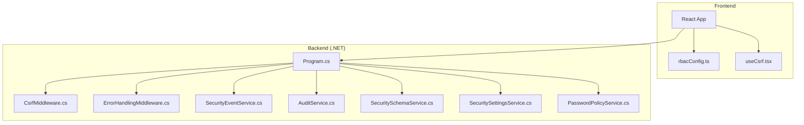
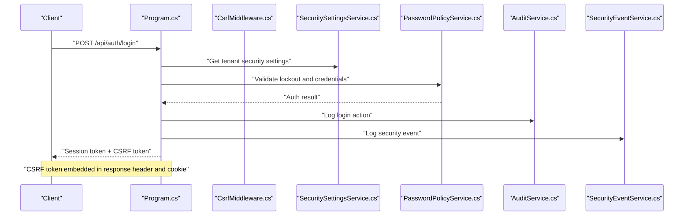
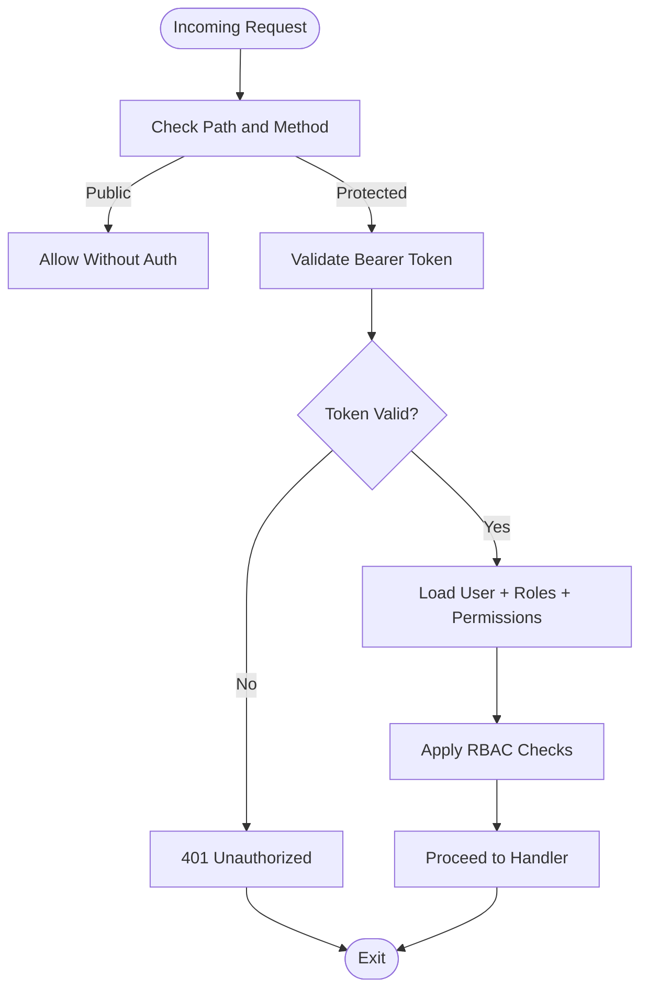
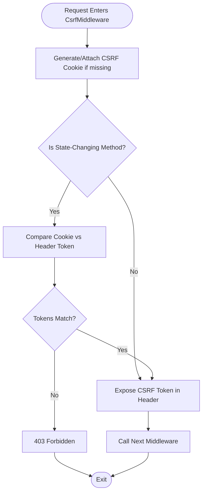
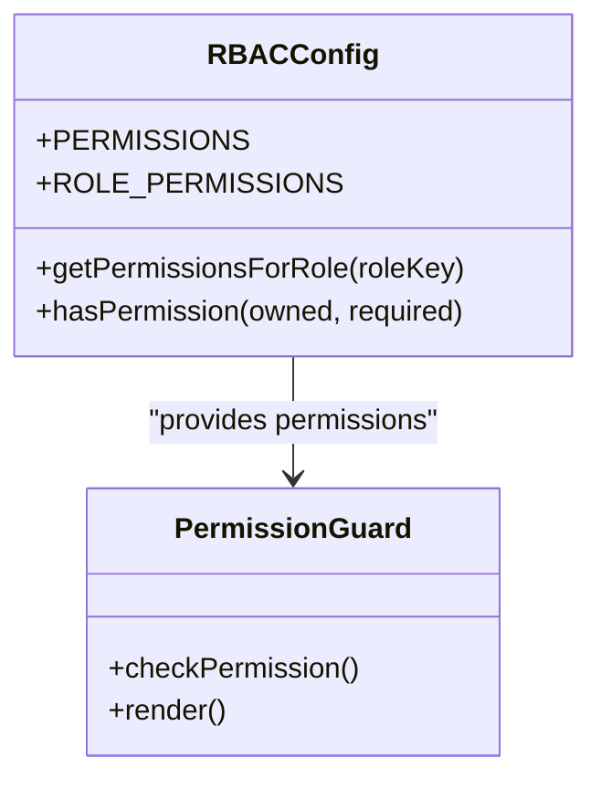
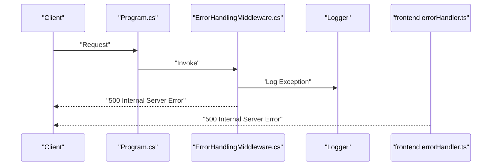
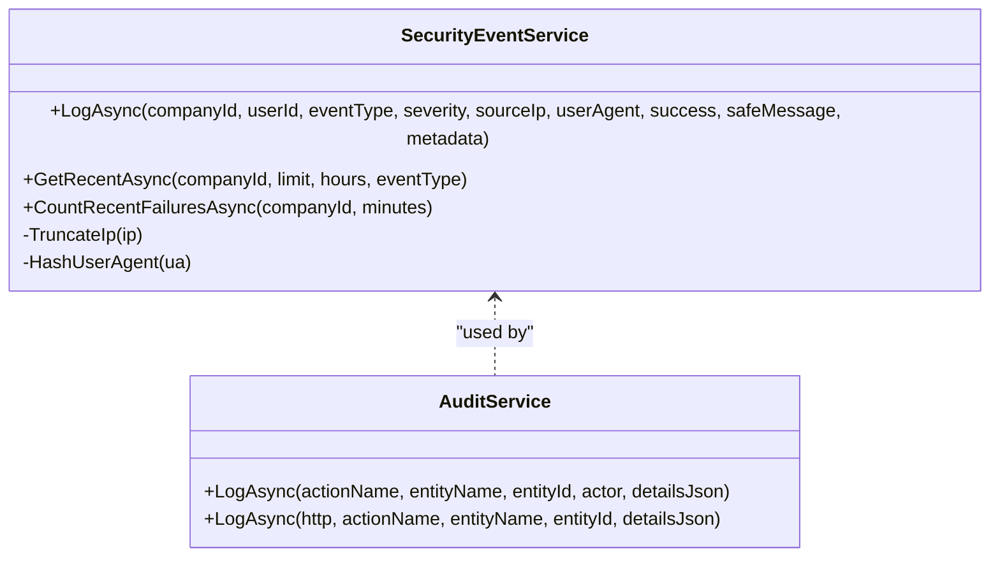
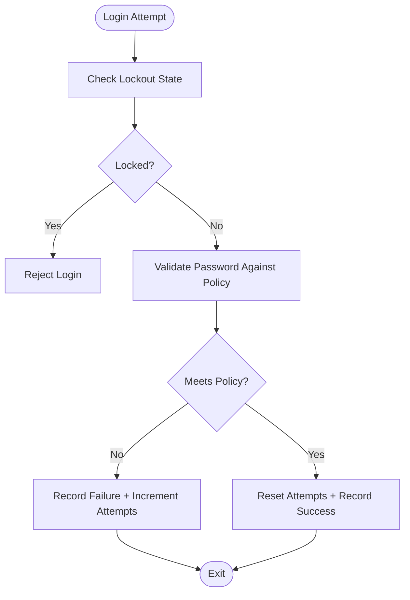
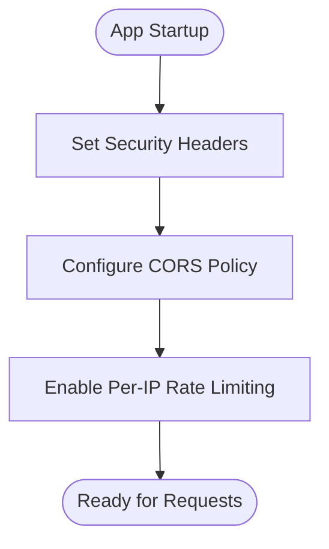
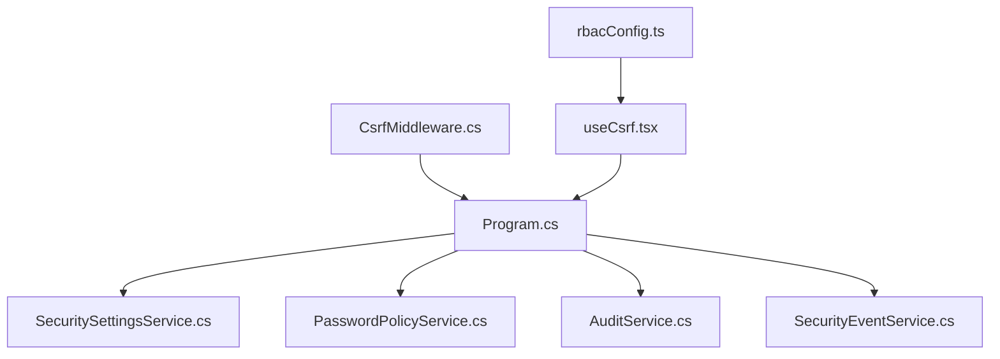

# Security Implementation

<cite>
**Referenced Files in This Document**
- [Program.cs](file://backend-dotnet/Program.cs)
- [CsrfMiddleware.cs](file://backend-dotnet/Middleware/CsrfMiddleware.cs)
- [ErrorHandlingMiddleware.cs](file://backend-dotnet/Middleware/ErrorHandlingMiddleware.cs)
- [errorHandler.ts](file://backend/src/middleware/errorHandler.ts)
- [SecurityEventService.cs](file://backend-dotnet/Services/SecurityEventService.cs)
- [AuditService.cs](file://backend-dotnet/Services/AuditService.cs)
- [SecuritySchemaService.cs](file://backend-dotnet/Services/SecuritySchemaService.cs)
- [SecuritySettingsService.cs](file://backend-dotnet/Services/SecuritySettingsService.cs)
- [PasswordPolicyService.cs](file://backend-dotnet/Services/PasswordPolicyService.cs)
- [rbacConfig.ts](file://frontend/src/auth/rbacConfig.ts)
- [useCsrf.tsx](file://frontend/src/hooks/useCsrf.tsx)
- [LOGIN_RBAC_CSRF.md](file://docs/LOGIN_RBAC_CSRF.md)
- [FINAL_HARDENING_REPORT.md](file://docs/FINAL_HARDENING_REPORT.md)
</cite>

## Table of Contents
1. [Introduction](#introduction)
2. [Project Structure](#project-structure)
3. [Core Components](#core-components)
4. [Architecture Overview](#architecture-overview)
5. [Detailed Component Analysis](#detailed-component-analysis)
6. [Dependency Analysis](#dependency-analysis)
7. [Performance Considerations](#performance-considerations)
8. [Troubleshooting Guide](#troubleshooting-guide)
9. [Conclusion](#conclusion)
10. [Appendices](#appendices)

## Introduction
This document provides comprehensive security implementation documentation for the OpsTrax system. It explains the layered security approach across authentication, authorization, input validation, and data protection. It also documents CSRF protection middleware, error handling security, secure communication patterns, security middleware implementation, request sanitization, and vulnerability prevention measures. The document details data encryption at rest and in transit, secure token management, session security, security event logging, audit trail implementation, and compliance monitoring. Mitigations for common threats (SQL injection, XSS, CSRF, brute force) are covered alongside security testing approaches, penetration testing procedures, and security update processes.

## Project Structure
The security implementation spans both backend services and frontend components:
- Backend (.NET): Authentication middleware, CSRF protection, error handling, security services, and audit/logging.
- Frontend (React): RBAC configuration, CSRF token management, and permission guards.
- Shared documentation: Login/RBAC/CSRF guide and hardening report.

**Diagram sources**
- [Program.cs:101-102](file://backend-dotnet/Program.cs#L101-L102)
- [CsrfMiddleware.cs:19-55](file://backend-dotnet/Middleware/CsrfMiddleware.cs#L19-L55)
- [ErrorHandlingMiddleware.cs:8-21](file://backend-dotnet/Middleware/ErrorHandlingMiddleware.cs#L8-L21)
- [SecurityEventService.cs:31-70](file://backend-dotnet/Services/SecurityEventService.cs#L31-L70)
- [AuditService.cs:7-21](file://backend-dotnet/Services/AuditService.cs#L7-L21)
- [SecuritySchemaService.cs:24-86](file://backend-dotnet/Services/SecuritySchemaService.cs#L24-L86)
- [SecuritySettingsService.cs:14-66](file://backend-dotnet/Services/SecuritySettingsService.cs#L14-L66)
- [PasswordPolicyService.cs:21-111](file://backend-dotnet/Services/PasswordPolicyService.cs#L21-L111)
- [rbacConfig.ts:1-404](file://frontend/src/auth/rbacConfig.ts#L1-L404)
- [useCsrf.tsx:20-41](file://frontend/src/hooks/useCsrf.tsx#L20-L41)

**Section sources**
- [Program.cs:101-102](file://backend-dotnet/Program.cs#L101-L102)
- [LOGIN_RBAC_CSRF.md:1-251](file://docs/LOGIN_RBAC_CSRF.md#L1-L251)

## Core Components
- Authentication and Authorization:
  - Backend session-based authentication with bearer token validation and RBAC enforcement.
  - Role-based permissions mapped in the frontend configuration.
- CSRF Protection:
  - Cookie-based CSRF token generation and header validation for state-changing requests.
- Error Handling:
  - Centralized error handling middleware with generic error responses and logging.
- Security Event Logging and Auditing:
  - Structured security event logging with IP truncation and user-agent hashing.
  - Audit logging for actions with actor identification and tenant scoping.
- Security Settings and Policies:
  - Tenant-level security settings including MFA, password policies, and session timeouts.
  - Password policy enforcement and lockout mechanisms.
- Secure Communication:
  - Strict transport security headers and CORS configuration.

**Section sources**
- [Program.cs:105-245](file://backend-dotnet/Program.cs#L105-L245)
- [rbacConfig.ts:1-404](file://frontend/src/auth/rbacConfig.ts#L1-L404)
- [CsrfMiddleware.cs:19-55](file://backend-dotnet/Middleware/CsrfMiddleware.cs#L19-L55)
- [ErrorHandlingMiddleware.cs:8-21](file://backend-dotnet/Middleware/ErrorHandlingMiddleware.cs#L8-L21)
- [SecurityEventService.cs:31-151](file://backend-dotnet/Services/SecurityEventService.cs#L31-L151)
- [AuditService.cs:7-47](file://backend-dotnet/Services/AuditService.cs#L7-L47)
- [SecuritySettingsService.cs:14-134](file://backend-dotnet/Services/SecuritySettingsService.cs#L14-L134)
- [PasswordPolicyService.cs:21-120](file://backend-dotnet/Services/PasswordPolicyService.cs#L21-L120)

## Architecture Overview
The security architecture integrates middleware, services, and frontend components to enforce authentication, authorization, and data protection.

**Diagram sources**
- [Program.cs:105-245](file://backend-dotnet/Program.cs#L105-L245)
- [SecuritySettingsService.cs:37-66](file://backend-dotnet/Services/SecuritySettingsService.cs#L37-L66)
- [PasswordPolicyService.cs:44-111](file://backend-dotnet/Services/PasswordPolicyService.cs#L44-L111)
- [AuditService.cs:9-21](file://backend-dotnet/Services/AuditService.cs#L9-L21)
- [SecurityEventService.cs:33-70](file://backend-dotnet/Services/SecurityEventService.cs#L33-L70)

## Detailed Component Analysis

### Authentication and Session Security
- Session tokens are bearer-style with strict validation and expiration checks.
- Sessions are tenant-scoped and include role and permission sets.
- Rate limiting is enforced per-IP to mitigate brute-force attacks.
- SSE streaming uses short-lived stream tickets instead of long-lived tokens in query strings.

**Diagram sources**
- [Program.cs:105-245](file://backend-dotnet/Program.cs#L105-L245)

**Section sources**
- [Program.cs:105-245](file://backend-dotnet/Program.cs#L105-L245)

### CSRF Protection Middleware
- Generates CSRF cookie for GET requests and exposes token via response header.
- Validates CSRF token on state-changing requests (POST/PUT/DELETE).
- Uses HttpOnly cookie, SameSite configuration, and secure flag.
- Exempts login endpoint from CSRF validation.

**Diagram sources**
- [CsrfMiddleware.cs:19-55](file://backend-dotnet/Middleware/CsrfMiddleware.cs#L19-L55)

**Section sources**
- [CsrfMiddleware.cs:19-55](file://backend-dotnet/Middleware/CsrfMiddleware.cs#L19-L55)
- [useCsrf.tsx:20-41](file://frontend/src/hooks/useCsrf.tsx#L20-L41)
- [LOGIN_RBAC_CSRF.md:14-21](file://docs/LOGIN_RBAC_CSRF.md#L14-L21)

### Authorization and RBAC
- Role-to-permissions mapping with canonical and alias variants.
- Wildcard support for flexible permission matching.
- Super admin role receives full permissions.
- Client-side permission checks and guards.

**Diagram sources**
- [rbacConfig.ts:326-367](file://frontend/src/auth/rbacConfig.ts#L326-L367)

**Section sources**
- [rbacConfig.ts:1-404](file://frontend/src/auth/rbacConfig.ts#L1-L404)
- [LOGIN_RBAC_CSRF.md:86-118](file://docs/LOGIN_RBAC_CSRF.md#L86-L118)

### Error Handling Security
- Centralized error handling middleware logs unhandled exceptions and returns generic error responses.
- Frontend Express error handler logs and returns structured JSON.

**Diagram sources**
- [ErrorHandlingMiddleware.cs:8-21](file://backend-dotnet/Middleware/ErrorHandlingMiddleware.cs#L8-L21)
- [errorHandler.ts:3-16](file://backend/src/middleware/errorHandler.ts#L3-L16)

**Section sources**
- [ErrorHandlingMiddleware.cs:8-21](file://backend-dotnet/Middleware/ErrorHandlingMiddleware.cs#L8-L21)
- [errorHandler.ts:3-16](file://backend/src/middleware/errorHandler.ts#L3-L16)

### Security Event Logging and Audit Trail
- SecurityEventService logs tenant-scoped events with IP truncation and user-agent hashing.
- AuditService logs actions with actor identification and details JSON.
- Both services enforce data minimization and tenant isolation.

**Diagram sources**
- [SecurityEventService.cs:31-151](file://backend-dotnet/Services/SecurityEventService.cs#L31-L151)
- [AuditService.cs:7-47](file://backend-dotnet/Services/AuditService.cs#L7-L47)

**Section sources**
- [SecurityEventService.cs:31-151](file://backend-dotnet/Services/SecurityEventService.cs#L31-L151)
- [AuditService.cs:7-47](file://backend-dotnet/Services/AuditService.cs#L7-L47)

### Security Settings and Password Policy
- Tenant-level security settings including MFA requirements, password rules, session timeouts, and retention policies.
- Password policy validation and lockout enforcement with generic error messaging to prevent user enumeration.
- Automatic lockout and unlock windows based on configured thresholds.

**Diagram sources**
- [PasswordPolicyService.cs:44-111](file://backend-dotnet/Services/PasswordPolicyService.cs#L44-L111)
- [SecuritySettingsService.cs:136-154](file://backend-dotnet/Services/SecuritySettingsService.cs#L136-L154)

**Section sources**
- [SecuritySettingsService.cs:14-134](file://backend-dotnet/Services/SecuritySettingsService.cs#L14-L134)
- [PasswordPolicyService.cs:21-120](file://backend-dotnet/Services/PasswordPolicyService.cs#L21-L120)

### Secure Communication and Headers
- Strict transport security headers applied globally.
- CORS configured with allowed origins and credentials support.
- Rate limiting implemented per-IP to prevent abuse.

**Diagram sources**
- [Program.cs:92-99](file://backend-dotnet/Program.cs#L92-L99)
- [Program.cs:55-63](file://backend-dotnet/Program.cs#L55-L63)
- [Program.cs:131-143](file://backend-dotnet/Program.cs#L131-L143)

**Section sources**
- [Program.cs:92-99](file://backend-dotnet/Program.cs#L92-L99)
- [Program.cs:55-63](file://backend-dotnet/Program.cs#L55-L63)
- [Program.cs:131-143](file://backend-dotnet/Program.cs#L131-L143)

## Dependency Analysis
- Authentication depends on security settings and password policy services.
- CSRF middleware is a global pipeline component invoked before protected routes.
- Security event and audit services depend on database access and are scoped appropriately.
- Frontend RBAC depends on backend-provided permissions and roles.

**Diagram sources**
- [Program.cs:101-102](file://backend-dotnet/Program.cs#L101-L102)
- [CsrfMiddleware.cs:19-55](file://backend-dotnet/Middleware/CsrfMiddleware.cs#L19-L55)
- [SecuritySettingsService.cs:14-66](file://backend-dotnet/Services/SecuritySettingsService.cs#L14-L66)
- [PasswordPolicyService.cs:21-42](file://backend-dotnet/Services/PasswordPolicyService.cs#L21-L42)
- [AuditService.cs:7-21](file://backend-dotnet/Services/AuditService.cs#L7-L21)
- [SecurityEventService.cs:31-70](file://backend-dotnet/Services/SecurityEventService.cs#L31-L70)
- [rbacConfig.ts:1-404](file://frontend/src/auth/rbacConfig.ts#L1-L404)
- [useCsrf.tsx:20-41](file://frontend/src/hooks/useCsrf.tsx#L20-L41)

**Section sources**
- [Program.cs:101-102](file://backend-dotnet/Program.cs#L101-L102)
- [CsrfMiddleware.cs:19-55](file://backend-dotnet/Middleware/CsrfMiddleware.cs#L19-L55)
- [SecuritySettingsService.cs:14-66](file://backend-dotnet/Services/SecuritySettingsService.cs#L14-L66)
- [PasswordPolicyService.cs:21-42](file://backend-dotnet/Services/PasswordPolicyService.cs#L21-L42)
- [AuditService.cs:7-21](file://backend-dotnet/Services/AuditService.cs#L7-L21)
- [SecurityEventService.cs:31-70](file://backend-dotnet/Services/SecurityEventService.cs#L31-L70)
- [rbacConfig.ts:1-404](file://frontend/src/auth/rbacConfig.ts#L1-L404)
- [useCsrf.tsx:20-41](file://frontend/src/hooks/useCsrf.tsx#L20-L41)

## Performance Considerations
- Permission checks are optimized with constant-time lookups and pre-compiled patterns.
- Token validation is O(1) string comparison.
- Session storage uses local caching for performance.
- Rate limiting uses in-memory windows keyed by IP.

[No sources needed since this section provides general guidance]

## Troubleshooting Guide
Common issues and resolutions:
- CSRF Token Mismatch (403):
  - Ensure X-CSRF-Token header is set for state-changing requests.
  - Confirm cookie value matches header token.
  - Verify withCredentials is enabled in client configuration.
- Permission Denied (redirect):
  - Verify user’s role and required permission string.
  - Check wildcard patterns (e.g., dashboard.*).
- Session Expired:
  - Re-login to obtain a new session.
  - Review server logs for 8-hour expiration timing.
- Brute Force Protection:
  - Monitor lockout thresholds and durations.
  - Consider enabling MFA for additional protection.

**Section sources**
- [LOGIN_RBAC_CSRF.md:213-235](file://docs/LOGIN_RBAC_CSRF.md#L213-L235)
- [PasswordPolicyService.cs:62-96](file://backend-dotnet/Services/PasswordPolicyService.cs#L62-L96)
- [SecuritySettingsService.cs:136-154](file://backend-dotnet/Services/SecuritySettingsService.cs#L136-L154)

## Conclusion
OpsTrax implements a robust, layered security model combining strong authentication, granular RBAC, CSRF protection, centralized error handling, and comprehensive event logging. The system enforces tenant isolation, applies data minimization, and mitigates common vulnerabilities through strict headers, CORS policies, and rate limiting. The documented services and middleware provide a solid foundation for secure operation, while the frontend components ensure consistent enforcement of permissions and CSRF safeguards.

[No sources needed since this section summarizes without analyzing specific files]

## Appendices

### Data Protection and Privacy
- IP addresses are truncated to first 3 octets (IPv4) or first 48 bits (IPv6) for privacy.
- User-Agent strings are hashed (first 8 hex chars of SHA-256) to enable correlation without exposing full UA.
- Metadata JSON excludes PII beyond what is necessary.

**Section sources**
- [SecurityEventService.cs:122-150](file://backend-dotnet/Services/SecurityEventService.cs#L122-L150)

### Secure Token Management
- Session tokens are base64-encoded random values with server-side validation and expiration.
- Tokens are rotated on re-login and are tenant-scoped.
- Short-lived stream tickets are used for SSE to avoid long-lived tokens in URLs.

**Section sources**
- [Program.cs:149-172](file://backend-dotnet/Program.cs#L149-L172)
- [FINAL_HARDENING_REPORT.md:114-121](file://docs/FINAL_HARDENING_REPORT.md#L114-L121)

### Vulnerability Prevention Measures
- SQL Injection:
  - Parameterized queries and ORM-backed database access.
- XSS:
  - Helmet middleware and strict Content-Type/Frame options headers.
- CSRF:
  - Cookie + header token validation with HttpOnly cookie and SameSite configuration.
- Brute Force:
  - Lockout thresholds, lockout duration, and generic error messaging.

**Section sources**
- [Program.cs:174-207](file://backend-dotnet/Program.cs#L174-L207)
- [CsrfMiddleware.cs:19-55](file://backend-dotnet/Middleware/CsrfMiddleware.cs#L19-L55)
- [PasswordPolicyService.cs:10-18](file://backend-dotnet/Services/PasswordPolicyService.cs#L10-L18)

### Security Testing and Penetration Testing
- Unit tests validate token rejection for expired or revoked states.
- Configuration validation tests check JWT key length and other security-related settings.
- Recommendations:
  - Conduct periodic penetration testing against staging environments.
  - Validate CSRF protections across browser and mobile clients.
  - Perform automated scanning for OWASP Top 10 vulnerabilities.

**Section sources**
- [FINAL_HARDENING_REPORT.md:147-156](file://docs/FINAL_HARDENING_REPORT.md#L147-L156)

### Security Update Processes
- Schema updates are executed during startup with graceful failure handling.
- Configuration validation runs in health endpoints to surface issues without exposing sensitive values.
- Audit logs track security setting changes for compliance monitoring.

**Section sources**
- [Program.cs:70-90](file://backend-dotnet/Program.cs#L70-L90)
- [Program.cs:296-378](file://backend-dotnet/Program.cs#L296-L378)
- [SecuritySchemaService.cs:24-86](file://backend-dotnet/Services/SecuritySchemaService.cs#L24-L86)
- [SecuritySettingsService.cs:132-134](file://backend-dotnet/Services/SecuritySettingsService.cs#L132-L134)