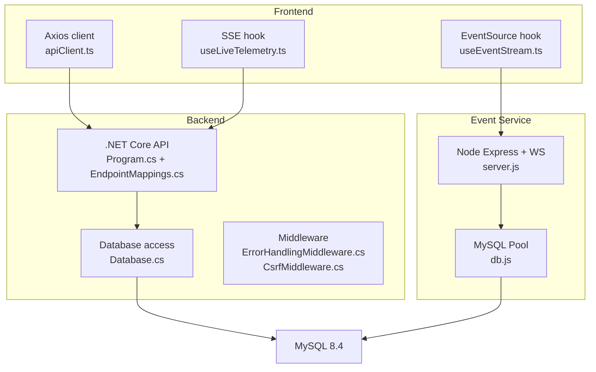
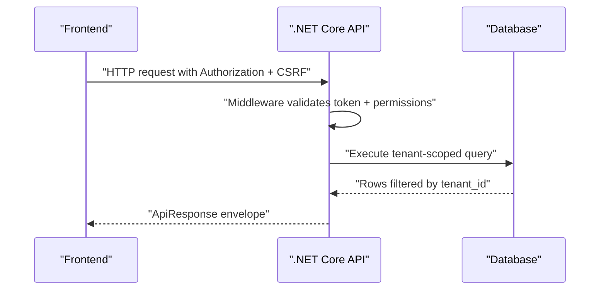
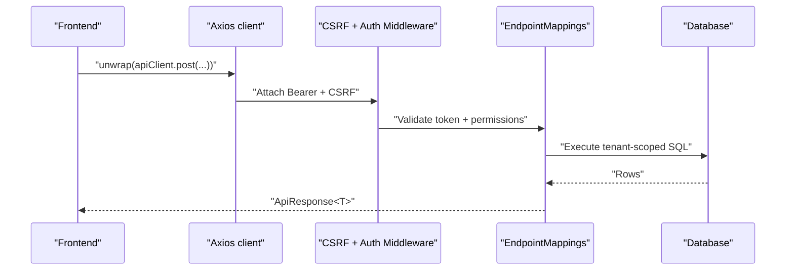
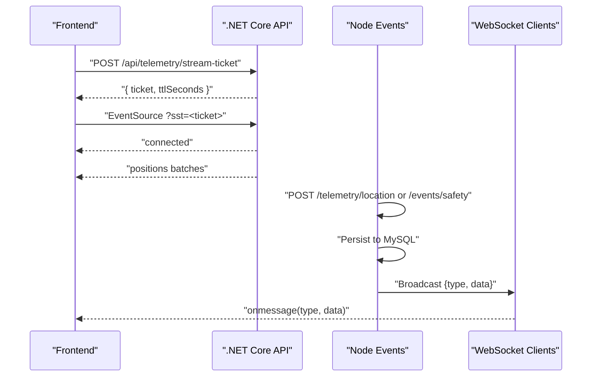
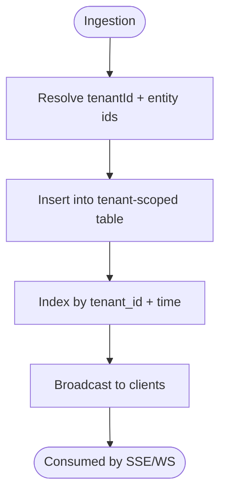
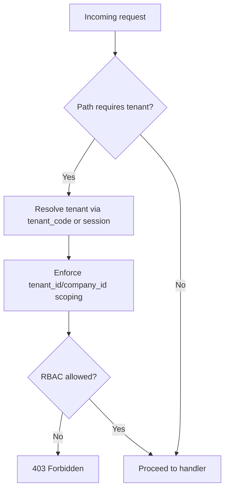
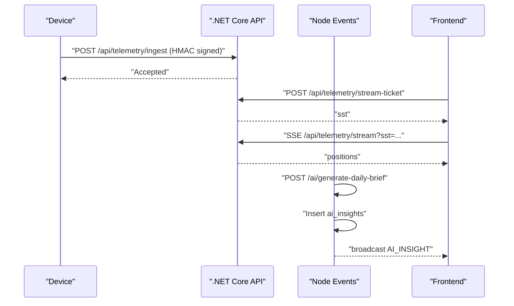
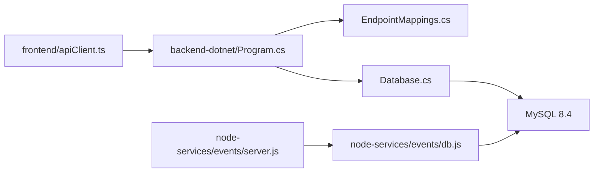

# Data Flow Architecture

<cite>
**Referenced Files in This Document**
- [README.md](file://README.md)
- [ARCHITECTURE.md](file://docs/ARCHITECTURE.md)
- [app.ts](file://backend/src/app.ts)
- [server.ts](file://backend/src/server.ts)
- [apiClient.ts](file://frontend/src/services/apiClient.ts)
- [useEventStream.ts](file://frontend/src/hooks/useEventStream.ts)
- [001_schema.sql](file://db/init/001_schema.sql)
- [Database.cs](file://backend-dotnet/Data/Database.cs)
- [Program.cs](file://backend-dotnet/Program.cs)
- [EndpointMappings.cs](file://backend-dotnet/Controllers/EndpointMappings.cs)
- [ApiResponse.cs](file://backend-dotnet/DTOs/ApiResponse.cs)
- [ErrorHandlingMiddleware.cs](file://backend-dotnet/Middleware/ErrorHandlingMiddleware.cs)
- [CsrfMiddleware.cs](file://backend-dotnet/Middleware/CsrfMiddleware.cs)
- [TelemetryHmacHelper.cs](file://backend-dotnet/TelemetryHmacHelper.cs)
- [TelemetryKeyStore.cs](file://backend-dotnet/TelemetryKeyStore.cs)
- [db.js](file://node-services/events/src/db.js)
- [server.js](file://node-services/events/src/server.js)
- [useLiveTelemetry.ts](file://frontend/src/hooks/useLiveTelemetry.ts)
</cite>

## Table of Contents
1. [Introduction](#introduction)
2. [Project Structure](#project-structure)
3. [Core Components](#core-components)
4. [Architecture Overview](#architecture-overview)
5. [Detailed Component Analysis](#detailed-component-analysis)
6. [Dependency Analysis](#dependency-analysis)
7. [Performance Considerations](#performance-considerations)
8. [Troubleshooting Guide](#troubleshooting-guide)
9. [Conclusion](#conclusion)
10. [Appendices](#appendices)

## Introduction
This document explains the data flow architecture of OpsTrax across three primary channels:
- REST API request-response from the React frontend to the .NET Core backend
- Real-time event streaming via Server-Sent Events (SSE) and WebSocket services
- Data persistence to the MySQL database with tenant-aware isolation and multi-tenant access controls

It also covers event-driven telemetry, safety events, and AI workflows; data transformation patterns; caching strategies; eventual consistency mechanisms; and validation, sanitization, and security considerations.

## Project Structure
The system comprises:
- Frontend (React 19.2) with Axios-based API client and SSE/WS hooks
- .NET Core 8 minimal API backend with endpoint mapping, middleware, and PostgreSQL-backed services
- Node.js event service for telemetry ingestion, WebSocket broadcasting, and AI daily brief generation
- MySQL 8.4 database with tenant-scoped tables and indices

**Diagram sources**
- [apiClient.ts:1-79](file://frontend/src/services/apiClient.ts#L1-L79)
- [useLiveTelemetry.ts:1-169](file://frontend/src/hooks/useLiveTelemetry.ts#L1-L169)
- [useEventStream.ts:1-23](file://frontend/src/hooks/useEventStream.ts#L1-L23)
- [Program.cs:1-452](file://backend-dotnet/Program.cs#L1-L452)
- [EndpointMappings.cs:1-800](file://backend-dotnet/Controllers/EndpointMappings.cs#L1-L800)
- [Database.cs:1-86](file://backend-dotnet/Data/Database.cs#L1-L86)
- [ErrorHandlingMiddleware.cs:1-22](file://backend-dotnet/Middleware/ErrorHandlingMiddleware.cs#L1-L22)
- [CsrfMiddleware.cs:1-62](file://backend-dotnet/Middleware/CsrfMiddleware.cs#L1-L62)
- [server.js:1-154](file://node-services/events/src/server.js#L1-L154)
- [db.js:1-35](file://node-services/events/src/db.js#L1-L35)

**Section sources**
- [README.md:117-142](file://README.md#L117-L142)
- [ARCHITECTURE.md:9-23](file://docs/ARCHITECTURE.md#L9-L23)

## Core Components
- Frontend API client: centralized base URL, credentials, interceptors for auth and CSRF, and response unwrapping
- .NET Core API: endpoint mapping, CORS/CSRF middleware, rate limiting, health/readiness endpoints, and tenant-scoped RBAC gating
- Node event service: telemetry ingestion endpoints, WebSocket broadcasting, and AI daily brief generation
- Database: tenant-scoped tables, indices, and PostgreSQL helpers for queries and inserts

**Section sources**
- [apiClient.ts:1-79](file://frontend/src/services/apiClient.ts#L1-L79)
- [Program.cs:55-244](file://backend-dotnet/Program.cs#L55-L244)
- [EndpointMappings.cs:52-120](file://backend-dotnet/Controllers/EndpointMappings.cs#L52-L120)
- [server.js:34-148](file://node-services/events/src/server.js#L34-L148)
- [001_schema.sql:4-263](file://db/init/001_schema.sql#L4-L263)

## Architecture Overview
The system enforces tenant-aware isolation at every layer:
- Frontend authenticates via session tokens and CSRF protection
- Backend validates bearer tokens, resolves user/role/permissions, and scopes queries to tenant/company
- Node event service ingests telemetry and safety events, persists to MySQL, and broadcasts to clients
- Database schema embeds tenant_id on all tenant-scoped entities

**Diagram sources**
- [Program.cs:101-244](file://backend-dotnet/Program.cs#L101-L244)
- [EndpointMappings.cs:19-800](file://backend-dotnet/Controllers/EndpointMappings.cs#L19-L800)
- [Database.cs:17-86](file://backend-dotnet/Data/Database.cs#L17-L86)

## Detailed Component Analysis

### REST API Request-Response Flow (Frontend to .NET Core)
- Authentication and CSRF:
  - Frontend reads session from local storage and attaches Authorization: Bearer
  - CSRF token is injected via X-CSRF-Token for state-changing requests
  - Backend generates CSRF cookie and validates header/token on protected routes
- Endpoint mapping:
  - Telemetry endpoints include ingest, stream ticket issuance, SSE stream, positions snapshot, metrics, and alerts
  - Safety endpoints include events, reviews, and driver scores
  - RBAC-permission gates are applied per endpoint
- Response envelope:
  - All responses conform to a unified ApiResponse<T> envelope

**Diagram sources**
- [apiClient.ts:21-72](file://frontend/src/services/apiClient.ts#L21-L72)
- [CsrfMiddleware.cs:19-54](file://backend-dotnet/Middleware/CsrfMiddleware.cs#L19-L54)
- [Program.cs:101-244](file://backend-dotnet/Program.cs#L101-L244)
- [EndpointMappings.cs:52-120](file://backend-dotnet/Controllers/EndpointMappings.cs#L52-L120)
- [ApiResponse.cs:1-8](file://backend-dotnet/DTOs/ApiResponse.cs#L1-L8)

**Section sources**
- [apiClient.ts:1-79](file://frontend/src/services/apiClient.ts#L1-L79)
- [CsrfMiddleware.cs:1-62](file://backend-dotnet/Middleware/CsrfMiddleware.cs#L1-L62)
- [Program.cs:101-244](file://backend-dotnet/Program.cs#L101-L244)
- [EndpointMappings.cs:52-120](file://backend-dotnet/Controllers/EndpointMappings.cs#L52-L120)
- [ApiResponse.cs:1-8](file://backend-dotnet/DTOs/ApiResponse.cs#L1-L8)

### Real-Time Streaming: SSE and WebSocket
- SSE (Server-Sent Events):
  - Frontend obtains a short-lived stream ticket (sst) via POST /api/telemetry/stream-ticket
  - Uses EventSource with ?sst=<ticket> for authentication; avoids placing long-lived tokens in query strings
  - Receives batches of positions and updates state
- WebSocket:
  - Node event service exposes /ws for WebSocket connections
  - Supports telemetry/location and safety events ingestion
  - Broadcasts events to connected clients

**Diagram sources**
- [useLiveTelemetry.ts:60-152](file://frontend/src/hooks/useLiveTelemetry.ts#L60-L152)
- [Program.cs:149-172](file://backend-dotnet/Program.cs#L149-L172)
- [server.js:34-148](file://node-services/events/src/server.js#L34-L148)

**Section sources**
- [useLiveTelemetry.ts:1-169](file://frontend/src/hooks/useLiveTelemetry.ts#L1-L169)
- [Program.cs:149-172](file://backend-dotnet/Program.cs#L149-L172)
- [useEventStream.ts:1-23](file://frontend/src/hooks/useEventStream.ts#L1-L23)
- [server.js:1-154](file://node-services/events/src/server.js#L1-L154)

### Data Persistence Workflows to MySQL
- Tenant-aware schema:
  - tenants table defines tenant metadata
  - All tenant-scoped entities include tenant_id and enforce uniqueness per tenant
  - Indices optimize tenant/time queries for location_events
- Node event service:
  - Resolves tenantId and related ids (vehicle/driver) by tenant_code
  - Inserts telemetry and safety events into MySQL
  - Broadcasts events to clients
- .NET Core API:
  - Uses a PostgreSQL abstraction for queries and inserts
  - Enforces tenant scoping via company_id and role-based permissions

**Diagram sources**
- [db.js:14-34](file://node-services/events/src/db.js#L14-L34)
- [server.js:34-148](file://node-services/events/src/server.js#L34-L148)
- [001_schema.sql:126-156](file://db/init/001_schema.sql#L126-L156)
- [Database.cs:17-86](file://backend-dotnet/Data/Database.cs#L17-L86)

**Section sources**
- [db.js:1-35](file://node-services/events/src/db.js#L1-L35)
- [server.js:34-148](file://node-services/events/src/server.js#L34-L148)
- [001_schema.sql:4-263](file://db/init/001_schema.sql#L4-L263)
- [Database.cs:1-86](file://backend-dotnet/Data/Database.cs#L1-L86)

### Tenant-Aware Data Access Patterns and Multi-Tenant Isolation
- Tenant resolution:
  - Node service resolves tenant by tenant_code and validates vehicle/driver existence under the same tenant
  - .NET Core middleware resolves user session and sets auth context items (user_id, company_id, role, permissions)
- Scoping enforcement:
  - All tenant-scoped endpoints filter by company_id/tenant_id
  - RBAC permissions gate access to sensitive endpoints
- Security:
  - Device telemetry ingest uses HMAC-SHA256 signatures with canonical request string
  - SSE stream tickets are short-lived, HMAC-signed, and passed via query string only after initial issuance

**Diagram sources**
- [db.js:14-34](file://node-services/events/src/db.js#L14-L34)
- [Program.cs:190-244](file://backend-dotnet/Program.cs#L190-L244)
- [EndpointMappings.cs:292-295](file://backend-dotnet/Controllers/EndpointMappings.cs#L292-L295)

**Section sources**
- [db.js:14-34](file://node-services/events/src/db.js#L14-L34)
- [Program.cs:190-244](file://backend-dotnet/Program.cs#L190-L244)
- [EndpointMappings.cs:292-295](file://backend-dotnet/Controllers/EndpointMappings.cs#L292-L295)

### Event-Driven Architecture for Telemetry, Safety Events, and AI Workflows
- Telemetry:
  - Device-authenticated ingest via HMAC signatures
  - SSE stream for live positions using short-lived tickets
- Safety events:
  - Ingest endpoints persist safety_events with severity and review status
  - Frontend receives broadcasts via WebSocket and SSE
- AI workflows:
  - Daily brief generation aggregates tenant stats and emits AI insight events
  - Insights stored in ai_insights and broadcast to clients

**Diagram sources**
- [TelemetryHmacHelper.cs:1-33](file://backend-dotnet/TelemetryHmacHelper.cs#L1-L33)
- [useLiveTelemetry.ts:60-152](file://frontend/src/hooks/useLiveTelemetry.ts#L60-L152)
- [server.js:115-148](file://node-services/events/src/server.js#L115-L148)

**Section sources**
- [TelemetryHmacHelper.cs:1-33](file://backend-dotnet/TelemetryHmacHelper.cs#L1-L33)
- [useLiveTelemetry.ts:1-169](file://frontend/src/hooks/useLiveTelemetry.ts#L1-L169)
- [server.js:115-148](file://node-services/events/src/server.js#L115-L148)

### Data Transformation Patterns
- Frontend transformations:
  - useLiveTelemetry converts raw rows into VehiclePosition with typed fields and staleness detection
  - useEventStream parses SSE messages and maintains recent events list
- Backend transformations:
  - Database.cs normalizes column names to camelCase for JSON responses
  - EndpointMappings assemble domain-specific views and KPIs from tenant-scoped tables

**Section sources**
- [useLiveTelemetry.ts:28-50](file://frontend/src/hooks/useLiveTelemetry.ts#L28-L50)
- [useEventStream.ts:5-22](file://frontend/src/hooks/useEventStream.ts#L5-L22)
- [Database.cs:79-84](file://backend-dotnet/Data/Database.cs#L79-L84)
- [EndpointMappings.cs:31-120](file://backend-dotnet/Controllers/EndpointMappings.cs#L31-L120)

### Caching Strategies and Eventual Consistency
- Current state:
  - Node event service writes to MySQL and broadcasts immediately
  - Frontend fetches a positions snapshot and subscribes to SSE for live updates
- Recommended future enhancements (non-enforced in current code):
  - Redis cache for live vehicle state
  - Queue/event bus (e.g., RabbitMQ/Kafka) for decoupled processing and replay
  - These would improve scalability and enable eventual consistency patterns

**Section sources**
- [useLiveTelemetry.ts:78-88](file://frontend/src/hooks/useLiveTelemetry.ts#L78-L88)
- [ARCHITECTURE.md:57-69](file://docs/ARCHITECTURE.md#L57-L69)

### Validation, Sanitization, and Security Considerations
- Input validation:
  - Node event endpoints validate required fields (e.g., vehicleCode, lat/lng)
  - .NET Core middleware enforces presence of bearer token and validates permissions
- Sanitization:
  - Database helpers convert column names to camelCase; no explicit SQL injection observed in helpers
- Security:
  - CSRF protection via cookie/header validation
  - Error handling middleware returns generic 500 responses
  - SSE stream tickets are short-lived and validated via HMAC
  - Device telemetry ingest uses HMAC-SHA256 signatures with constant-time comparisons

**Section sources**
- [server.js:47-49](file://node-services/events/src/server.js#L47-L49)
- [Program.cs:101-102](file://backend-dotnet/Program.cs#L101-L102)
- [CsrfMiddleware.cs:19-54](file://backend-dotnet/Middleware/CsrfMiddleware.cs#L19-L54)
- [ErrorHandlingMiddleware.cs:1-22](file://backend-dotnet/Middleware/ErrorHandlingMiddleware.cs#L1-L22)
- [TelemetryHmacHelper.cs:25-31](file://backend-dotnet/TelemetryHmacHelper.cs#L25-L31)
- [TelemetryKeyStore.cs:1-12](file://backend-dotnet/TelemetryKeyStore.cs#L1-L12)

## Dependency Analysis
- Frontend depends on:
  - API base URL and CSRF handling
  - SSE and WebSocket hooks for real-time updates
- Backend depends on:
  - Middleware stack for auth, CSRF, and error handling
  - EndpointMappings for routing and tenant-scoped logic
  - Database abstraction for data access
- Node event service depends on:
  - MySQL pool for tenant/entity resolution and event persistence
  - WebSocket server for broadcasting

**Diagram sources**
- [apiClient.ts:1-79](file://frontend/src/services/apiClient.ts#L1-L79)
- [Program.cs:1-452](file://backend-dotnet/Program.cs#L1-L452)
- [EndpointMappings.cs:1-800](file://backend-dotnet/Controllers/EndpointMappings.cs#L1-L800)
- [Database.cs:1-86](file://backend-dotnet/Data/Database.cs#L1-L86)
- [server.js:1-154](file://node-services/events/src/server.js#L1-L154)
- [db.js:1-35](file://node-services/events/src/db.js#L1-L35)

**Section sources**
- [apiClient.ts:1-79](file://frontend/src/services/apiClient.ts#L1-L79)
- [Program.cs:1-452](file://backend-dotnet/Program.cs#L1-L452)
- [EndpointMappings.cs:1-800](file://backend-dotnet/Controllers/EndpointMappings.cs#L1-L800)
- [Database.cs:1-86](file://backend-dotnet/Data/Database.cs#L1-L86)
- [server.js:1-154](file://node-services/events/src/server.js#L1-L154)
- [db.js:1-35](file://node-services/events/src/db.js#L1-L35)

## Performance Considerations
- Rate limiting:
  - Both Node and .NET backends implement request windows and limits for API paths
- Indexing:
  - location_events indexed by tenant_id and event_time to accelerate tenant-scoped queries
- Streaming:
  - SSE reduces polling overhead; short-lived tickets minimize exposure
- Recommendations:
  - Introduce Redis caching for frequently accessed live state
  - Add a queue/event bus for decoupling and scaling telemetry processing

**Section sources**
- [app.ts:42-72](file://backend/src/app.ts#L42-L72)
- [Program.cs:66-68](file://backend-dotnet/Program.cs#L66-L68)
- [001_schema.sql:139-140](file://db/init/001_schema.sql#L139-L140)
- [ARCHITECTURE.md:57-69](file://docs/ARCHITECTURE.md#L57-L69)

## Troubleshooting Guide
- 401 Unauthorized:
  - Verify Authorization header and session validity; ensure CSRF token is present for state-changing requests
- 403 CSRF failure:
  - Confirm CSRF cookie matches header token and is not expired
- 429 Too Many Requests:
  - Respect rate-limit windows; reduce request frequency
- SSE disconnections:
  - Stream tickets expire; frontend renews automatically; check network and backend health endpoints
- Node event ingestion errors:
  - Validate required fields and tenant_code; confirm MySQL connectivity

**Section sources**
- [Program.cs:101-144](file://backend-dotnet/Program.cs#L101-L144)
- [CsrfMiddleware.cs:36-49](file://backend-dotnet/Middleware/CsrfMiddleware.cs#L36-L49)
- [app.ts:42-72](file://backend/src/app.ts#L42-L72)
- [useLiveTelemetry.ts:143-148](file://frontend/src/hooks/useLiveTelemetry.ts#L143-L148)
- [server.js:150-153](file://node-services/events/src/server.js#L150-L153)

## Conclusion
OpsTrax implements a clear, layered data flow architecture with strong tenant isolation and robust security controls. The combination of REST APIs, SSE/WS streaming, and tenant-scoped persistence enables real-time fleet visibility and event-driven workflows. Future enhancements around caching and event buses will further improve scalability and consistency.

## Appendices
- Ports and services overview:
  - Frontend: 10000
  - .NET API: 8088
  - Node Events: 8090
  - Database: MySQL 8.4

**Section sources**
- [README.md:17-20](file://README.md#L17-L20)