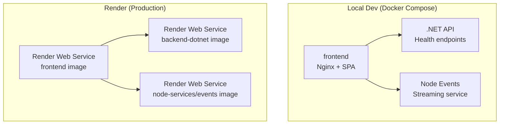
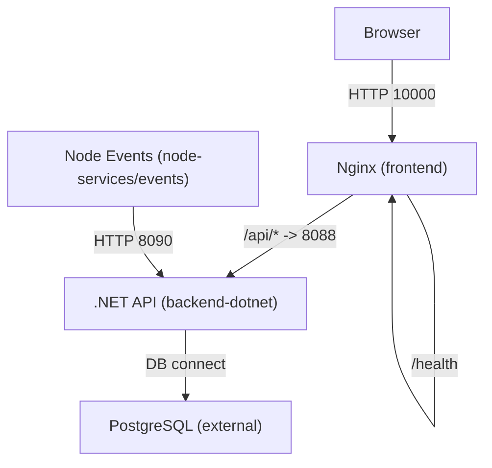
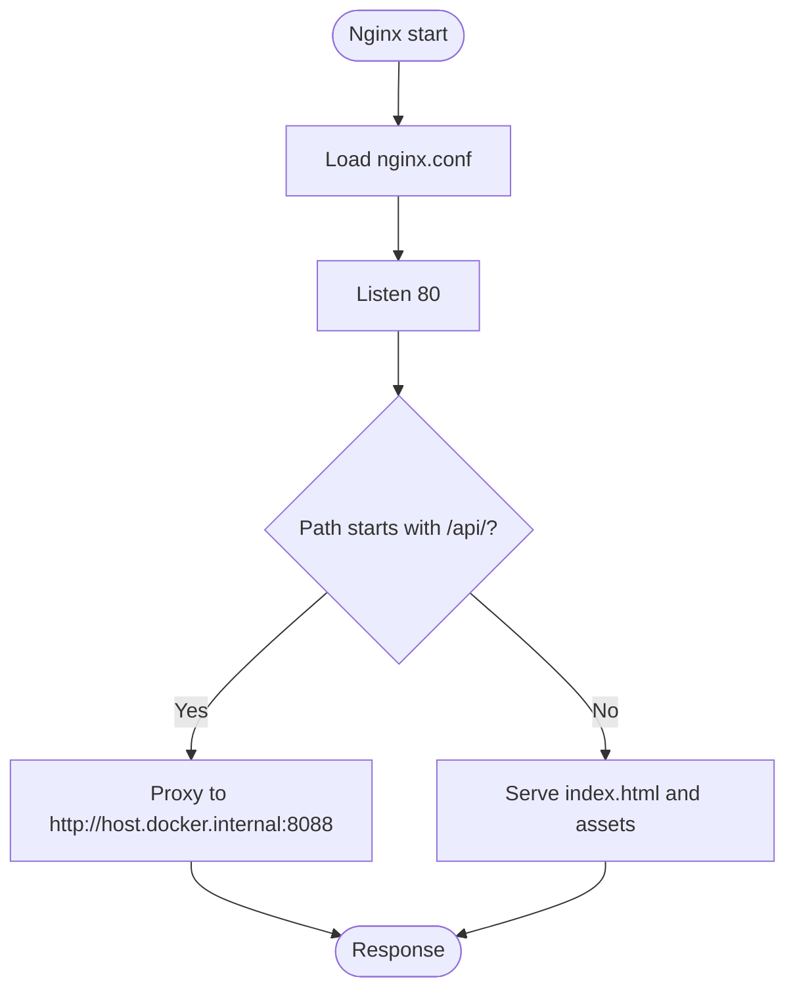
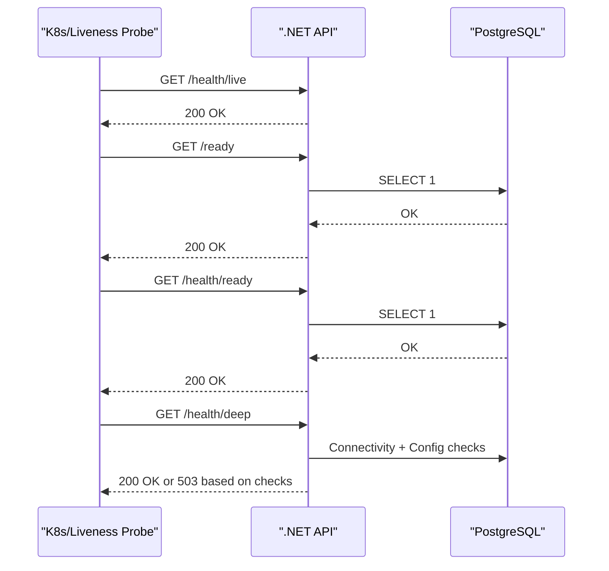
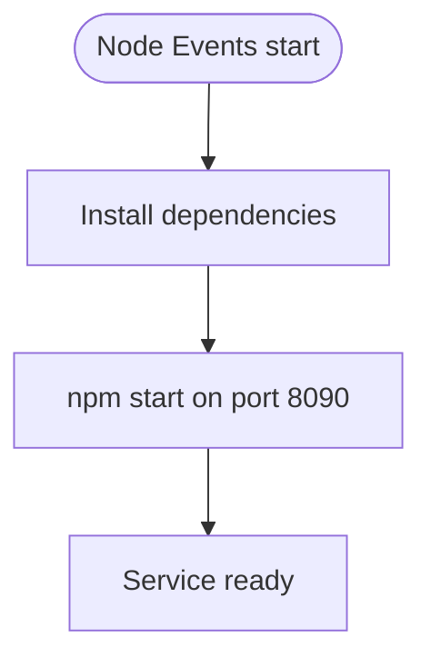
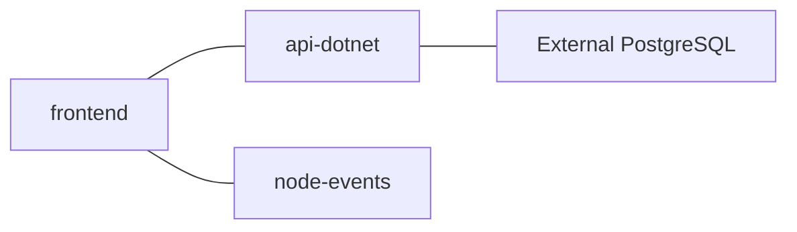
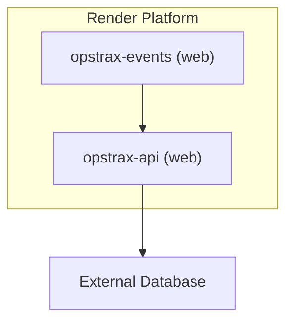
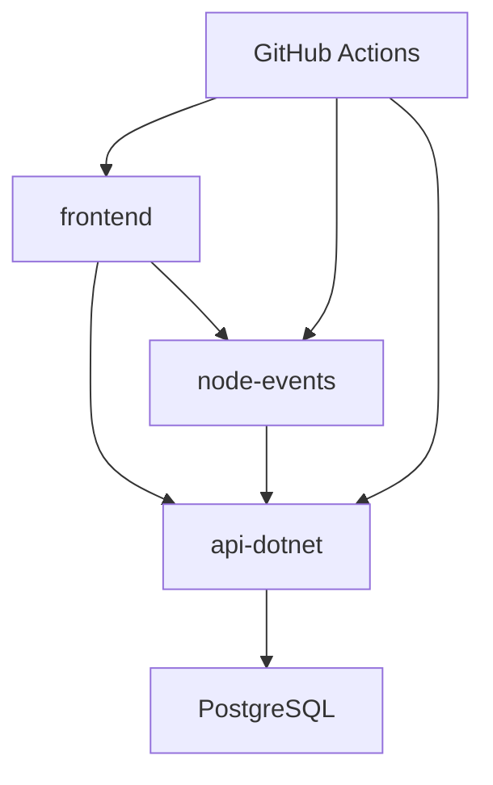
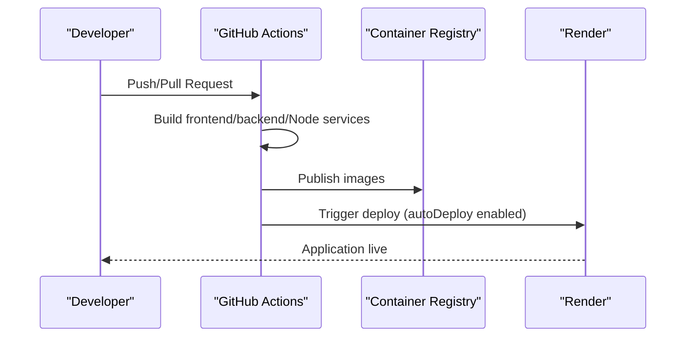

# Deployment Topology

<cite>
**Referenced Files in This Document**
- [docker-compose.yml](file://docker-compose.yml)
- [render.yaml](file://render.yaml)
- [Dockerfile](file://Dockerfile)
- [backend-dotnet/Dockerfile](file://backend-dotnet/Dockerfile)
- [frontend/Dockerfile](file://frontend/Dockerfile)
- [node-services/events/Dockerfile](file://node-services/events/Dockerfile)
- [services/node-events/Dockerfile](file://services/node-events/Dockerfile)
- [start-local.sh](file://start-local.sh)
- [stop-local.sh](file://stop-local.sh)
- [reset-local.sh](file://reset-local.sh)
- [run-tests.sh](file://run-tests.sh)
- [.github/workflows/ci.yml](file://.github/workflows/ci.yml)
- [frontend/nginx.conf](file://frontend/nginx.conf)
- [backend-dotnet/Program.cs](file://backend-dotnet/Program.cs)
- [backend-dotnet/Data/Database.cs](file://backend-dotnet/Data/Database.cs)
- [api-dotnet/Infrastructure/Database.cs](file://api-dotnet/Infrastructure/Database.cs)
- [db/init/001_schema.sql](file://db/init/001_schema.sql)
- [db/init/002_seed.sql](file://db/init/002_seed.sql)
</cite>

## Table of Contents
1. [Introduction](#introduction)
2. [Project Structure](#project-structure)
3. [Core Components](#core-components)
4. [Architecture Overview](#architecture-overview)
5. [Detailed Component Analysis](#detailed-component-analysis)
6. [Dependency Analysis](#dependency-analysis)
7. [Performance Considerations](#performance-considerations)
8. [Troubleshooting Guide](#troubleshooting-guide)
9. [Conclusion](#conclusion)
10. [Appendices](#appendices)

## Introduction
This document describes the OpsTrax deployment topology and containerization strategy. It explains how Docker Compose orchestrates local development and how Render deploys the production stack. It also covers service discovery, load balancing, reverse proxy configuration, container networking, volumes, environment variables, production deployment considerations, scaling, health checks, monitoring, disaster recovery, backup procedures, high availability, and deployment automation with CI/CD.

## Project Structure
The repository organizes the platform into three primary services:
- Frontend: Nginx-based static site serving the React SPA.
- API: .NET backend exposing REST endpoints and health checks.
- Node Events: Real-time events service for streaming updates.

Local orchestration is managed via Docker Compose, while production deployments target Render with Docker runtime. CI/CD is configured through GitHub Actions.

**Diagram sources**
- [docker-compose.yml:3-44](file://docker-compose.yml#L3-L44)
- [render.yaml:1-41](file://render.yaml#L1-L41)

**Section sources**
- [docker-compose.yml:1-45](file://docker-compose.yml#L1-L45)
- [render.yaml:1-41](file://render.yaml#L1-L41)

## Core Components
- Frontend service
  - Built from the frontend directory and served by Nginx.
  - Exposes port 80 inside the container; mapped to host port 10000 in Compose.
  - Reverse proxies API requests to the .NET API service.
- API service (.NET)
  - Multi-stage build publishing the application.
  - Exposes port 8080; health endpoints are registered at runtime.
  - Reads database connection string from environment variables.
- Node Events service (Node.js)
  - Minimal Alpine image with production dependencies installed.
  - Exposes port 8090; configured to forward to the .NET API for event coordination.

Environment variables and ports are defined per service in Compose and Render configuration files.

**Section sources**
- [frontend/Dockerfile:1-6](file://frontend/Dockerfile#L1-L6)
- [backend-dotnet/Dockerfile:1-13](file://backend-dotnet/Dockerfile#L1-L13)
- [node-services/events/Dockerfile:1-8](file://node-services/events/Dockerfile#L1-L8)
- [docker-compose.yml:4-44](file://docker-compose.yml#L4-L44)
- [render.yaml:10-40](file://render.yaml#L10-L40)

## Architecture Overview
The system comprises three containers orchestrated locally and deployed on Render. The frontend acts as the reverse proxy for API traffic and serves the SPA. The .NET API exposes health endpoints and database readiness checks. The Node Events service integrates with the API for real-time capabilities.

**Diagram sources**
- [docker-compose.yml:4-44](file://docker-compose.yml#L4-L44)
- [frontend/nginx.conf:12-19](file://frontend/nginx.conf#L12-L19)
- [backend-dotnet/Program.cs:257-378](file://backend-dotnet/Program.cs#L257-L378)

## Detailed Component Analysis

### Frontend Containerization and Reverse Proxy
- Build and runtime
  - Nginx base image with a custom configuration file.
  - Static assets are copied into the image and served on port 80.
- Reverse proxy
  - API requests under /api/ are proxied to the .NET API endpoint.
  - Headers are forwarded to preserve client context.
- Health endpoint
  - A synthetic /health endpoint returns a simple 200 response for container health checks.

**Diagram sources**
- [frontend/nginx.conf:1-31](file://frontend/nginx.conf#L1-L31)
- [frontend/Dockerfile:1-6](file://frontend/Dockerfile#L1-L6)

**Section sources**
- [frontend/nginx.conf:12-29](file://frontend/nginx.conf#L12-L29)
- [frontend/Dockerfile:1-6](file://frontend/Dockerfile#L1-L6)

### .NET API Containerization and Health Checks
- Build and runtime
  - Multi-stage Dockerfile publishes the application and runs it on ASP.NET Core runtime.
  - Exposes port 8080 in the container.
- Health endpoints
  - /health and /health/live always return success when the process is alive.
  - /ready and /health/ready validate database connectivity and return 503 when unavailable.
  - /health/deep performs comprehensive checks without exposing secrets.

**Diagram sources**
- [backend-dotnet/Program.cs:257-378](file://backend-dotnet/Program.cs#L257-L378)
- [backend-dotnet/Data/Database.cs:1-35](file://backend-dotnet/Data/Database.cs#L1-L35)

**Section sources**
- [backend-dotnet/Dockerfile:1-13](file://backend-dotnet/Dockerfile#L1-L13)
- [backend-dotnet/Program.cs:257-378](file://backend-dotnet/Program.cs#L257-L378)
- [backend-dotnet/Data/Database.cs:1-35](file://backend-dotnet/Data/Database.cs#L1-L35)

### Node Events Containerization
- Build and runtime
  - Minimal Node.js Alpine image with production dependencies installed.
  - Exposes port 8090 and starts the service via npm.
- Environment configuration
  - Port, API base URL, and CORS origin are configurable via environment variables.

**Diagram sources**
- [node-services/events/Dockerfile:1-8](file://node-services/events/Dockerfile#L1-L8)
- [services/node-events/Dockerfile:1-8](file://services/node-events/Dockerfile#L1-L8)

**Section sources**
- [node-services/events/Dockerfile:1-8](file://node-services/events/Dockerfile#L1-L8)
- [services/node-events/Dockerfile:1-8](file://services/node-events/Dockerfile#L1-L8)

### Local Orchestration with Docker Compose
- Services
  - frontend: Builds from frontend, sets Vite base URLs, maps port 10000, depends on API and Node Events.
  - api-dotnet: Builds from backend-dotnet, exposes 8088, reads database connection string from environment.
  - node-events: Builds from services/node-events, exposes 8090, forwards to API.
- Networking
  - Containers communicate using service names as hostnames within the Compose network.
- Environment variables
  - ASPNETCORE_URLS, ConnectionStrings__DefaultConnection, CORS origins, and Node Events variables are set per service.

**Diagram sources**
- [docker-compose.yml:3-44](file://docker-compose.yml#L3-L44)

**Section sources**
- [docker-compose.yml:3-44](file://docker-compose.yml#L3-L44)

### Production Deployment on Render
- Runtime and images
  - Two web services use Docker runtime: opstrax-api and opstrax-events.
  - Each service specifies root directory and Dockerfile path.
- Health checks
  - Both services define a health check path at /health.
- Environment variables
  - API service sets ASPNETCORE environment, URLs, port, and database connection string.
  - Events service sets CORS origin and MySQL connection parameters.

**Diagram sources**
- [render.yaml:1-41](file://render.yaml#L1-L41)

**Section sources**
- [render.yaml:1-41](file://render.yaml#L1-L41)

## Dependency Analysis
- Internal dependencies
  - Frontend depends on API for data and on Node Events for streaming.
  - API depends on the database for readiness and operational data.
  - Node Events depends on API for coordination.
- External dependencies
  - Database: PostgreSQL connection string is injected via environment variables.
  - CI/CD: GitHub Actions builds frontend, backend, and Node services.

**Diagram sources**
- [docker-compose.yml:13-43](file://docker-compose.yml#L13-L43)
- [.github/workflows/ci.yml:1-52](file://.github/workflows/ci.yml#L1-L52)

**Section sources**
- [docker-compose.yml:13-43](file://docker-compose.yml#L13-L43)
- [.github/workflows/ci.yml:1-52](file://.github/workflows/ci.yml#L1-L52)

## Performance Considerations
- Container sizing and resource limits
  - Configure CPU/memory requests/limits in production to prevent contention.
- Database connections
  - Pool size and timeouts should be tuned based on workload; monitor connection saturation.
- Reverse proxy tuning
  - Adjust Nginx worker processes and keepalive timeouts for concurrent clients.
- Caching and compression
  - Enable gzip/static caching in Nginx for SPA assets.
- Health probes
  - Liveness and readiness thresholds should balance fast recovery with stability.

[No sources needed since this section provides general guidance]

## Troubleshooting Guide
- Health checks
  - Verify /health/live returns 200 when the process is alive.
  - /ready and /health/ready should pass when the database is reachable.
  - /health/deep aggregates service and configuration checks; failures indicate misconfiguration.
- Database connectivity
  - Confirm the database connection string is present and reachable from the API container.
  - Use the readiness endpoint to detect connectivity issues.
- Reverse proxy routing
  - Ensure /api/ requests are being proxied to the correct API port.
  - Validate CORS settings for the frontend origin.
- Container logs
  - Inspect logs for the frontend, API, and Node Events containers for startup and runtime errors.

**Section sources**
- [backend-dotnet/Program.cs:257-378](file://backend-dotnet/Program.cs#L257-L378)
- [backend-dotnet/Data/Database.cs:1-35](file://backend-dotnet/Data/Database.cs#L1-L35)
- [frontend/nginx.conf:12-29](file://frontend/nginx.conf#L12-L29)

## Conclusion
OpsTrax employs a straightforward, container-first architecture with clear separation of concerns. Docker Compose enables local development with predictable networking and environment configuration, while Render provides a robust platform for production deployments. Health endpoints, CI/CD automation, and modular containerization support scalable, observable, and maintainable operations.

[No sources needed since this section summarizes without analyzing specific files]

## Appendices

### Container Networking and Ports
- frontend
  - Internal port 80; host port 10000 in Compose; reverse proxies /api/ to API service.
- api-dotnet
  - Internal port 8080; host port 8088 in Compose; health endpoints exposed.
- node-events
  - Internal port 8090; host port 8090 in Compose; forwards to API.

**Section sources**
- [docker-compose.yml:13-43](file://docker-compose.yml#L13-L43)
- [frontend/nginx.conf:12-19](file://frontend/nginx.conf#L12-L19)

### Volume Mounting
- Local development does not define explicit volumes in Compose; builds use context copying.
- For persistent data in production, mount volumes for databases and backups as part of infrastructure provisioning.

**Section sources**
- [docker-compose.yml:3-44](file://docker-compose.yml#L3-L44)

### Environment Variable Management
- Compose
  - API service reads the database connection string from an environment variable.
  - Frontend sets Vite base URLs for API and events endpoints.
  - Node Events sets port, API base URL, and CORS origin.
- Render
  - API service defines ASP.NET Core environment, URLs, port, and database connection string.
  - Events service defines CORS origin and MySQL connection parameters.

**Section sources**
- [docker-compose.yml:25-43](file://docker-compose.yml#L25-L43)
- [render.yaml:10-40](file://render.yaml#L10-L40)

### Scaling Strategies
- Horizontal scaling
  - Run multiple replicas of the API and Node Events services behind a load balancer.
  - Ensure stateless API design and externalized session storage if applicable.
- Database scaling
  - Use read replicas for reporting queries; separate write/read paths.
- Frontend
  - Serve static assets via CDN or Render’s global distribution for low latency.

[No sources needed since this section provides general guidance]

### Monitoring Setup
- Health endpoints
  - Use /health/live, /ready, and /health/ready for basic observability.
- Logs
  - Centralize container logs to a log aggregation platform.
- Metrics
  - Expose Prometheus metrics from the API and Node Events services.
- Tracing
  - Add distributed tracing for cross-service visibility.

**Section sources**
- [backend-dotnet/Program.cs:257-378](file://backend-dotnet/Program.cs#L257-L378)

### Disaster Recovery and Backups
- Database backups
  - Schedule regular logical backups of PostgreSQL; store offsite.
- Restore testing
  - Periodically validate restore procedures against backups.
- High availability
  - Deploy database in HA mode (replication or managed service).
- Secrets rotation
  - Rotate database credentials and re-deploy services with updated environment variables.

**Section sources**
- [db/init/001_schema.sql:1-263](file://db/init/001_schema.sql#L1-L263)
- [db/init/002_seed.sql:1-70](file://db/init/002_seed.sql#L1-L70)

### High Availability Configurations
- Render
  - Enable autoscaling and multiple instances for web services.
- Database
  - Use managed PostgreSQL with automatic failover and cross-zone replication.
- Frontend
  - Distribute static assets globally via CDN or Render’s edge network.

**Section sources**
- [render.yaml:1-41](file://render.yaml#L1-L41)

### Deployment Automation and CI/CD
- Local automation
  - Scripts to build, reset, and stop the environment streamline developer workflows.
- CI/CD
  - GitHub Actions builds frontend, backend, and Node services on push and PR.
- Release process
  - Tag releases and promote images to production via Render’s automated deployment.

**Diagram sources**
- [.github/workflows/ci.yml:1-52](file://.github/workflows/ci.yml#L1-L52)
- [render.yaml:8-9](file://render.yaml#L8-L9)

**Section sources**
- [start-local.sh:1-15](file://start-local.sh#L1-L15)
- [reset-local.sh:1-11](file://reset-local.sh#L1-L11)
- [stop-local.sh:1-4](file://stop-local.sh#L1-L4)
- [run-tests.sh:1-88](file://run-tests.sh#L1-L88)
- [.github/workflows/ci.yml:1-52](file://.github/workflows/ci.yml#L1-L52)
- [render.yaml:8-9](file://render.yaml#L8-L9)