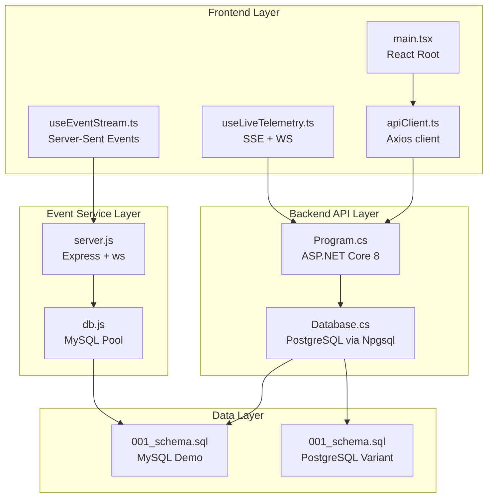
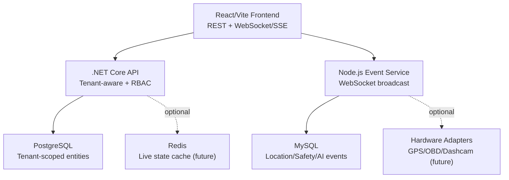
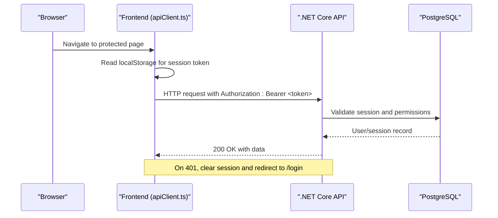
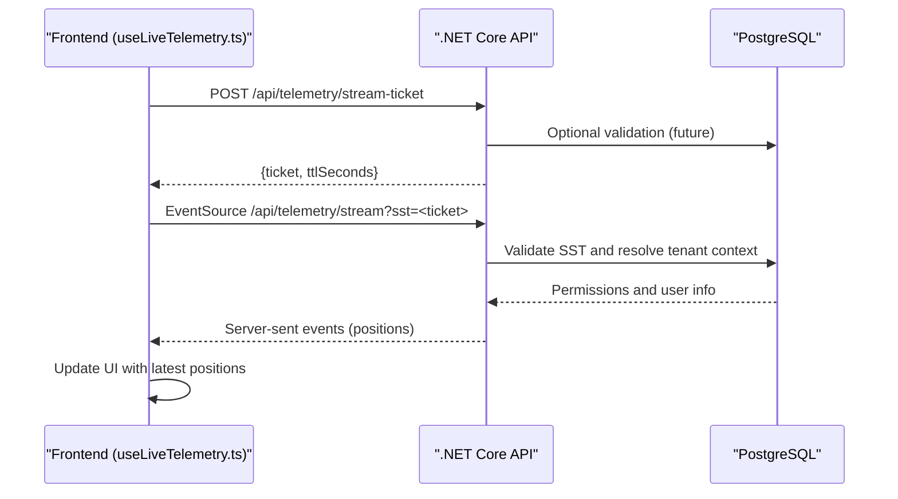
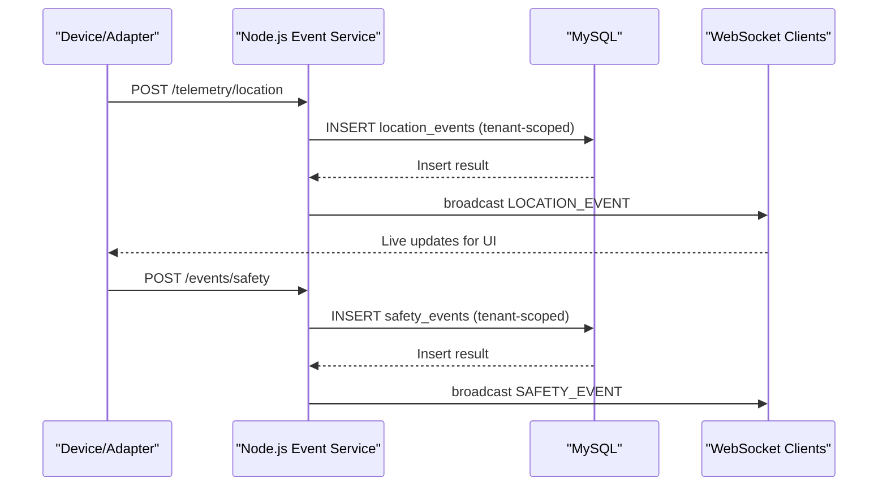
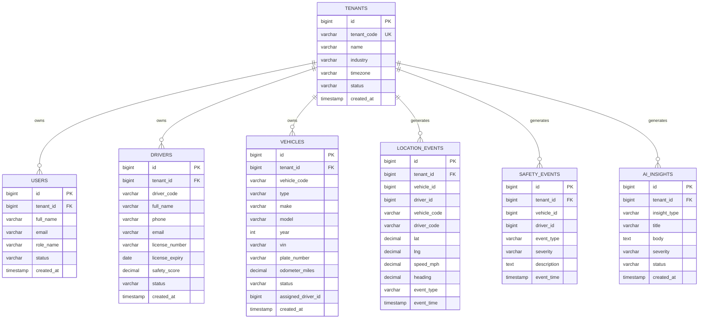
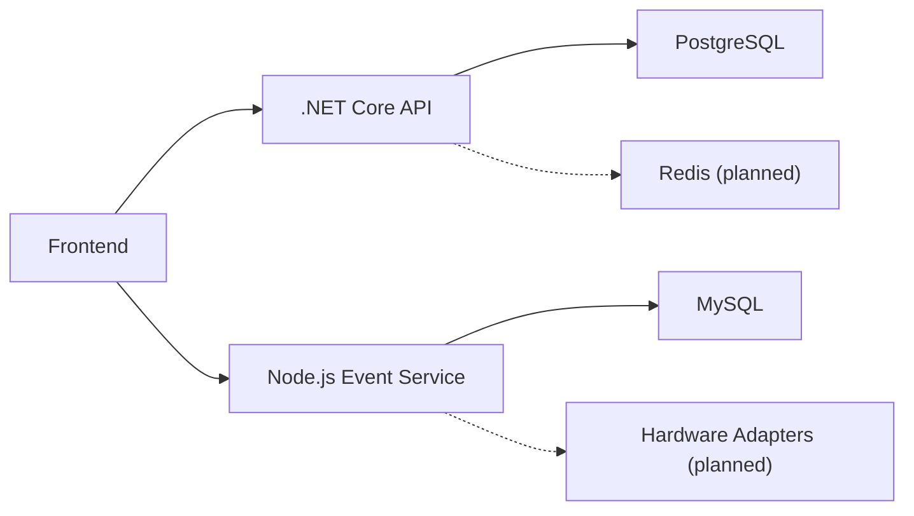
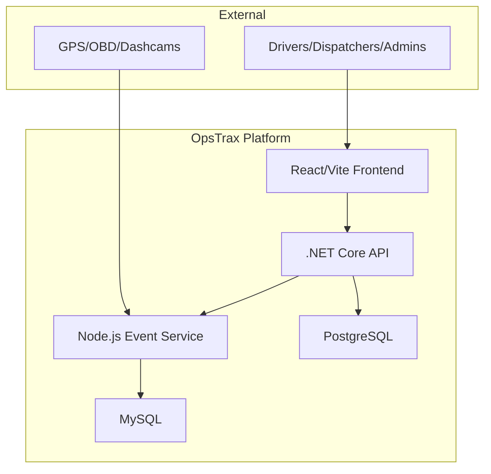

# Logical Architecture

<cite>
**Referenced Files in This Document**
- [README.md](file://README.md)
- [ARCHITECTURE.md](file://docs/ARCHITECTURE.md)
- [main.tsx](file://frontend/src/main.tsx)
- [apiClient.ts](file://frontend/src/services/apiClient.ts)
- [useLiveTelemetry.ts](file://frontend/src/hooks/useLiveTelemetry.ts)
- [useEventStream.ts](file://frontend/src/hooks/useEventStream.ts)
- [package.json](file://frontend/package.json)
- [server.ts](file://backend/src/server.ts)
- [package.json](file://backend/package.json)
- [Program.cs](file://backend-dotnet/Program.cs)
- [Database.cs](file://backend-dotnet/Data/Database.cs)
- [Opstrax.Api.csproj](file://backend-dotnet/Opstrax.Api.csproj)
- [server.js](file://node-services/events/src/server.js)
- [db.js](file://node-services/events/src/db.js)
- [package.json](file://node-services/events/package.json)
- [001_schema.sql](file://db/init/001_schema.sql)
- [001_schema.sql](file://database/init/001_schema.sql)
- [tenantConfig.service.ts](file://backend/src/modules/tenant-config/tenantConfig.service.ts)
</cite>

## Table of Contents
1. [Introduction](#introduction)
2. [Project Structure](#project-structure)
3. [Core Components](#core-components)
4. [Architecture Overview](#architecture-overview)
5. [Detailed Component Analysis](#detailed-component-analysis)
6. [Dependency Analysis](#dependency-analysis)
7. [Performance Considerations](#performance-considerations)
8. [Troubleshooting Guide](#troubleshooting-guide)
9. [Conclusion](#conclusion)
10. [Appendices](#appendices)

## Introduction
This document describes the logical architecture of OpsTrax, an enterprise-grade transport management solution. It explains the layered architecture spanning a React/Vite frontend, a .NET Core API, a Node.js event service, and a MySQL database. It documents service responsibilities, communication patterns, multi-tenancy design, and planned enhancements such as JWT authentication, Redis caching, event streaming, and hardware integrations. It also outlines scalability considerations and future expansion plans.

## Project Structure
The repository is organized into distinct layers and services:
- Frontend: React 19 with Vite, TypeScript, Tailwind CSS, TanStack Query, and React Router
- .NET Core API: ASP.NET Core 8 Minimal API exposing 200+ endpoints, RBAC, and tenant-aware data access
- Node.js Event Service: Express + ws WebSocket server for telemetry and event broadcasting
- Database: MySQL 8.4 (with seed/demo data) and a PostgreSQL schema variant
- Supporting services: Dockerized composition, Nginx reverse proxy, and CI/CD pipeline

**Diagram sources**
- [main.tsx:1-35](file://frontend/src/main.tsx#L1-L35)
- [apiClient.ts:1-79](file://frontend/src/services/apiClient.ts#L1-L79)
- [useLiveTelemetry.ts:1-169](file://frontend/src/hooks/useLiveTelemetry.ts#L1-L169)
- [useEventStream.ts:1-23](file://frontend/src/hooks/useEventStream.ts#L1-L23)
- [Program.cs:1-452](file://backend-dotnet/Program.cs#L1-L452)
- [Database.cs:1-86](file://backend-dotnet/Data/Database.cs#L1-L86)
- [server.js:1-154](file://node-services/events/src/server.js#L1-L154)
- [db.js:1-35](file://node-services/events/src/db.js#L1-L35)
- [001_schema.sql:1-263](file://db/init/001_schema.sql#L1-L263)
- [001_schema.sql:1-800](file://database/init/001_schema.sql#L1-L800)

**Section sources**
- [README.md:117-142](file://README.md#L117-L142)
- [ARCHITECTURE.md:9-23](file://docs/ARCHITECTURE.md#L9-L23)

## Core Components
- React/Vite Frontend
  - Provides enterprise command center UI, module navigation, dashboards, live map placeholders, AI insights panel, and data tables.
  - Uses Axios for REST calls, TanStack Query for caching and re-fetching, and React Router for navigation.
  - Implements CSRF protection and session-based auth via local storage.

- .NET Core API
  - Minimal API surface with 200+ endpoints, CORS, CSRF middleware, and rate limiting.
  - Tenant-aware data access and RBAC enforcement via session tokens.
  - Health/ready/deep probes, schema bootstrapping, and hosted background services.

- Node.js Event Service
  - Exposes REST endpoints for telemetry ingestion and event broadcasting over WebSocket.
  - Generates AI insights and broadcasts them to clients.
  - Supports tenant scoping and vehicle/driver resolution.

- MySQL Database
  - Multi-tenant schema with tenants, users, drivers, vehicles, jobs, routes, location events, safety events, AI insights, and audit logs.
  - Includes a PostgreSQL schema variant with JSONB and timestamptz for advanced features.

**Section sources**
- [ARCHITECTURE.md:25-56](file://docs/ARCHITECTURE.md#L25-L56)
- [README.md:24-34](file://README.md#L24-L34)
- [frontend/package.json:1-42](file://frontend/package.json#L1-L42)
- [backend/package.json:1-39](file://backend/package.json#L1-L39)
- [Opstrax.Api.csproj:1-17](file://backend-dotnet/Opstrax.Api.csproj#L1-L17)
- [Program.cs:55-103](file://backend-dotnet/Program.cs#L55-L103)
- [server.js:34-148](file://node-services/events/src/server.js#L34-L148)
- [001_schema.sql:4-263](file://db/init/001_schema.sql#L4-L263)

## Architecture Overview
The logical architecture separates concerns across layers:
- Frontend communicates with the .NET Core API over HTTP and with the Node.js Event Service over WebSocket/SSE.
- The .NET Core API interacts with PostgreSQL via Npgsql and exposes tenant-aware endpoints.
- The Node.js Event Service ingests telemetry and events into MySQL and broadcasts updates to clients.
- The database supports multi-tenancy with tenant-scoped entities and event streams.

**Diagram sources**
- [README.md:117-142](file://README.md#L117-L142)
- [Program.cs:101-103](file://backend-dotnet/Program.cs#L101-L103)
- [server.js:21-28](file://node-services/events/src/server.js#L21-L28)
- [001_schema.sql:126-238](file://db/init/001_schema.sql#L126-L238)

## Detailed Component Analysis

### Frontend Authentication and Session Flow
The frontend manages session tokens and CSRF tokens, sending Authorization headers and X-CSRF-Token for state-changing requests. On 401, it clears sessions and redirects to login.

**Diagram sources**
- [apiClient.ts:21-72](file://frontend/src/services/apiClient.ts#L21-L72)
- [Program.cs:182-244](file://backend-dotnet/Program.cs#L182-L244)

**Section sources**
- [apiClient.ts:1-79](file://frontend/src/services/apiClient.ts#L1-L79)
- [Program.cs:182-244](file://backend-dotnet/Program.cs#L182-L244)

### Live Telemetry Streaming (SSE + Ticketing)
The frontend obtains a short-lived stream ticket (SST) from the API and opens an EventSource connection with the SST query parameter. The API validates the SST and injects tenant-scoped context into the request pipeline.

**Diagram sources**
- [useLiveTelemetry.ts:60-123](file://frontend/src/hooks/useLiveTelemetry.ts#L60-L123)
- [Program.cs:149-172](file://backend-dotnet/Program.cs#L149-L172)

**Section sources**
- [useLiveTelemetry.ts:1-169](file://frontend/src/hooks/useLiveTelemetry.ts#L1-L169)
- [Program.cs:149-172](file://backend-dotnet/Program.cs#L149-L172)

### Node.js Event Service Telemetry Ingestion and Broadcasting
The Node.js service accepts telemetry and safety events, resolves tenant/vehicle/driver identifiers, persists to MySQL, and broadcasts via WebSocket.

**Diagram sources**
- [server.js:34-113](file://node-services/events/src/server.js#L34-L113)
- [db.js:14-34](file://node-services/events/src/db.js#L14-L34)
- [001_schema.sql:126-201](file://db/init/001_schema.sql#L126-L201)

**Section sources**
- [server.js:34-148](file://node-services/events/src/server.js#L34-L148)
- [db.js:1-35](file://node-services/events/src/db.js#L1-L35)
- [001_schema.sql:126-201](file://db/init/001_schema.sql#L126-L201)

### Multi-Tenant Design Principles
Multi-tenancy is enforced by:
- Tenant-scoped tables with tenant_id/company_id foreign keys
- Tenant resolution in the Node.js service via tenant_code
- Tenant-aware queries and RBAC in the .NET Core API
- Tenant runtime configuration building in the backend

**Diagram sources**
- [001_schema.sql:4-263](file://db/init/001_schema.sql#L4-L263)

**Section sources**
- [001_schema.sql:4-263](file://db/init/001_schema.sql#L4-L263)
- [tenantConfig.service.ts:25-64](file://backend/src/modules/tenant-config/tenantConfig.service.ts#L25-L64)
- [server.js:51-52](file://node-services/events/src/server.js#L51-L52)

### Planned Enhancements and Future Expansion
- Authentication: JWT + refresh tokens with tenant resolution from claims
- Caching: Redis for live vehicle state and hot-path reads
- Event Streaming: Queue/event bus (e.g., RabbitMQ/Kafka/Azure Service Bus)
- Storage: Object storage for media/documents
- Mobile: React Native driver app
- Maps: Mapbox/Google Maps integration
- Hardware: GPS/OBD/dashcam adapters
- AI: Dedicated AI service with vector search and audit-safe prompt logging
- DevOps: CI/CD with environment promotion

**Section sources**
- [ARCHITECTURE.md:57-69](file://docs/ARCHITECTURE.md#L57-L69)
- [README.md:117-142](file://README.md#L117-L142)

## Dependency Analysis
High-level dependencies and coupling:
- Frontend depends on .NET Core API for REST and Node.js Event Service for real-time updates
- .NET Core API depends on PostgreSQL for persistence and hosted services for background tasks
- Node.js Event Service depends on MySQL for event storage and ws for broadcasting
- Tenant configuration logic in the backend composes country, industry, and device module mappings

**Diagram sources**
- [apiClient.ts:5-12](file://frontend/src/services/apiClient.ts#L5-L12)
- [Program.cs:14-15](file://backend-dotnet/Program.cs#L14-L15)
- [server.js:1-11](file://node-services/events/src/server.js#L1-L11)
- [001_schema.sql:1-20](file://db/init/001_schema.sql#L1-L20)

**Section sources**
- [apiClient.ts:1-79](file://frontend/src/services/apiClient.ts#L1-L79)
- [Program.cs:14-15](file://backend-dotnet/Program.cs#L14-L15)
- [server.js:1-11](file://node-services/events/src/server.js#L1-L11)
- [tenantConfig.service.ts:17-23](file://backend/src/modules/tenant-config/tenantConfig.service.ts#L17-L23)

## Performance Considerations
- Frontend caching: TanStack Query configured with retry and controlled refetch behavior
- API rate limiting: Per-IP sliding window with 240 requests per minute
- Database indexing: Tenant/time indexes on location events; composite indexes on vehicles/drivers/customers
- Streaming: Short-lived stream tickets (SST) reduce exposure and improve security
- Scalability: Horizontal scaling of API and Node services behind a reverse proxy; Redis caching and event streaming to offload DB pressure

[No sources needed since this section provides general guidance]

## Troubleshooting Guide
- Unauthorized requests: Verify Authorization header presence and validity; ensure session is not expired
- Stream ticket errors: Confirm SST issuance endpoint availability and ticket TTL; ensure query string uses SST instead of session tokens
- Health probes: Use /health/live, /health/ready, and /health/deep to diagnose service and DB connectivity
- CORS issues: Confirm allowed origins and credentials policy in API middleware
- Node.js event ingestion: Validate tenant code resolution and vehicle/driver lookup; inspect WebSocket broadcast logs

**Section sources**
- [Program.cs:101-103](file://backend-dotnet/Program.cs#L101-L103)
- [Program.cs:138-144](file://backend-dotnet/Program.cs#L138-L144)
- [useLiveTelemetry.ts:108-123](file://frontend/src/hooks/useLiveTelemetry.ts#L108-L123)
- [server.js:34-81](file://node-services/events/src/server.js#L34-L81)

## Conclusion
OpsTrax employs a clean layered architecture with explicit separation of concerns. The React/Vite frontend integrates with a .NET Core API secured by session-based RBAC and tenant-aware data access, while a Node.js Event Service handles real-time telemetry and event broadcasting. The database supports multi-tenancy with tenant-scoped entities and indexes optimized for common SaaS access patterns. Planned enhancements around JWT, Redis, event streaming, and hardware integrations position the platform for secure, scalable growth.

[No sources needed since this section summarizes without analyzing specific files]

## Appendices

### System Context Diagram

**Diagram sources**
- [README.md:117-142](file://README.md#L117-L142)
- [Program.cs:101-103](file://backend-dotnet/Program.cs#L101-L103)
- [server.js:21-28](file://node-services/events/src/server.js#L21-L28)
- [001_schema.sql:1-20](file://db/init/001_schema.sql#L1-L20)