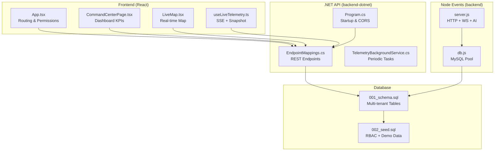
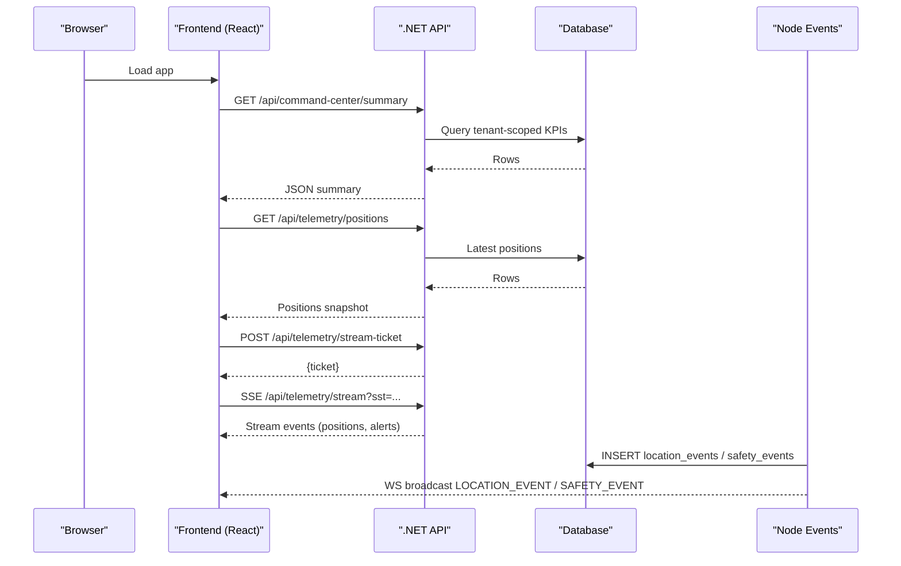
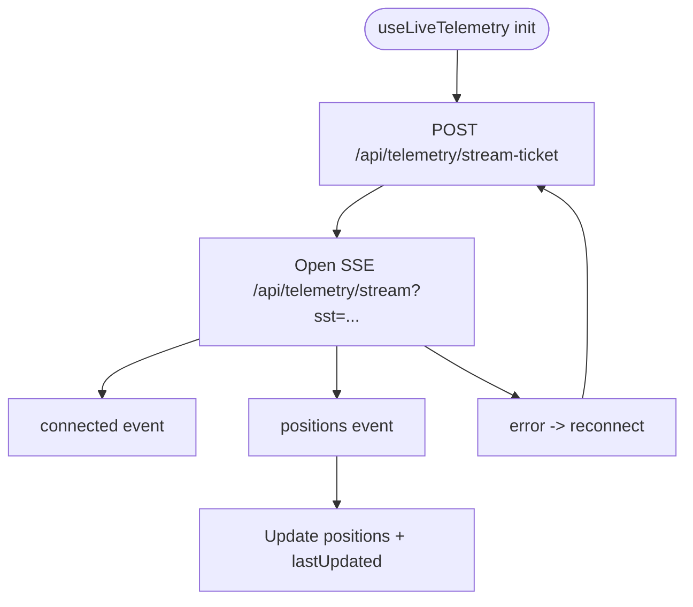
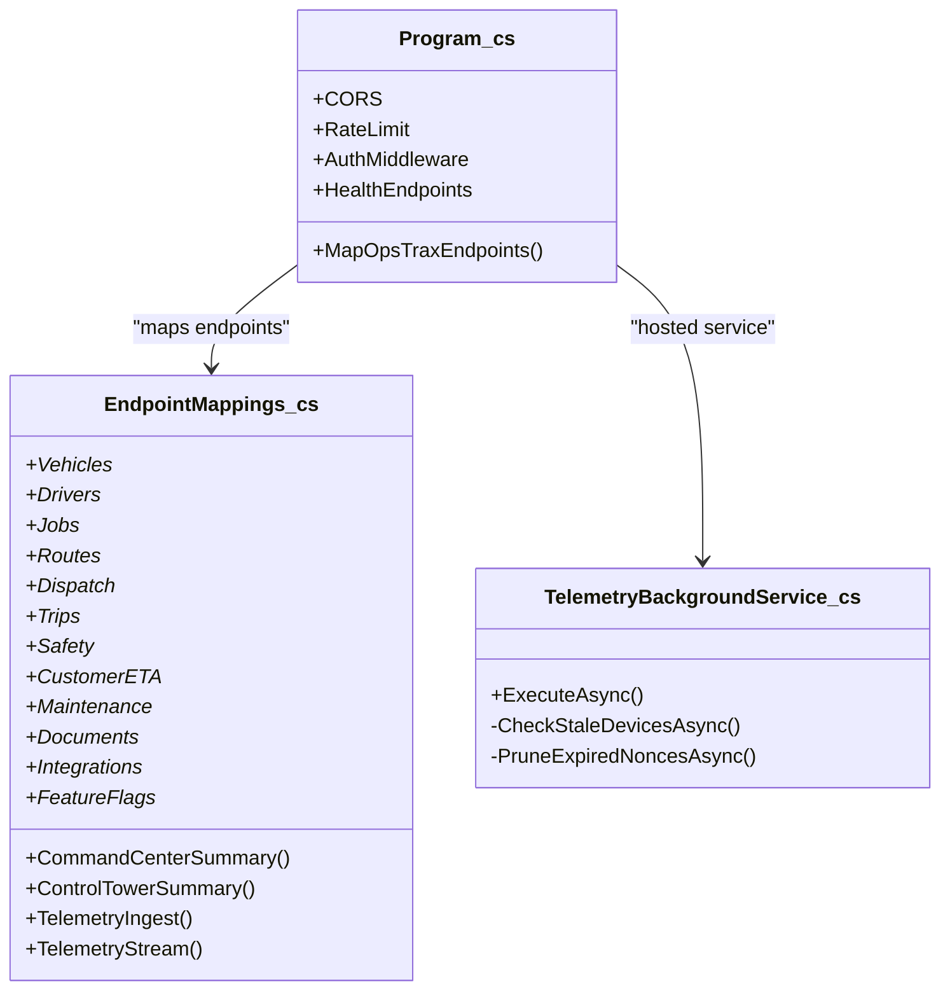
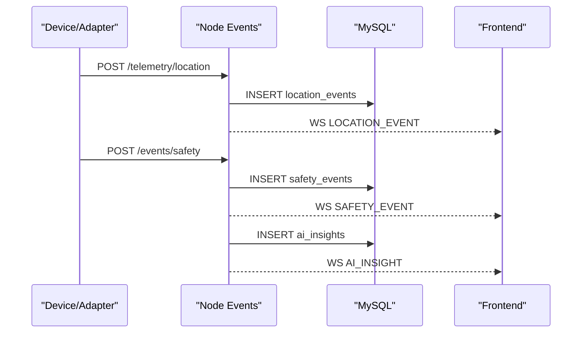
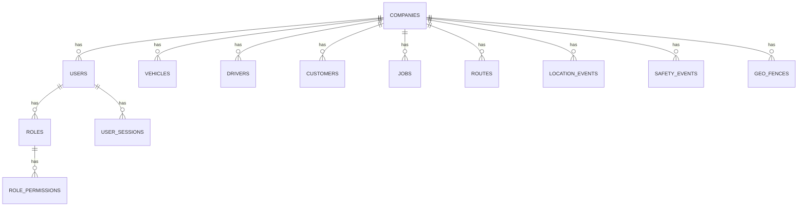
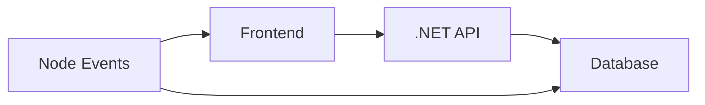

# Service Responsibilities

<cite>
**Referenced Files in This Document**
- [App.tsx](file://frontend/src/App.tsx)
- [moduleConfig.ts](file://frontend/src/modules/moduleConfig.ts)
- [CommandCenterPage.tsx](file://frontend/src/pages/CommandCenterPage.tsx)
- [LiveMap.tsx](file://frontend/src/components/LiveMap.tsx)
- [useLiveTelemetry.ts](file://frontend/src/hooks/useLiveTelemetry.ts)
- [commandCenterApi.ts](file://frontend/src/services/commandCenterApi.ts)
- [app.ts](file://backend/src/app.ts)
- [Program.cs](file://backend-dotnet/Program.cs)
- [EndpointMappings.cs](file://backend-dotnet/Controllers/EndpointMappings.cs)
- [TelemetryBackgroundService.cs](file://backend-dotnet/Services/TelemetryBackgroundService.cs)
- [TelemetryHmacHelper.cs](file://backend-dotnet/TelemetryHmacHelper.cs)
- [server.js](file://node-services/events/src/server.js)
- [db.js](file://node-services/events/src/db.js)
- [001_schema.sql](file://database/init/001_schema.sql)
- [002_seed.sql](file://database/init/002_seed.sql)
</cite>

## Table of Contents
1. [Introduction](#introduction)
2. [Project Structure](#project-structure)
3. [Core Components](#core-components)
4. [Architecture Overview](#architecture-overview)
5. [Detailed Component Analysis](#detailed-component-analysis)
6. [Dependency Analysis](#dependency-analysis)
7. [Performance Considerations](#performance-considerations)
8. [Troubleshooting Guide](#troubleshooting-guide)
9. [Conclusion](#conclusion)

## Introduction
This document defines service responsibilities across OpsTrax components, focusing on:
- React frontend: command center UI, module navigation, dashboard KPIs, and live map capabilities
- .NET Core API: core business APIs, tenant-aware data access, and operational modules
- Node.js event service: telemetry ingestion, WebSocket broadcasting, and AI workflow processing
- MySQL database: multi-tenant data storage and extensible schema design
It also specifies service boundaries and inter-service communication protocols.

## Project Structure
The repository is organized into four primary runtime services plus shared database assets:
- frontend: React SPA with routing, module-driven navigation, and live telemetry integration
- backend-dotnet: .NET 8 Web API implementing RBAC, tenant scoping, and operational endpoints
- backend: Node.js Express service for telemetry ingestion, WebSocket broadcasting, and AI insights
- database: PostgreSQL schema and seed data supporting multi-tenant operations

**Diagram sources**
- [App.tsx:124-322](file://frontend/src/App.tsx#L124-L322)
- [Program.cs:10-120](file://backend-dotnet/Program.cs#L10-L120)
- [EndpointMappings.cs:19-80](file://backend-dotnet/Controllers/EndpointMappings.cs#L19-L80)
- [TelemetryBackgroundService.cs:17-44](file://backend-dotnet/Services/TelemetryBackgroundService.cs#L17-L44)
- [server.js:17-32](file://node-services/events/src/server.js#L17-L32)
- [db.js:3-12](file://node-services/events/src/db.js#L3-L12)
- [001_schema.sql:4-120](file://database/init/001_schema.sql#L4-L120)
- [002_seed.sql:28-45](file://database/init/002_seed.sql#L28-L45)

**Section sources**
- [App.tsx:119-322](file://frontend/src/App.tsx#L119-L322)
- [moduleConfig.ts:52-134](file://frontend/src/modules/moduleConfig.ts#L52-L134)
- [Program.cs:10-120](file://backend-dotnet/Program.cs#L10-L120)
- [EndpointMappings.cs:19-80](file://backend-dotnet/Controllers/EndpointMappings.cs#L19-L80)
- [server.js:17-32](file://node-services/events/src/server.js#L17-L32)
- [db.js:3-12](file://node-services/events/src/db.js#L3-L12)
- [001_schema.sql:4-120](file://database/init/001_schema.sql#L4-L120)
- [002_seed.sql:28-45](file://database/init/002_seed.sql#L28-L45)

## Core Components
- Frontend React
  - Routing and permission gating define module access and landing routes
  - Command Center page aggregates KPIs, fleet status, exception queue, and charts
  - LiveMap renders real-time vehicle positions and geofences
  - useLiveTelemetry integrates with .NET SSE stream and snapshot endpoint
- .NET Core API
  - Centralized startup, CORS, rate limiting, and middleware
  - EndpointMappings.cs defines all REST endpoints grouped by operational domains
  - TelemetryBackgroundService performs periodic tasks (stale device detection, nonce pruning)
  - TelemetryHmacHelper validates device-signed ingest requests
- Node.js Event Service
  - HTTP endpoints for telemetry ingestion and AI insights
  - WebSocket broadcast for live updates
  - MySQL-backed persistence for events and insights
- Database
  - Multi-tenant schema with tenant scoping and RBAC tables
  - Seed data populates roles, permissions, and demo entities

**Section sources**
- [App.tsx:119-322](file://frontend/src/App.tsx#L119-L322)
- [CommandCenterPage.tsx:49-195](file://frontend/src/pages/CommandCenterPage.tsx#L49-L195)
- [LiveMap.tsx:78-201](file://frontend/src/components/LiveMap.tsx#L78-L201)
- [useLiveTelemetry.ts:71-169](file://frontend/src/hooks/useLiveTelemetry.ts#L71-L169)
- [Program.cs:65-120](file://backend-dotnet/Program.cs#L65-L120)
- [EndpointMappings.cs:19-80](file://backend-dotnet/Controllers/EndpointMappings.cs#L19-L80)
- [TelemetryBackgroundService.cs:17-44](file://backend-dotnet/Services/TelemetryBackgroundService.cs#L17-L44)
- [TelemetryHmacHelper.cs:5-32](file://backend-dotnet/TelemetryHmacHelper.cs#L5-L32)
- [server.js:34-81](file://node-services/events/src/server.js#L34-L81)
- [db.js:14-34](file://node-services/events/src/db.js#L14-L34)
- [001_schema.sql:4-120](file://database/init/001_schema.sql#L4-L120)
- [002_seed.sql:28-45](file://database/init/002_seed.sql#L28-L45)

## Architecture Overview
OpsTrax employs a distributed architecture:
- Frontend consumes .NET REST endpoints and subscribes to telemetry via SSE
- Node.js service ingests device telemetry, persists events, and broadcasts updates
- Database stores multi-tenant entities, operational events, and RBAC metadata
- Inter-service communication:
  - Frontend ↔ .NET API: HTTPS REST + SSE
  - Node Events ↔ Database: MySQL
  - Node Events ↔ Frontend: WebSocket

**Diagram sources**
- [CommandCenterPage.tsx:50-54](file://frontend/src/pages/CommandCenterPage.tsx#L50-L54)
- [useLiveTelemetry.ts:78-123](file://frontend/src/hooks/useLiveTelemetry.ts#L78-L123)
- [EndpointMappings.cs:31-66](file://backend-dotnet/Controllers/EndpointMappings.cs#L31-L66)
- [server.js:34-81](file://node-services/events/src/server.js#L34-L81)

**Section sources**
- [CommandCenterPage.tsx:49-195](file://frontend/src/pages/CommandCenterPage.tsx#L49-L195)
- [useLiveTelemetry.ts:71-169](file://frontend/src/hooks/useLiveTelemetry.ts#L71-L169)
- [EndpointMappings.cs:31-66](file://backend-dotnet/Controllers/EndpointMappings.cs#L31-L66)
- [server.js:34-81](file://node-services/events/src/server.js#L34-L81)

## Detailed Component Analysis

### React Frontend Responsibilities
- Navigation and Permission Gating
  - App.tsx defines routes and permission-based protection for modules
  - Landing route selection depends on user permissions
- Command Center UI
  - CommandCenterPage.tsx fetches summary data and renders KPIs, fleet status, exception queue, and charts
  - Uses commandCenterApi to call /api/command-center/summary
- Live Map
  - LiveMap.tsx renders vehicle positions and geofences using Leaflet
  - Handles demo coordinates fallback when live data is unavailable
- Live Telemetry Integration
  - useLiveTelemetry.ts manages:
    - Snapshot retrieval via GET /api/telemetry/positions
    - Short-lived stream ticket via POST /api/telemetry/stream-ticket
    - SSE subscription to /api/telemetry/stream with ?sst=
    - Automatic renewal of stream tickets

**Diagram sources**
- [useLiveTelemetry.ts:108-151](file://frontend/src/hooks/useLiveTelemetry.ts#L108-L151)

**Section sources**
- [App.tsx:119-322](file://frontend/src/App.tsx#L119-L322)
- [moduleConfig.ts:52-134](file://frontend/src/modules/moduleConfig.ts#L52-L134)
- [CommandCenterPage.tsx:49-195](file://frontend/src/pages/CommandCenterPage.tsx#L49-L195)
- [LiveMap.tsx:78-201](file://frontend/src/components/LiveMap.tsx#L78-L201)
- [useLiveTelemetry.ts:71-169](file://frontend/src/hooks/useLiveTelemetry.ts#L71-L169)
- [commandCenterApi.ts:1-9](file://frontend/src/services/commandCenterApi.ts#L1-L9)

### .NET Core API Responsibilities
- Startup and Security
  - Program.cs configures CORS, rate limiting, middleware, and health endpoints
  - Authentication middleware validates bearer tokens and injects tenant/session context
- Endpoint Coverage
  - EndpointMappings.cs maps core business APIs:
    - Command Center and Control Tower summaries
    - Vehicles, Drivers, Jobs, Routes, Dispatch, Trips
    - Telemetry ingestion, streaming, metrics, alerts, rules
    - Safety events, driver scores, coaching, rules
    - Customer ETA, visibility, communications
    - Fleet utilization, maintenance, DVIR, documents
    - Integrations, feature flags, owners, service history
- Telemetry Background Processing
  - TelemetryBackgroundService periodically detects stale devices and prunes nonces

**Diagram sources**
- [Program.cs:55-120](file://backend-dotnet/Program.cs#L55-L120)
- [EndpointMappings.cs:19-80](file://backend-dotnet/Controllers/EndpointMappings.cs#L19-L80)
- [TelemetryBackgroundService.cs:17-44](file://backend-dotnet/Services/TelemetryBackgroundService.cs#L17-L44)

**Section sources**
- [Program.cs:65-120](file://backend-dotnet/Program.cs#L65-L120)
- [EndpointMappings.cs:19-80](file://backend-dotnet/Controllers/EndpointMappings.cs#L19-L80)
- [TelemetryBackgroundService.cs:17-44](file://backend-dotnet/Services/TelemetryBackgroundService.cs#L17-L44)

### Node.js Event Service Responsibilities
- Telemetry Ingestion
  - POST /telemetry/location accepts vehicle and driver identifiers, validates tenant, and persists location events
- Safety Events
  - POST /events/safety persists safety events and broadcasts updates
- AI Workflow
  - POST /ai/generate-daily-brief computes insights and publishes AI_INSIGHT events
- WebSocket Broadcasting
  - WebSocket server broadcasts LOCATION_EVENT and SAFETY_EVENT to clients
- Persistence
  - db.js connects to MySQL and resolves tenant/vehicle/driver IDs

**Diagram sources**
- [server.js:34-81](file://node-services/events/src/server.js#L34-L81)
- [server.js:83-113](file://node-services/events/src/server.js#L83-L113)
- [server.js:115-148](file://node-services/events/src/server.js#L115-L148)
- [db.js:14-34](file://node-services/events/src/db.js#L14-L34)

**Section sources**
- [server.js:34-81](file://node-services/events/src/server.js#L34-L81)
- [server.js:83-113](file://node-services/events/src/server.js#L83-L113)
- [server.js:115-148](file://node-services/events/src/server.js#L115-L148)
- [db.js:14-34](file://node-services/events/src/db.js#L14-L34)

### Database Responsibilities
- Multi-Tenant Design
  - Entities include company_id for tenant isolation
  - RBAC tables (roles, permissions, role_permissions, user_sessions) enable fine-grained access
- Operational Data
  - Tables for vehicles, drivers, jobs, routes, trips, location_events, safety_events, geofences, etc.
- Extensibility
  - JSONB fields and module_records support dynamic metadata and feature flags
- Seed Data
  - 002_seed.sql initializes companies, roles, permissions, and demo entities

**Diagram sources**
- [001_schema.sql:4-120](file://database/init/001_schema.sql#L4-L120)
- [001_schema.sql:653-680](file://database/init/001_schema.sql#L653-L680)
- [002_seed.sql:28-45](file://database/init/002_seed.sql#L28-L45)

**Section sources**
- [001_schema.sql:4-120](file://database/init/001_schema.sql#L4-L120)
- [001_schema.sql:653-680](file://database/init/001_schema.sql#L653-L680)
- [002_seed.sql:28-45](file://database/init/002_seed.sql#L28-L45)

## Dependency Analysis
- Frontend depends on .NET API for:
  - Command center KPIs and summaries
  - Telemetry positions and SSE stream
- Node Events depends on:
  - MySQL for event persistence
  - Frontend via WebSocket for live updates
- .NET API depends on:
  - Database for tenant-scoped queries and RBAC
  - TelemetryBackgroundService for periodic tasks

**Diagram sources**
- [App.tsx:119-322](file://frontend/src/App.tsx#L119-L322)
- [EndpointMappings.cs:19-80](file://backend-dotnet/Controllers/EndpointMappings.cs#L19-L80)
- [server.js:17-32](file://node-services/events/src/server.js#L17-L32)

**Section sources**
- [App.tsx:119-322](file://frontend/src/App.tsx#L119-L322)
- [EndpointMappings.cs:19-80](file://backend-dotnet/Controllers/EndpointMappings.cs#L19-L80)
- [server.js:17-32](file://node-services/events/src/server.js#L17-L32)

## Performance Considerations
- Frontend
  - useLiveTelemetry refreshes snapshot and maintains SSE connection; ensure efficient rendering of large datasets
- .NET API
  - Rate limiting and health endpoints prevent overload; consider caching frequently accessed summaries
- Node Events
  - WebSocket broadcasting scales horizontally; ensure database write throughput for high-frequency events
- Database
  - Indexes on tenant-scoped columns and event timestamps improve query performance

## Troubleshooting Guide
- Authentication Failures
  - Verify bearer token presence and validity in .NET API middleware
  - Confirm session token expiration and user status
- Telemetry Ingestion
  - Node service requires valid tenant and entity codes; confirm MySQL connectivity and inserts
  - Device-signed ingest uses HMAC-SHA256; validate canonical string and signature computation
- Live Telemetry
  - Ensure stream ticket acquisition succeeds and SSE URL includes ?sst=
  - Monitor connection errors and automatic reconnection behavior

**Section sources**
- [Program.cs:190-244](file://backend-dotnet/Program.cs#L190-L244)
- [TelemetryHmacHelper.cs:5-32](file://backend-dotnet/TelemetryHmacHelper.cs#L5-L32)
- [useLiveTelemetry.ts:108-151](file://frontend/src/hooks/useLiveTelemetry.ts#L108-L151)
- [server.js:34-81](file://node-services/events/src/server.js#L34-L81)

## Conclusion
OpsTrax separates concerns across a React frontend, .NET Core API, Node.js event service, and a multi-tenant database. The frontend orchestrates navigation, dashboards, and live map experiences, while the .NET API enforces tenant-aware RBAC and exposes comprehensive operational endpoints. The Node service handles telemetry ingestion and real-time broadcasting, and the database supports scalable, extensible multi-tenant operations with robust RBAC and seed data for demonstration.