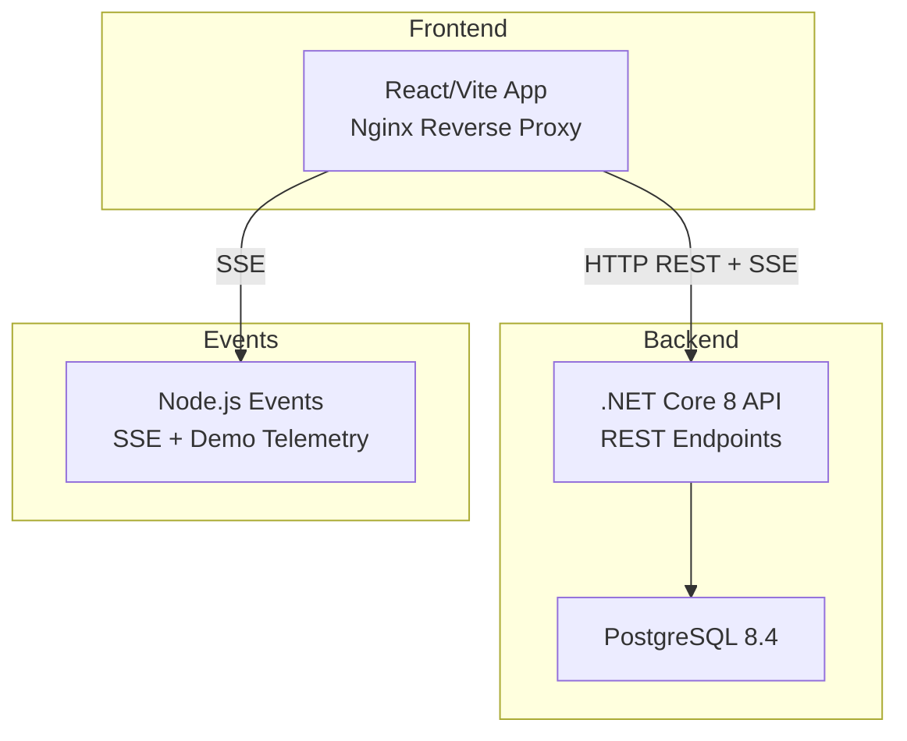
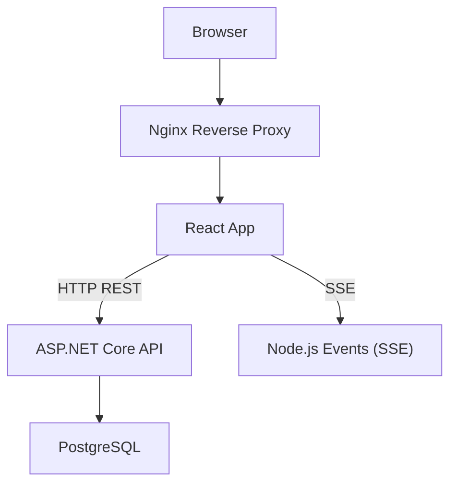
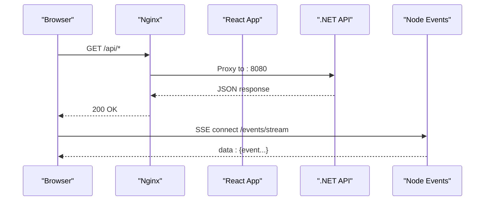
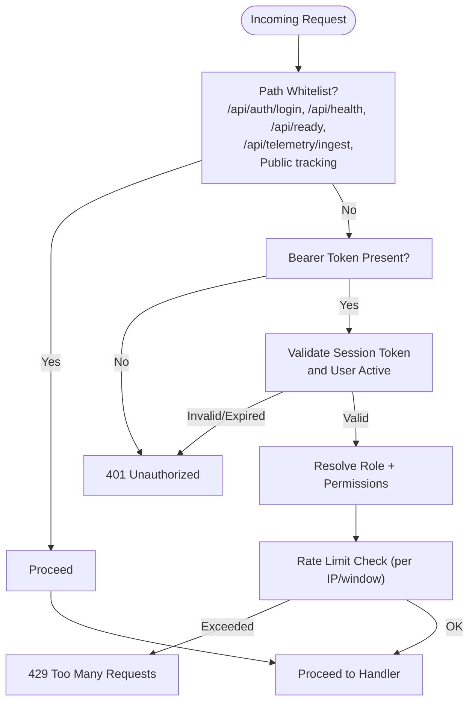
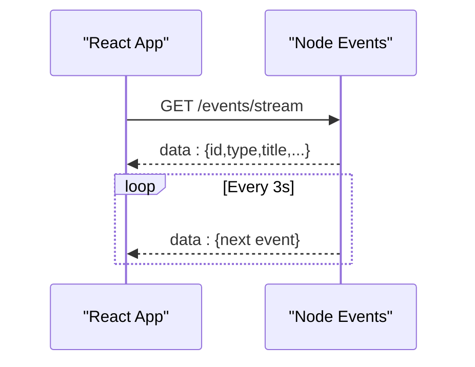
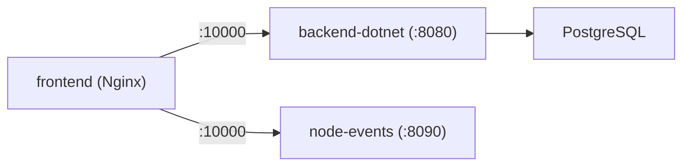

# System Architecture

<cite>
**Referenced Files in This Document**
- [README.md](file://README.md)
- [docker-compose.yml](file://docker-compose.yml)
- [frontend/package.json](file://frontend/package.json)
- [frontend/nginx.conf](file://frontend/nginx.conf)
- [frontend/Dockerfile](file://frontend/Dockerfile)
- [frontend/src/main.tsx](file://frontend/src/main.tsx)
- [frontend/src/services/apiClient.ts](file://frontend/src/services/apiClient.ts)
- [frontend/src/hooks/useEventStream.ts](file://frontend/src/hooks/useEventStream.ts)
- [backend-dotnet/Program.cs](file://backend-dotnet/Program.cs)
- [backend-dotnet/Data/Database.cs](file://backend-dotnet/Data/Database.cs)
- [backend-dotnet/Dockerfile](file://backend-dotnet/Dockerfile)
- [api-dotnet/Opstrax.Api.csproj](file://api-dotnet/Opstrax.Api.csproj)
- [services/node-events/src/server.js](file://services/node-events/src/server.js)
- [services/node-events/Dockerfile](file://services/node-events/Dockerfile)
- [docs/ARCHITECTURE.md](file://docs/ARCHITECTURE.md)
- [PRODUCTION_READINESS.md](file://PRODUCTION_READINESS.md)
</cite>

## Table of Contents
1. [Introduction](#introduction)
2. [Project Structure](#project-structure)
3. [Core Components](#core-components)
4. [Architecture Overview](#architecture-overview)
5. [Detailed Component Analysis](#detailed-component-analysis)
6. [Dependency Analysis](#dependency-analysis)
7. [Performance Considerations](#performance-considerations)
8. [Troubleshooting Guide](#troubleshooting-guide)
9. [Conclusion](#conclusion)
10. [Appendices](#appendices)

## Introduction
This document describes the OpsTrax Enterprise Build system architecture. It covers the high-level design with a React/Vite frontend, an ASP.NET Core API, a Node.js event service, and a MySQL database. It explains component interactions, data flows, and integration patterns across layers, along with containerization, reverse proxy setup, and service orchestration. It also outlines infrastructure requirements, scalability considerations, deployment topology, and cross-cutting concerns such as security, monitoring, and disaster recovery.

## Project Structure
The repository is organized into layered services:
- Frontend: React 19.2 with Vite, Tailwind CSS v4, TanStack Query v5, and React Router v6, packaged behind Nginx in production.
- Backend API: ASP.NET Core 8 minimal API written in C# 12, exposing 200+ REST endpoints and integrating with PostgreSQL (via Npgsql) for tenant-aware operations.
- Node.js Events: Node.js 20 Express service providing Server-Sent Events (SSE) and demo telemetry endpoints.
- Database: PostgreSQL 8.4 (configured in the .NET API) and MySQL seeds (legacy init scripts included).
- Orchestration: Docker Compose for local development and Nginx reverse proxy for production builds.

**Diagram sources**
- [README.md:117-142](file://README.md#L117-L142)
- [docker-compose.yml:3-45](file://docker-compose.yml#L3-L45)
- [frontend/nginx.conf:12-19](file://frontend/nginx.conf#L12-L19)
- [backend-dotnet/Program.cs:10-103](file://backend-dotnet/Program.cs#L10-L103)

**Section sources**
- [README.md:24-34](file://README.md#L24-L34)
- [README.md:117-142](file://README.md#L117-L142)
- [docker-compose.yml:3-45](file://docker-compose.yml#L3-L45)

## Core Components
- React/Vite Frontend
  - Provides enterprise dashboards, navigation, KPIs, and real-time event feed via Server-Sent Events.
  - Uses Axios for REST calls and TanStack Query for caching and re-fetching.
  - Built with TypeScript and Vite; served via Nginx in production.
- ASP.NET Core 8 API (.NET 8)
  - Minimal API with Swagger/OpenAPI, CORS, CSRF protection, and rate limiting.
  - Tenant-aware endpoints with RBAC enforcement and session-based authentication.
  - Health/Readiness/Deep probes for observability and Kubernetes integration.
- Node.js Events Service
  - SSE endpoint for live fleet events and demo telemetry ingestion endpoints.
  - CORS-enabled and health endpoint for readiness checks.
- PostgreSQL Database
  - Used by the .NET API for tenant-aware data access and schema migrations.
  - Health checks and heartbeat monitoring for background services.

**Section sources**
- [frontend/src/main.tsx:11-18](file://frontend/src/main.tsx#L11-L18)
- [frontend/src/services/apiClient.ts:14-19](file://frontend/src/services/apiClient.ts#L14-L19)
- [backend-dotnet/Program.cs:10-103](file://backend-dotnet/Program.cs#L10-L103)
- [services/node-events/src/server.js:101-114](file://services/node-events/src/server.js#L101-L114)
- [backend-dotnet/Data/Database.cs:10-15](file://backend-dotnet/Data/Database.cs#L10-L15)

## Architecture Overview
The system follows a layered architecture:
- Presentation: React frontend with Nginx reverse proxy.
- Application: ASP.NET Core API for business logic and tenant-aware data access.
- Real-time: Node.js service for SSE and demo telemetry.
- Data: PostgreSQL for relational data and schema migration/bootstrap.

**Diagram sources**
- [README.md:117-142](file://README.md#L117-L142)
- [frontend/nginx.conf:12-19](file://frontend/nginx.conf#L12-L19)
- [backend-dotnet/Program.cs:257-294](file://backend-dotnet/Program.cs#L257-L294)
- [services/node-events/src/server.js:101-114](file://services/node-events/src/server.js#L101-L114)

## Detailed Component Analysis

### Frontend: React/Vite + Nginx
- Composition and initialization:
  - Root initializes TanStack Query, routing, internationalization, error boundary, authentication provider, and strict mode.
  - Axios client configured with base URLs from environment variables, credentials enabled, and interceptors for auth and CSRF.
- Real-time integration:
  - SSE consumption via EventSource to receive live events from the Node.js service.
- Build and runtime:
  - Nginx serves built assets and proxies API requests to the .NET API host/port.
  - Ports exposed locally differ from production defaults; Compose remaps ports accordingly.

**Diagram sources**
- [frontend/nginx.conf:12-19](file://frontend/nginx.conf#L12-L19)
- [frontend/src/services/apiClient.ts:14-19](file://frontend/src/services/apiClient.ts#L14-L19)
- [services/node-events/src/server.js:101-114](file://services/node-events/src/server.js#L101-L114)

**Section sources**
- [frontend/src/main.tsx:11-18](file://frontend/src/main.tsx#L11-L18)
- [frontend/src/services/apiClient.ts:14-19](file://frontend/src/services/apiClient.ts#L14-L19)
- [frontend/src/hooks/useEventStream.ts:8-19](file://frontend/src/hooks/useEventStream.ts#L8-L19)
- [frontend/nginx.conf:12-19](file://frontend/nginx.conf#L12-L19)

### Backend API: ASP.NET Core 8
- Authentication and authorization:
  - Session-based authentication validated against the database; bearer tokens required for most endpoints except whitelisted public paths.
  - CSRF protection middleware and per-request rate limiting.
- Schema bootstrap and migrations:
  - Automatic schema steps for multiple batches on startup.
- Observability:
  - Health endpoints (/health, /ready, /health/deep) for liveness, readiness, and deep checks.
- CORS and security headers:
  - Configurable allowed origins and hardened headers (X-Content-Type-Options, X-Frame-Options, Referrer-Policy, Permissions-Policy).
- Data access:
  - PostgreSQL via Npgsql with helpers for queries, scalars, and inserts.

**Diagram sources**
- [backend-dotnet/Program.cs:105-172](file://backend-dotnet/Program.cs#L105-L172)
- [backend-dotnet/Program.cs:131-143](file://backend-dotnet/Program.cs#L131-L143)

**Section sources**
- [backend-dotnet/Program.cs:10-103](file://backend-dotnet/Program.cs#L10-L103)
- [backend-dotnet/Program.cs:257-378](file://backend-dotnet/Program.cs#L257-L378)
- [backend-dotnet/Data/Database.cs:10-15](file://backend-dotnet/Data/Database.cs#L10-L15)

### Node.js Events Service
- SSE streaming:
  - Endpoint emits structured events at intervals for live feeds.
- Demo telemetry endpoints:
  - POST handlers simulate ingestion of location and safety events.
- Health and CORS:
  - Health endpoint and CORS configuration for frontend origin.

**Diagram sources**
- [services/node-events/src/server.js:101-114](file://services/node-events/src/server.js#L101-L114)

**Section sources**
- [services/node-events/src/server.js:101-114](file://services/node-events/src/server.js#L101-L114)
- [services/node-events/src/server.js:120-126](file://services/node-events/src/server.js#L120-L126)

### Database Layer
- PostgreSQL usage:
  - The .NET API uses Npgsql for database operations and schema bootstrap.
- MySQL seeds:
  - Legacy init scripts exist under database/db/init for MySQL; current runtime uses PostgreSQL.

**Section sources**
- [backend-dotnet/Data/Database.cs:10-15](file://backend-dotnet/Data/Database.cs#L10-L15)
- [docs/ARCHITECTURE.md:51-56](file://docs/ARCHITECTURE.md#L51-L56)

## Dependency Analysis
- Containerization and orchestration:
  - Docker Compose defines three services: frontend (Nginx + Vite), .NET API, and Node events, with explicit port mappings and environment variables.
  - Frontend image is Nginx serving built assets; API runs ASP.NET Core; Node service runs Express.
- Network and ports:
  - Frontend: exposed on 10000; API on 8088; Node events on 8090.
  - Nginx proxies /api/ to the .NET API host/port.
- Cross-service dependencies:
  - Frontend depends on API and Node events.
  - API depends on PostgreSQL connectivity.

**Diagram sources**
- [docker-compose.yml:3-45](file://docker-compose.yml#L3-L45)
- [frontend/nginx.conf:12-19](file://frontend/nginx.conf#L12-L19)

**Section sources**
- [docker-compose.yml:3-45](file://docker-compose.yml#L3-L45)
- [README.md:17-20](file://README.md#L17-L20)

## Performance Considerations
- Frontend caching:
  - TanStack Query configured with retry and controlled refetch behavior to reduce redundant network calls.
- API rate limiting:
  - Per-IP sliding window rate limiting to mitigate abuse.
- Streaming:
  - SSE streaming interval and payload sizes should be tuned for production scale.
- Database:
  - Use connection pooling and consider adding a cache layer (e.g., Redis) for frequently accessed live state.

**Section sources**
- [frontend/src/main.tsx:11-18](file://frontend/src/main.tsx#L11-L18)
- [backend-dotnet/Program.cs:131-143](file://backend-dotnet/Program.cs#L131-L143)

## Troubleshooting Guide
- Health and readiness:
  - Use /health, /health/live, /health/ready, and /health/deep for diagnostics.
- Session expiration:
  - Axios interceptor handles 401 responses by clearing session and redirecting to login.
- Database connectivity:
  - Verify PostgreSQL availability and connection string configuration.
- Recovery procedures:
  - Restore database from backups and re-run schema/migrations.
  - Maintain versioned artifacts for documents and media.

**Section sources**
- [backend-dotnet/Program.cs:257-378](file://backend-dotnet/Program.cs#L257-L378)
- [frontend/src/services/apiClient.ts:58-72](file://frontend/src/services/apiClient.ts#L58-L72)
- [PRODUCTION_READINESS.md:15-28](file://PRODUCTION_READINESS.md#L15-L28)

## Conclusion
OpsTrax Enterprise Build demonstrates a clean separation of concerns across a React frontend, an ASP.NET Core API, a Node.js event service, and a PostgreSQL-backed data layer. The design supports real-time updates via SSE, robust health and security controls, and a containerized local development workflow. For production, the documented enhancements (authentication, caching, queues, storage, mobile app, and AI service) provide a roadmap to scale and harden the platform.

## Appendices

### Deployment Topology and Ports
- Local development:
  - Frontend: http://localhost:10000
  - API: http://localhost:8088
  - Node Events: http://localhost:8090
- Production:
  - Nginx serves frontend and proxies /api/ to the .NET API.
  - Ports differ in Compose; verify environment variable overrides.

**Section sources**
- [README.md:67-81](file://README.md#L67-L81)
- [docker-compose.yml:13-14](file://docker-compose.yml#L13-L14)
- [frontend/nginx.conf:12-19](file://frontend/nginx.conf#L12-L19)

### Technology Stack and Compatibility
- Frontend: React 19.2, TypeScript, Vite, Tailwind CSS v4, TanStack Query v5, React Router v6.
- Backend API: ASP.NET Core 8, C# 12, Npgsql, Swashbuckle.
- Node Events: Node.js 20, Express, ws (via SSE).
- Database: PostgreSQL 8.4 (runtime); legacy MySQL init scripts included.
- Containerization: Docker Compose; Nginx reverse proxy for production.

**Section sources**
- [README.md:24-34](file://README.md#L24-L34)
- [frontend/package.json:15-27](file://frontend/package.json#L15-L27)
- [backend-dotnet/Opstrax.Api.csproj:1-17](file://backend-dotnet/Opstrax.Api.csproj#L1-L17)
- [api-dotnet/Opstrax.Api.csproj:1-12](file://api-dotnet/Opstrax.Api.csproj#L1-L12)

### Security, Monitoring, and Disaster Recovery
- Security:
  - CSRF middleware, CORS policy, hardened headers, bearer token auth, and rate limiting.
- Monitoring:
  - Health endpoints and background service heartbeat table for service status.
- Disaster recovery:
  - Database backup restoration and artifact versioning guidance.

**Section sources**
- [backend-dotnet/Program.cs:92-103](file://backend-dotnet/Program.cs#L92-L103)
- [backend-dotnet/Program.cs:296-378](file://backend-dotnet/Program.cs#L296-L378)
- [PRODUCTION_READINESS.md:15-28](file://PRODUCTION_READINESS.md#L15-L28)