# Testing Strategy

<cite>
**Referenced Files in This Document**
- [Opstrax.Tests.csproj](file://backend-dotnet.Tests/Opstrax.Tests.csproj)
- [run-tests.sh](file://run-tests.sh)
- [ci.yml](file://.github/workflows/ci.yml)
- [SafetyTests.cs](file://backend-dotnet.Tests/SafetyTests.cs)
- [DispatchTests.cs](file://backend-dotnet.Tests/DispatchTests.cs)
- [DriverWorkflowTests.cs](file://backend-dotnet.Tests/DriverWorkflowTests.cs)
- [CustomerVisibilityTests.cs](file://backend-dotnet.Tests/CustomerVisibilityTests.cs)
- [MaintenanceTests.cs](file://backend-dotnet.Tests/MaintenanceTests.cs)
- [NotificationTests.cs](file://backend-dotnet.Tests/NotificationTests.cs)
- [P41HardeningTests.cs](file://backend-dotnet.Tests/P41HardeningTests.cs)
- [P8ReportingTests.cs](file://backend-dotnet.Tests/P8ReportingTests.cs)
- [P9ObservabilityTests.cs](file://backend-dotnet.Tests/P9ObservabilityTests.cs)
- [001_schema.sql](file://db/init/001_schema.sql)
- [002_seed.sql](file://db/init/002_seed.sql)
- [Program.cs](file://backend-dotnet/Program.cs)
- [EndpointMappings.cs](file://backend-dotnet/Controllers/EndpointMappings.cs)
</cite>

## Table of Contents
1. [Introduction](#introduction)
2. [Project Structure](#project-structure)
3. [Core Components](#core-components)
4. [Architecture Overview](#architecture-overview)
5. [Detailed Component Analysis](#detailed-component-analysis)
6. [Dependency Analysis](#dependency-analysis)
7. [Performance Considerations](#performance-considerations)
8. [Troubleshooting Guide](#troubleshooting-guide)
9. [Conclusion](#conclusion)
10. [Appendices](#appendices)

## Introduction
This document defines the comprehensive testing strategy for the OpsTrax development lifecycle. It outlines a multi-layered approach covering unit tests, integration tests, and end-to-end testing. The strategy details the .NET test suite organization, test categories (Safety, Dispatch, DriverWorkflow, CustomerVisibility, Maintenance, Notification, P41Hardening, P8Reporting, P9Observability), and execution procedures. It also covers testing utilities, mock data management, test environment setup, API testing strategies, database test isolation, test data seeding, continuous integration testing, automated test execution, test reporting, performance testing, load testing, security testing, test coverage requirements, quality gates, and enterprise testing best practices.

## Project Structure
The repository organizes testing across:
- A dedicated .NET test project for backend services
- Bash scripts for local and CI test orchestration
- Database initialization scripts for schema and seed data
- CI workflow definitions for automated pipeline execution

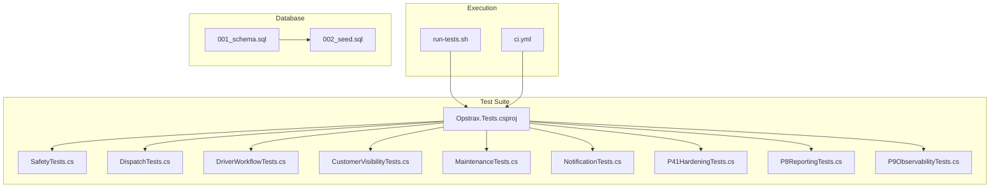

**Diagram sources**
- [Opstrax.Tests.csproj:1-25](file://backend-dotnet.Tests/Opstrax.Tests.csproj#L1-L25)
- [run-tests.sh:1-88](file://run-tests.sh#L1-L88)
- [.github/workflows/ci.yml:1-52](file://.github/workflows/ci.yml#L1-L52)
- [001_schema.sql:1-263](file://db/init/001_schema.sql#L1-L263)
- [002_seed.sql:1-70](file://db/init/002_seed.sql#L1-L70)

**Section sources**
- [Opstrax.Tests.csproj:1-25](file://backend-dotnet.Tests/Opstrax.Tests.csproj#L1-L25)
- [run-tests.sh:1-88](file://run-tests.sh#L1-L88)
- [.github/workflows/ci.yml:1-52](file://.github/workflows/ci.yml#L1-L52)
- [001_schema.sql:1-263](file://db/init/001_schema.sql#L1-L263)
- [002_seed.sql:1-70](file://db/init/002_seed.sql#L1-L70)

## Core Components
- Test project configuration and dependencies
  - SDK, target framework, nullable enablement, and test packages
  - References to the backend project and xUnit runner
- Test categories and coverage
  - Safety: scoring, insights, state transitions, tenant isolation, duplicates, weights
  - Dispatch: state machine, eligibility, RBAC, tenant isolation, lifecycle, exceptions, trip integration, insights
  - DriverWorkflow: permissions, status transitions, scoping, offline queue idempotency, tenant isolation, DVIR security
  - CustomerVisibility: token strategy, scoping, ETA risk engine, SLA logic, safe exposure, timeline
  - Maintenance: DVIR/inspection, defect lifecycle, vehicle availability, work order lifecycle, fault codes, PM rules, tenant isolation, insights
  - Notification: permissions, deduplication, scoping, acknowledgements, messaging, escalation, external channels, system triggers
  - P41Hardening: override permissions, OOS hold logic, exception resume
  - P8Reporting: dataset registry, SQL injection validation/build, row limits, tenant isolation, saved report visibility
  - P9Observability: error sanitization, config validation, incident thresholds, service run states, RBAC gating, health safety, service name validation, stale binary hardening, ops metrics DTOs

**Section sources**
- [Opstrax.Tests.csproj:1-25](file://backend-dotnet.Tests/Opstrax.Tests.csproj#L1-L25)
- [SafetyTests.cs:1-365](file://backend-dotnet.Tests/SafetyTests.cs#L1-L365)
- [DispatchTests.cs:1-495](file://backend-dotnet.Tests/DispatchTests.cs#L1-L495)
- [DriverWorkflowTests.cs:1-297](file://backend-dotnet.Tests/DriverWorkflowTests.cs#L1-L297)
- [CustomerVisibilityTests.cs:1-410](file://backend-dotnet.Tests/CustomerVisibilityTests.cs#L1-L410)
- [MaintenanceTests.cs:1-504](file://backend-dotnet.Tests/MaintenanceTests.cs#L1-L504)
- [NotificationTests.cs:1-712](file://backend-dotnet.Tests/NotificationTests.cs#L1-L712)
- [P41HardeningTests.cs:1-199](file://backend-dotnet.Tests/P41HardeningTests.cs#L1-L199)
- [P8ReportingTests.cs:1-800](file://backend-dotnet.Tests/P8ReportingTests.cs#L1-L800)
- [P9ObservabilityTests.cs:1-777](file://backend-dotnet.Tests/P9ObservabilityTests.cs#L1-L777)

## Architecture Overview
The testing architecture integrates unit-level logic tests with CI automation and database fixtures. Tests validate pure logic contracts, RBAC permissions, tenant isolation, and security controls without requiring live databases in most cases. CI pipelines build and test the backend project, while local scripts ensure fresh builds and comprehensive checks.

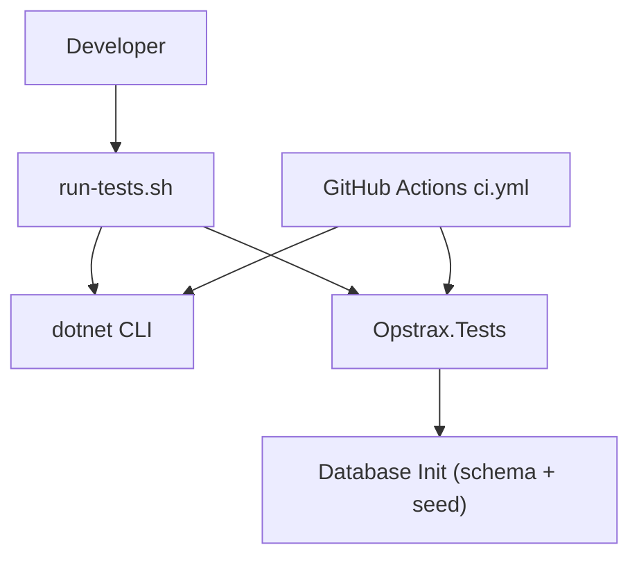

**Diagram sources**
- [run-tests.sh:1-88](file://run-tests.sh#L1-L88)
- [.github/workflows/ci.yml:1-52](file://.github/workflows/ci.yml#L1-L52)
- [001_schema.sql:1-263](file://db/init/001_schema.sql#L1-L263)
- [002_seed.sql:1-70](file://db/init/002_seed.sql#L1-L70)

**Section sources**
- [run-tests.sh:1-88](file://run-tests.sh#L1-L88)
- [.github/workflows/ci.yml:1-52](file://.github/workflows/ci.yml#L1-L52)

## Detailed Component Analysis

### Safety Testing Strategy
Safety tests validate scoring logic, system insights, workflow state transitions, tenant isolation, duplicate prevention, and scoring weights. Tests assert pure logic contracts and SQL-like query patterns without DB dependencies.

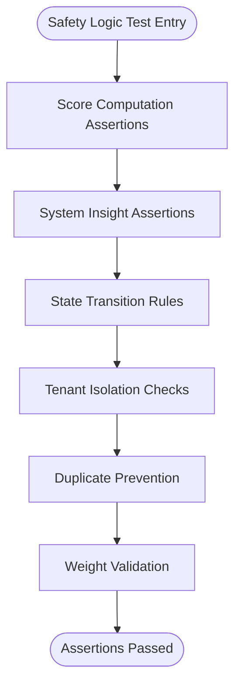

**Diagram sources**
- [SafetyTests.cs:10-365](file://backend-dotnet.Tests/SafetyTests.cs#L10-L365)

**Section sources**
- [SafetyTests.cs:1-365](file://backend-dotnet.Tests/SafetyTests.cs#L1-L365)

### Dispatch Testing Strategy
Dispatch tests cover state machines, eligibility rules, RBAC permissions, tenant isolation, assignment lifecycle, exception workflows, trip integration, and insights. Tests verify SQL patterns and permission defaults.

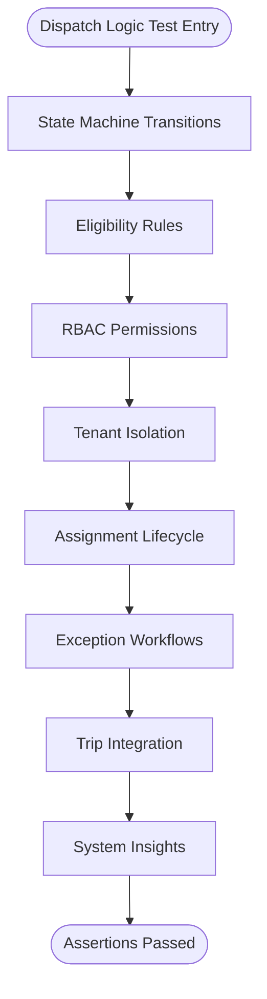

**Diagram sources**
- [DispatchTests.cs:10-495](file://backend-dotnet.Tests/DispatchTests.cs#L10-L495)

**Section sources**
- [DispatchTests.cs:1-495](file://backend-dotnet.Tests/DispatchTests.cs#L1-L495)

### Driver Workflow Testing Strategy
Driver workflow tests focus on role permissions, status transitions, scoping logic, offline queue idempotency, tenant isolation, and DVIR security contracts.

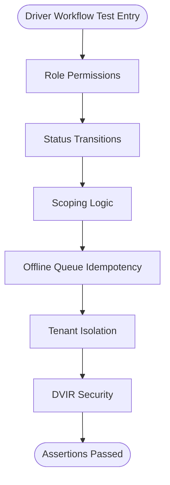

**Diagram sources**
- [DriverWorkflowTests.cs:12-297](file://backend-dotnet.Tests/DriverWorkflowTests.cs#L12-L297)

**Section sources**
- [DriverWorkflowTests.cs:1-297](file://backend-dotnet.Tests/DriverWorkflowTests.cs#L1-L297)

### Customer Visibility Testing Strategy
Customer visibility tests validate token generation, scoping, ETA risk engine, SLA logic, safe data exposure, and timeline constraints.

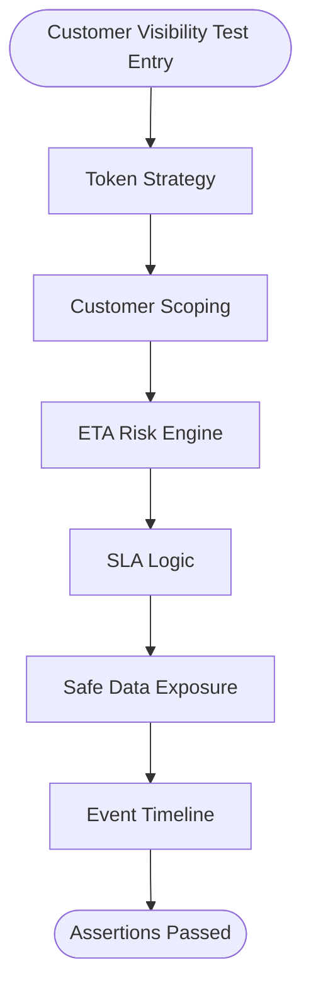

**Diagram sources**
- [CustomerVisibilityTests.cs:8-410](file://backend-dotnet.Tests/CustomerVisibilityTests.cs#L8-L410)

**Section sources**
- [CustomerVisibilityTests.cs:1-410](file://backend-dotnet.Tests/CustomerVisibilityTests.cs#L1-L410)

### Maintenance Testing Strategy
Maintenance tests cover DVIR/inspection logic, defect lifecycle, vehicle availability, work order lifecycle, fault codes, PM rules, tenant isolation, and system insights.

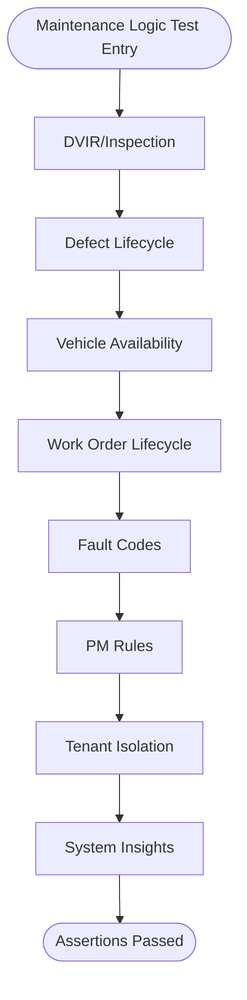

**Diagram sources**
- [MaintenanceTests.cs:8-504](file://backend-dotnet.Tests/MaintenanceTests.cs#L8-L504)

**Section sources**
- [MaintenanceTests.cs:1-504](file://backend-dotnet.Tests/MaintenanceTests.cs#L1-L504)

### Notification Testing Strategy
Notification tests validate permissions, deduplication logic, scoping, acknowledgements, messaging, escalation rules, external channels, and system triggers.

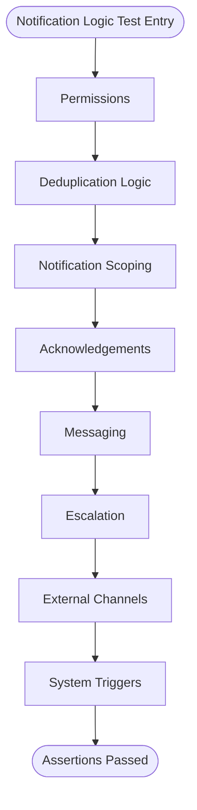

**Diagram sources**
- [NotificationTests.cs:14-712](file://backend-dotnet.Tests/NotificationTests.cs#L14-L712)

**Section sources**
- [NotificationTests.cs:1-712](file://backend-dotnet.Tests/NotificationTests.cs#L1-L712)

### P41 Hardening Testing Strategy
P41 hardening tests verify dispatch override permissions and OOS dispatch hold logic, including state transitions and tenant isolation.

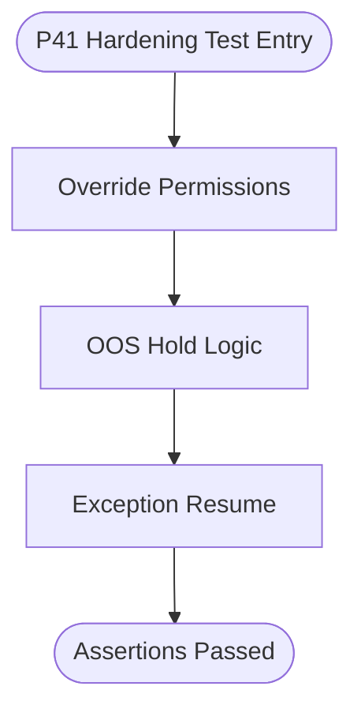

**Diagram sources**
- [P41HardeningTests.cs:9-199](file://backend-dotnet.Tests/P41HardeningTests.cs#L9-L199)

**Section sources**
- [P41HardeningTests.cs:1-199](file://backend-dotnet.Tests/P41HardeningTests.cs#L1-L199)

### P8 Reporting Testing Strategy
P8 reporting tests enforce dataset registry validation, SQL injection prevention, row limits, tenant isolation, and saved report visibility.

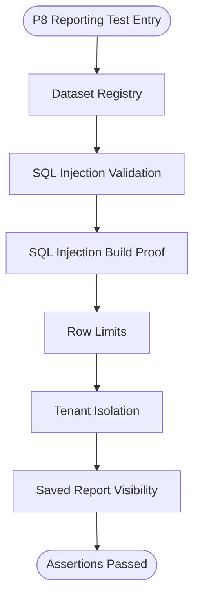

**Diagram sources**
- [P8ReportingTests.cs:20-800](file://backend-dotnet.Tests/P8ReportingTests.cs#L20-L800)

**Section sources**
- [P8ReportingTests.cs:1-800](file://backend-dotnet.Tests/P8ReportingTests.cs#L1-L800)

### P9 Observability Testing Strategy
P9 observability tests cover error sanitization, config validation, incident thresholds, service run states, RBAC gating, health response safety, service name validation, stale binary hardening, and ops metrics DTOs.

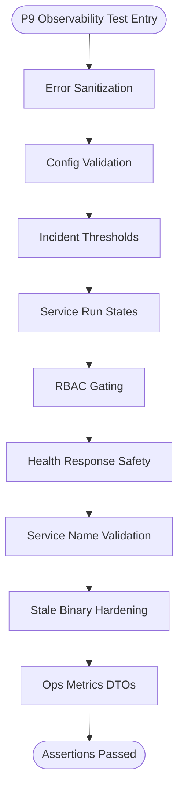

**Diagram sources**
- [P9ObservabilityTests.cs:23-777](file://backend-dotnet.Tests/P9ObservabilityTests.cs#L23-L777)

**Section sources**
- [P9ObservabilityTests.cs:1-777](file://backend-dotnet.Tests/P9ObservabilityTests.cs#L1-L777)

## Dependency Analysis
The test suite depends on:
- Backend project references for controller mappings, services, and schema definitions
- Database initialization scripts for schema and seed data
- CI and local scripts for build/test orchestration

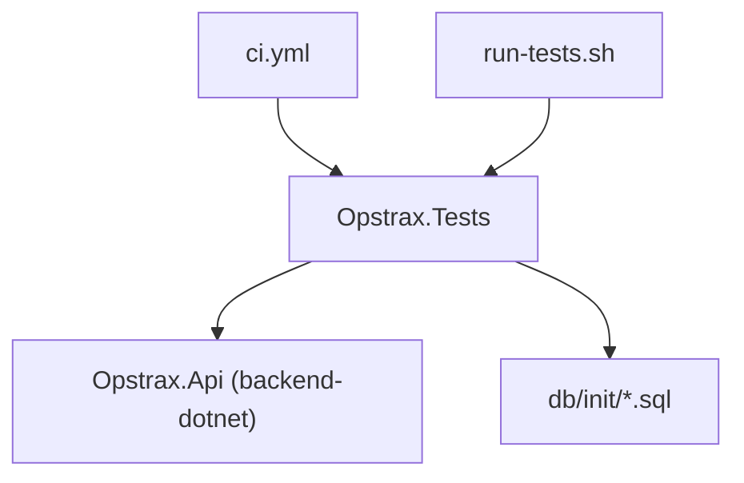

**Diagram sources**
- [Opstrax.Tests.csproj:17-19](file://backend-dotnet.Tests/Opstrax.Tests.csproj#L17-L19)
- [001_schema.sql:1-263](file://db/init/001_schema.sql#L1-L263)
- [002_seed.sql:1-70](file://db/init/002_seed.sql#L1-L70)
- [.github/workflows/ci.yml:1-52](file://.github/workflows/ci.yml#L1-L52)
- [run-tests.sh:1-88](file://run-tests.sh#L1-L88)

**Section sources**
- [Opstrax.Tests.csproj:1-25](file://backend-dotnet.Tests/Opstrax.Tests.csproj#L1-L25)
- [001_schema.sql:1-263](file://db/init/001_schema.sql#L1-L263)
- [002_seed.sql:1-70](file://db/init/002_seed.sql#L1-L70)
- [.github/workflows/ci.yml:1-52](file://.github/workflows/ci.yml#L1-L52)
- [run-tests.sh:1-88](file://run-tests.sh#L1-L88)

## Performance Considerations
- Prefer pure-logic unit tests for performance-sensitive domains (scoring, eligibility, risk engines) to minimize overhead
- Use deterministic fixtures and deterministic SQL patterns to ensure reproducible performance characteristics
- Avoid heavy DB round-trips in unit tests; rely on query pattern assertions and parameterized SQL proofs
- For integration/performance tests, isolate database connections and use lightweight schema/seed data

## Troubleshooting Guide
Common issues and resolutions:
- Stale binary test failures
  - Symptom: Tests appear to run but do not reflect recent changes
  - Cause: Using --no-build in CI or local scripts
  - Resolution: Ensure fresh builds before running tests; the run-tests.sh script enforces this
- SQL injection and tenant isolation violations
  - Symptom: Reporting and observability tests fail on injection attempts or tenant scoping
  - Resolution: Validate SecureQueryBuilder and tenant filters; confirm dataset registry whitelists
- RBAC and permission mismatches
  - Symptom: Permission tests fail for roles or endpoints
  - Resolution: Verify EndpointMappings role permission defaults and requirePermission checks
- Health and observability sanitization
  - Symptom: Deep health or error sanitization tests fail
  - Resolution: Confirm sanitization logic for secrets, IP addresses, and JWT tokens

**Section sources**
- [run-tests.sh:1-88](file://run-tests.sh#L1-L88)
- [P8ReportingTests.cs:114-289](file://backend-dotnet.Tests/P8ReportingTests.cs#L114-L289)
- [P9ObservabilityTests.cs:23-103](file://backend-dotnet.Tests/P9ObservabilityTests.cs#L23-L103)
- [EndpointMappings.cs:1-800](file://backend-dotnet/Controllers/EndpointMappings.cs#L1-L800)

## Conclusion
The OpsTrax testing strategy emphasizes robust unit-level validation of critical business logic, strong security and isolation controls, and comprehensive CI automation. By organizing tests by functional categories, enforcing fresh builds, and validating SQL injection and tenant isolation, the suite ensures reliability, security, and maintainability across the platform.

## Appendices

### Test Categories and Coverage Matrix
- Safety: scoring, insights, state transitions, tenant isolation, duplicates, weights
- Dispatch: state machine, eligibility, RBAC, tenant isolation, lifecycle, exceptions, trip integration, insights
- DriverWorkflow: permissions, status transitions, scoping, offline queue idempotency, tenant isolation, DVIR security
- CustomerVisibility: token strategy, scoping, ETA risk engine, SLA logic, safe exposure, timeline
- Maintenance: DVIR/inspection, defect lifecycle, vehicle availability, work order lifecycle, fault codes, PM rules, tenant isolation, insights
- Notification: permissions, deduplication, scoping, acknowledgements, messaging, escalation, external channels, system triggers
- P41Hardening: override permissions, OOS hold logic, exception resume
- P8Reporting: dataset registry, SQL injection validation/build, row limits, tenant isolation, saved report visibility
- P9Observability: error sanitization, config validation, incident thresholds, service run states, RBAC gating, health safety, service name validation, stale binary hardening, ops metrics DTOs

### Test Execution Procedures
- Local execution
  - Use the run-tests.sh script to clean, build, and test the backend project with fresh binaries
  - Supports backend-only and frontend-only modes for targeted checks
- CI execution
  - GitHub Actions workflow builds and tests the backend project
  - Frontend and backend Node projects are built separately in dedicated jobs

**Section sources**
- [run-tests.sh:1-88](file://run-tests.sh#L1-L88)
- [.github/workflows/ci.yml:1-52](file://.github/workflows/ci.yml#L1-L52)

### API Testing Strategies
- Validate RBAC and permission defaults via EndpointMappings
- Use controller mappings to verify endpoint contracts and tenant scoping
- Test health endpoints for sanitization and status derivation
- Validate streaming and telemetry ingestion contracts

**Section sources**
- [EndpointMappings.cs:1-800](file://backend-dotnet/Controllers/EndpointMappings.cs#L1-L800)
- [Program.cs:257-378](file://backend-dotnet/Program.cs#L257-L378)

### Database Test Isolation and Seeding
- Schema and seed scripts define a controlled environment for tests
- Tenant isolation is enforced via company_id filters in SQL patterns
- Saved report visibility tests validate scoping and ownership rules

**Section sources**
- [001_schema.sql:1-263](file://db/init/001_schema.sql#L1-L263)
- [002_seed.sql:1-70](file://db/init/002_seed.sql#L1-L70)
- [P8ReportingTests.cs:662-800](file://backend-dotnet.Tests/P8ReportingTests.cs#L662-L800)

### Continuous Integration and Automated Execution
- CI pipeline stages for frontend, Node backend, Node events, and .NET build
- Local scripts ensure fresh builds and prevent stale-binary test failures

**Section sources**
- [.github/workflows/ci.yml:1-52](file://.github/workflows/ci.yml#L1-L52)
- [run-tests.sh:1-88](file://run-tests.sh#L1-L88)

### Test Reporting and Quality Gates
- Use xUnit test results and CI logs for reporting
- Quality gates include:
  - Fresh builds before tests
  - SQL injection and tenant isolation validations
  - RBAC and permission checks
  - Health and observability sanitization

**Section sources**
- [Opstrax.Tests.csproj:10-15](file://backend-dotnet.Tests/Opstrax.Tests.csproj#L10-L15)
- [run-tests.sh:1-88](file://run-tests.sh#L1-L88)
- [P8ReportingTests.cs:114-289](file://backend-dotnet.Tests/P8ReportingTests.cs#L114-L289)
- [P9ObservabilityTests.cs:23-103](file://backend-dotnet.Tests/P9ObservabilityTests.cs#L23-L103)

### Performance, Load, and Security Testing Approaches
- Performance
  - Favor unit tests for performance-sensitive logic; validate deterministic SQL and parameterized queries
- Load
  - Use lightweight schema/seed data; avoid heavy DB round-trips in unit tests
- Security
  - Enforce SQL injection prevention and tenant isolation in reporting and observability tests
  - Validate error sanitization and health response safety

**Section sources**
- [P8ReportingTests.cs:296-487](file://backend-dotnet.Tests/P8ReportingTests.cs#L296-L487)
- [P9ObservabilityTests.cs:23-103](file://backend-dotnet.Tests/P9ObservabilityTests.cs#L23-L103)