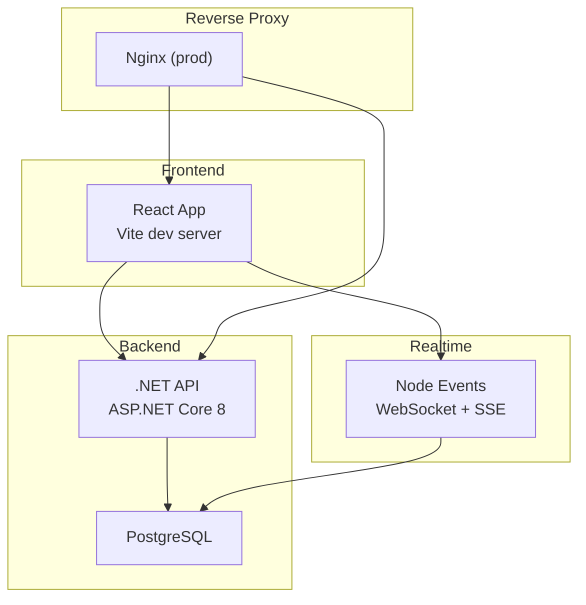
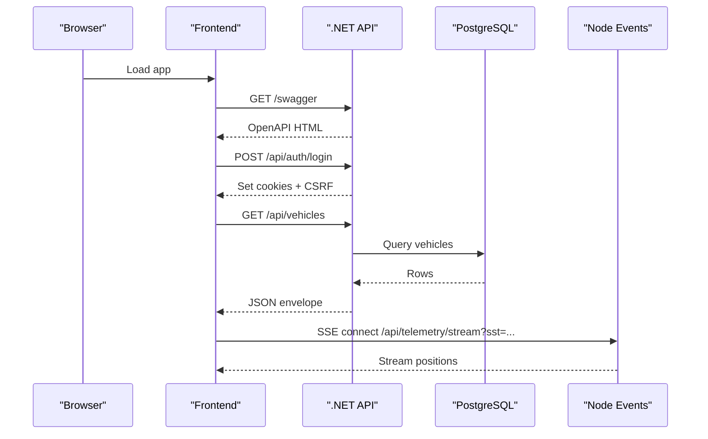
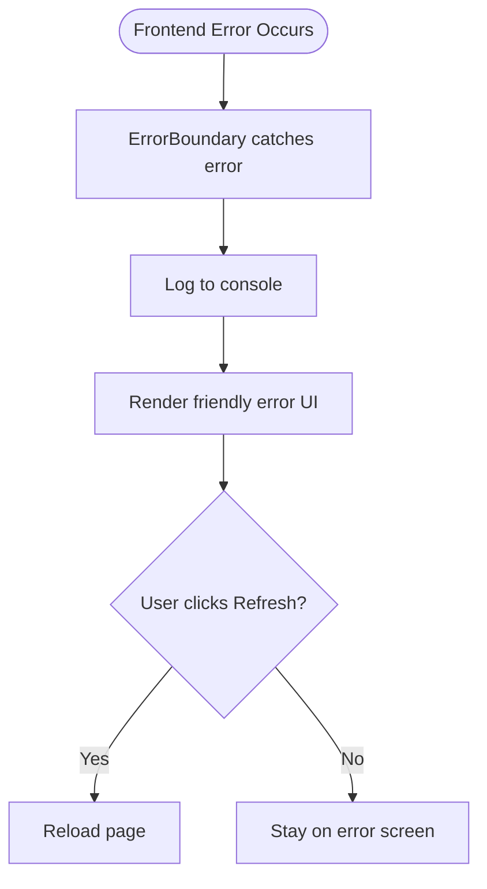
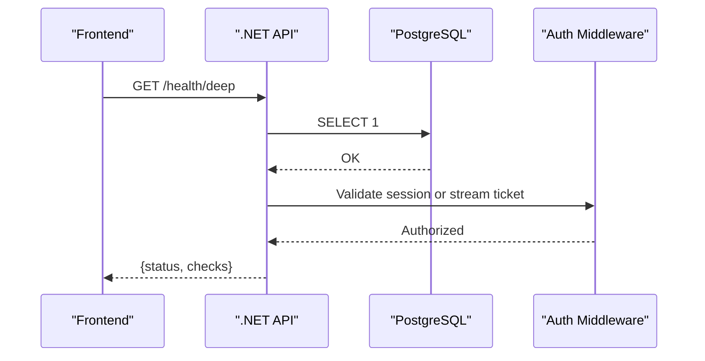
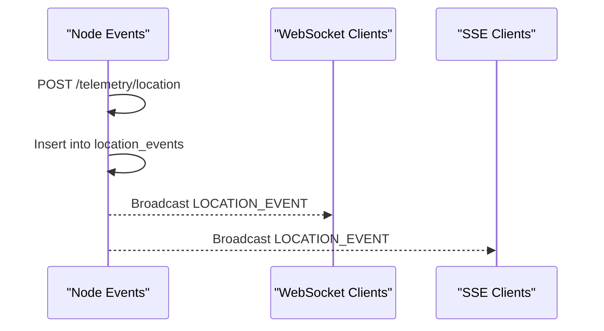
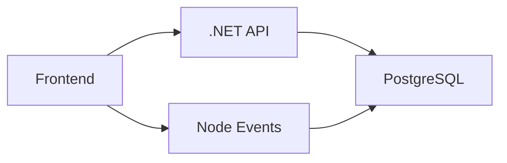
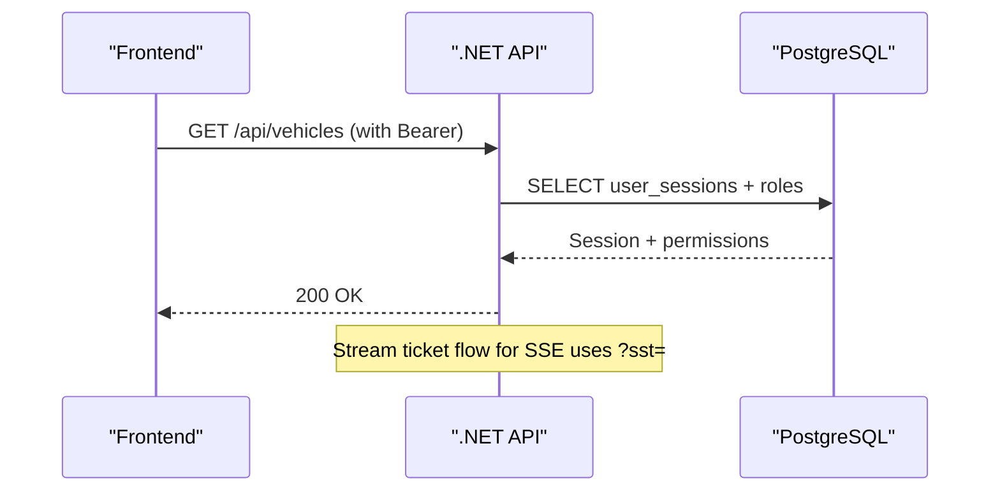
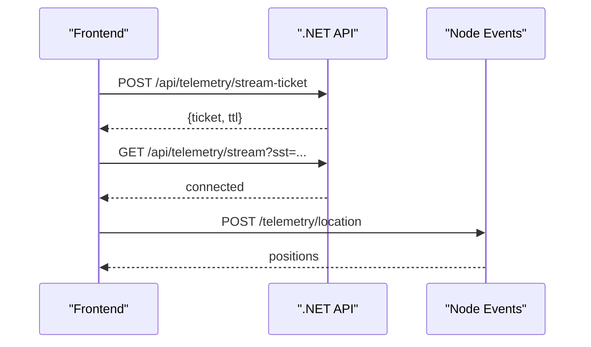

# Troubleshooting & FAQ

<cite>
**Referenced Files in This Document**
- [README.md](file://README.md)
- [PRODUCTION_QA_MATRIX.md](file://PRODUCTION_QA_MATRIX.md)
- [PRODUCTION_READINESS.md](file://PRODUCTION_READINESS.md)
- [docs\KNOWN_LIMITATIONS.md](file://docs\KNOWN_LIMITATIONS.md)
- [backend\src\middleware\errorHandler.ts](file://backend\src\middleware\errorHandler.ts)
- [frontend\src\components\ErrorBoundary.tsx](file://frontend\src\components\ErrorBoundary.tsx)
- [backend-dotnet\Middleware\ErrorHandlingMiddleware.cs](file://backend-dotnet\Middleware\ErrorHandlingMiddleware.cs)
- [backend-dotnet\Controllers\EndpointMappings.cs](file://backend-dotnet\Controllers\EndpointMappings.cs)
- [node-services\events\src\server.js](file://node-services\events\src\server.js)
- [frontend\src\hooks\useEventStream.ts](file://frontend\src\hooks\useEventStream.ts)
- [frontend\src\hooks\useLiveTelemetry.ts](file://frontend\src\hooks\useLiveTelemetry.ts)
- [docker-compose.yml](file://docker-compose.yml)
- [backend-dotnet\Program.cs](file://backend-dotnet\Program.cs)
- [frontend\package.json](file://frontend\package.json)
- [backend\package.json](file://backend\package.json)
- [database\init\001_schema.sql](file://database\init\001_schema.sql)
- [frontend\src\services\apiClient.ts](file://frontend\src\services\apiClient.ts)
</cite>

## Table of Contents
1. [Introduction](#introduction)
2. [Project Structure](#project-structure)
3. [Core Components](#core-components)
4. [Architecture Overview](#architecture-overview)
5. [Detailed Component Analysis](#detailed-component-analysis)
6. [Dependency Analysis](#dependency-analysis)
7. [Performance Considerations](#performance-considerations)
8. [Troubleshooting Guide](#troubleshooting-guide)
9. [Conclusion](#conclusion)
10. [Appendices](#appendices)

## Introduction
This document provides comprehensive troubleshooting and FAQ guidance for OpsTrax system maintenance and support across development, deployment, and production environments. It consolidates operational checks, diagnostic procedures, log analysis techniques, and debugging strategies for frontend, backend, and infrastructure components. It also covers performance troubleshooting, memory leak detection, database optimization, known limitations, workarounds, planned improvements, network connectivity issues, authentication problems, and real-time communication failures. Finally, it includes frequently asked questions around licensing, compliance, customization, and integration scenarios.

## Project Structure
OpsTrax is a containerized, multi-service system composed of:
- Frontend (React/Vite) serving the UI and consuming REST APIs and streaming endpoints
- ASP.NET Core 8 API (C#) providing REST endpoints, RBAC, and health probes
- Node Events service (Express/ws) emitting simulated real-time events and telemetry streams
- PostgreSQL database hosting tenant-scoped data and audit trails
- Nginx reverse proxy in production builds

**Diagram sources**
- [docker-compose.yml:1-45](file://docker-compose.yml#L1-L45)
- [README.md:117-142](file://README.md#L117-L142)

**Section sources**
- [README.md:1-166](file://README.md#L1-L166)
- [docker-compose.yml:1-45](file://docker-compose.yml#L1-L45)

## Core Components
- Frontend: React 19.2 with Vite, TanStack Query, React Router, and Axios-based API client. Includes an Error Boundary to prevent app crashes and a CSRF-aware request pipeline.
- Backend API: ASP.NET Core 8 minimal API with CORS, CSRF protection, rate limiting, RBAC, and health/ready/deep probes.
- Node Events: Express server exposing health, telemetry ingestion, and SSE/WebSocket endpoints for simulated real-time updates.
- Database: PostgreSQL schema supporting multi-tenant entities, audit logs, and streaming tables.

**Section sources**
- [README.md:24-34](file://README.md#L24-L34)
- [frontend\src\components\ErrorBoundary.tsx:1-51](file://frontend\src\components\ErrorBoundary.tsx#L1-L51)
- [frontend\src\services\apiClient.ts:1-79](file://frontend\src\services\apiClient.ts#L1-L79)
- [backend-dotnet\Program.cs:55-103](file://backend-dotnet\Program.cs#L55-L103)
- [node-services\events\src\server.js:1-154](file://node-services\events\src\server.js#L1-L154)
- [database\init\001_schema.sql:1-800](file://database\init\001_schema.sql#L1-L800)

## Architecture Overview
The system integrates frontend, backend, and realtime services with explicit authentication, authorization, and telemetry pathways.

**Diagram sources**
- [backend-dotnet\Program.cs:257-294](file://backend-dotnet\Program.cs#L257-L294)
- [backend-dotnet\Controllers\EndpointMappings.cs:52-66](file://backend-dotnet\Controllers\EndpointMappings.cs#L52-L66)
- [node-services\events\src\server.js:108-148](file://node-services\events\src\server.js#L108-L148)
- [frontend\src\hooks\useLiveTelemetry.ts:108-151](file://frontend\src\hooks\useLiveTelemetry.ts#L108-L151)

## Detailed Component Analysis

### Frontend Diagnostics and Debugging
- Error Boundary: Catches rendering errors and displays a friendly recovery UI with a refresh action.
- API Client: Injects Authorization and CSRF tokens; redirects to login on 401; unwraps API envelopes.
- Streaming Hooks:
  - useEventStream: Subscribes to SSE events from Node Events.
  - useLiveTelemetry: Obtains a short-lived stream ticket, opens an EventSource, and handles renewal.

**Diagram sources**
- [frontend\src\components\ErrorBoundary.tsx:12-50](file://frontend\src\components\ErrorBoundary.tsx#L12-L50)

**Section sources**
- [frontend\src\components\ErrorBoundary.tsx:1-51](file://frontend\src\components\ErrorBoundary.tsx#L1-L51)
- [frontend\src\services\apiClient.ts:14-79](file://frontend\src\services\apiClient.ts#L14-L79)
- [frontend\src\hooks\useEventStream.ts:1-23](file://frontend\src\hooks\useEventStream.ts#L1-L23)
- [frontend\src\hooks\useLiveTelemetry.ts:60-169](file://frontend\src\hooks\useLiveTelemetry.ts#L60-L169)

### Backend API Diagnostics and Debugging
- Health and Readiness:
  - /health, /health/live: Always available.
  - /health/ready: DB connectivity check.
  - /health/deep: Comprehensive health including DB latency, service heartbeats, and config validation.
- Authentication and Authorization:
  - Session-based Bearer tokens validated against user_sessions.
  - Special exemptions for telemetry ingest and public tracking endpoints.
  - Short-lived stream tickets for SSE.
- Error Handling: Centralized middleware logs and returns structured failure responses.
- Rate Limiting: Per-IP sliding window with 429 responses.

**Diagram sources**
- [backend-dotnet\Program.cs:257-378](file://backend-dotnet\Program.cs#L257-L378)
- [backend-dotnet\Middleware\ErrorHandlingMiddleware.cs:6-21](file://backend-dotnet\Middleware\ErrorHandlingMiddleware.cs#L6-L21)

**Section sources**
- [backend-dotnet\Program.cs:257-378](file://backend-dotnet\Program.cs#L257-L378)
- [backend-dotnet\Middleware\ErrorHandlingMiddleware.cs:1-22](file://backend-dotnet\Middleware\ErrorHandlingMiddleware.cs#L1-L22)

### Node Events Diagnostics and Debugging
- Health: GET /health returns service status.
- Telemetry Ingestion: POST /telemetry/location and /events/safety insert events and broadcast via WebSocket/SSE.
- Error Handling: Generic 500 handler logs and returns structured error.

**Diagram sources**
- [node-services\events\src\server.js:34-81](file://node-services\events\src\server.js#L34-L81)

**Section sources**
- [node-services\events\src\server.js:1-154](file://node-services\events\src\server.js#L1-L154)

### Database Diagnostics and Optimization
- Schema: Multi-tenant entities with indexes optimized for common access patterns (e.g., audit logs, jobs, vehicles).
- Audit Logging: Centralized audit_logs with tenant-scoped lookups.
- Recommendations:
  - Monitor slow queries using EXPLAIN/EXPLAIN ANALYZE.
  - Ensure appropriate indexes exist for tenant filters and time-series scans.
  - Regularly vacuum/analyze for performance stability.
  - Use connection pooling and limit concurrent long-running queries.

**Section sources**
- [database\init\001_schema.sql:518-531](file://database\init\001_schema.sql#L518-L531)
- [database\init\001_schema.sql:627-649](file://database\init\001_schema.sql#L627-L649)

## Dependency Analysis
- Frontend depends on backend REST endpoints and Node Events SSE/WS.
- Backend depends on PostgreSQL and exposes health/readiness endpoints.
- Node Events depends on PostgreSQL for event persistence and emits to clients.

**Diagram sources**
- [docker-compose.yml:1-45](file://docker-compose.yml#L1-L45)

**Section sources**
- [docker-compose.yml:1-45](file://docker-compose.yml#L1-L45)

## Performance Considerations
- Frontend:
  - Use TanStack Query for caching and background refetching.
  - Debounce frequent UI interactions and throttle polling intervals.
- Backend:
  - Enable rate limiting and monitor 429 responses.
  - Optimize endpoint queries with indexes and pagination.
- Realtime:
  - Keep SSE tickets short-lived and renew proactively.
  - Limit payload sizes and batch updates where possible.
- Database:
  - Maintain statistics and analyze slow queries.
  - Partition or archive historical telemetry tables.

[No sources needed since this section provides general guidance]

## Troubleshooting Guide

### Development Startup and Connectivity
- Ports and services:
  - Frontend: http://localhost:10000
  - API: http://localhost:8088
  - Node Events: http://localhost:8090
- Verify containers are healthy and ports are mapped correctly.
- Confirm CORS and allowed origins are configured for localhost.

**Section sources**
- [README.md:67-81](file://README.md#L67-L81)
- [docker-compose.yml:13-17](file://docker-compose.yml#L13-L17)
- [backend-dotnet\Program.cs:55-63](file://backend-dotnet\Program.cs#L55-L63)

### Authentication and Authorization Failures
Common symptoms:
- 401 Unauthorized on protected endpoints
- Redirect to login after session expiry
- CSRF token mismatch on state-changing requests

Diagnostic steps:
- Confirm Authorization header presence and validity.
- Verify session token in local storage and CSRF token propagation.
- Check special exemptions for telemetry ingest and public tracking.
- Validate stream ticket issuance and renewal for SSE.

**Diagram sources**
- [frontend\src\services\apiClient.ts:21-47](file://frontend\src\services\apiClient.ts#L21-L47)
- [backend-dotnet\Program.cs:174-244](file://backend-dotnet\Program.cs#L174-L244)

**Section sources**
- [frontend\src\services\apiClient.ts:49-72](file://frontend\src\services\apiClient.ts#L49-L72)
- [backend-dotnet\Program.cs:174-244](file://backend-dotnet\Program.cs#L174-L244)

### Real-Time Communication Failures
Symptoms:
- Live map not updating
- Telemetry SSE disconnects
- Node Events health OK but no broadcasts

Diagnostic steps:
- Confirm Node Events health endpoint responds.
- Verify SSE ticket acquisition and renewal loop.
- Check browser EventSource error handling and logs.
- Validate WebSocket connections for event stream.

**Diagram sources**
- [frontend\src\hooks\useLiveTelemetry.ts:60-151](file://frontend\src\hooks\useLiveTelemetry.ts#L60-L151)
- [backend-dotnet\Controllers\EndpointMappings.cs:52-66](file://backend-dotnet\Controllers\EndpointMappings.cs#L52-L66)
- [node-services\events\src\server.js:34-81](file://node-services\events\src\server.js#L34-L81)

**Section sources**
- [frontend\src\hooks\useLiveTelemetry.ts:90-169](file://frontend\src\hooks\useLiveTelemetry.ts#L90-L169)
- [frontend\src\hooks\useEventStream.ts:1-23](file://frontend\src\hooks\useEventStream.ts#L1-L23)
- [node-services\events\src\server.js:30-32](file://node-services\events\src\server.js#L30-L32)

### Database Connectivity and Health
- Use readiness probe to confirm DB connectivity.
- Use deep probe to inspect DB latency, service heartbeats, and config validation.
- Investigate slow queries and missing indexes impacting UI responsiveness.

**Section sources**
- [backend-dotnet\Program.cs:257-378](file://backend-dotnet\Program.cs#L257-L378)
- [database\init\001_schema.sql:627-649](file://database\init\001_schema.sql#L627-L649)

### Error Handling and Logging
- Frontend:
  - ErrorBoundary prevents unhandled crashes and suggests refresh.
  - API client interceptors handle CSRF and 401 redirection.
- Backend:
  - Global error middleware logs and returns structured failures.
  - Frontend error handler logs to console.

**Section sources**
- [frontend\src\components\ErrorBoundary.tsx:1-51](file://frontend\src\components\ErrorBoundary.tsx#L1-L51)
- [frontend\src\services\apiClient.ts:49-72](file://frontend\src\services\apiClient.ts#L49-L72)
- [backend-dotnet\Middleware\ErrorHandlingMiddleware.cs:1-22](file://backend-dotnet\Middleware\ErrorHandlingMiddleware.cs#L1-L22)
- [backend\src\middleware\errorHandler.ts:1-17](file://backend\src\middleware\errorHandler.ts#L1-L17)

### Performance Troubleshooting
- Frontend:
  - Reduce polling frequency and leverage caching.
  - Avoid unnecessary re-renders and heavy computations.
- Backend:
  - Monitor rate-limiting thresholds and adjust as needed.
  - Profile endpoints and optimize queries.
- Realtime:
  - Ensure timely renewal of stream tickets.
  - Limit payload sizes and batch updates.

**Section sources**
- [backend-dotnet\Program.cs:65-69](file://backend-dotnet\Program.cs#L65-L69)
- [frontend\src\hooks\useLiveTelemetry.ts:150-151](file://frontend\src\hooks\useLiveTelemetry.ts#L150-L151)

### Memory Leaks Detection
- Frontend:
  - Unsubscribe from EventSource and cancel timers on component unmount.
  - Avoid retaining large datasets in state; use pagination.
- Backend:
  - Dispose of database connections and resources promptly.
  - Monitor GC and memory metrics in container runtime.
- Realtime:
  - Close WebSocket/SSE connections on navigation or errors.

**Section sources**
- [frontend\src\hooks\useLiveTelemetry.ts:156-165](file://frontend\src\hooks\useLiveTelemetry.ts#L156-L165)
- [frontend\src\hooks\useEventStream.ts:17-19](file://frontend\src\hooks\useEventStream.ts#L17-L19)

### Known Limitations and Workarounds
- AI/ML: Demo uses seeded responses; integrate an LLM provider in production.
- Maps: No live tile layer; add Mapbox/Google Maps in production.
- ELD/Telematics: Demo-only; integrate provider SDK/webhook.
- Notifications: Demo-only; add SMTP/Twilio in production.
- Authentication: Demo tokens; replace with JWT and hashed passwords.
- File uploads: Demo placeholders; add S3-compatible storage.
- Payments: Demo-only; integrate Stripe in production.
- Multi-tenant isolation: Not enforced in API queries; add tenant middleware.
- Compliance: Framework only; final compliance responsibility remains with operators.

**Section sources**
- [docs\KNOWN_LIMITATIONS.md:1-96](file://docs\KNOWN_LIMITATIONS.md#L1-L96)

### Planned Improvements
- Replace demo tokens with JWT and refresh flow.
- Enforce tenant isolation via middleware.
- Integrate live telemetry providers and notifications.
- Add object storage and payment processors.
- Expand AI/ML capabilities with external LLMs.

**Section sources**
- [docs\KNOWN_LIMITATIONS.md:10-96](file://docs\KNOWN_LIMITATIONS.md#L10-L96)

### Licensing, Compliance, and Customization
- Licensing: MIT for backend starter; consult product licensing for full distribution.
- Compliance: OpsTrax provides compliance tools; final regulatory compliance remains operator responsibility.
- Customization: Extend modules, integrate third-party systems, and adapt UI themes and languages.

**Section sources**
- [README.md:111-114](file://README.md#L111-L114)
- [PRODUCTION_QA_MATRIX.md:1-57](file://PRODUCTION_QA_MATRIX.md#L1-L57)

### Frequently Asked Questions (FAQ)
- How do I start the system locally?
  - Use docker compose to build and run all services; frontend listens on port 10000, API on 8088, Node Events on 8090.
- Why am I seeing 401 errors?
  - Ensure Authorization header is present and valid; verify session token and CSRF token propagation.
- Why is my live map not updating?
  - Check Node Events health, verify SSE ticket acquisition, and confirm EventSource error handling.
- How do I test readiness and health?
  - Use /health, /health/ready, and /health/deep endpoints.
- How do I recover from a failure?
  - Restore database from backups, redeploy previous image, and re-apply migrations.

**Section sources**
- [README.md:67-81](file://README.md#L67-L81)
- [backend-dotnet\Program.cs:257-378](file://backend-dotnet\Program.cs#L257-L378)
- [PRODUCTION_READINESS.md:15-29](file://PRODUCTION_READINESS.md#L15-L29)

## Conclusion
This guide consolidates actionable troubleshooting procedures and FAQs for OpsTrax across frontend, backend, and infrastructure layers. By leveraging health probes, structured error handling, and targeted diagnostics, most issues can be resolved quickly. For production, address known limitations, enforce tenant isolation, and integrate live telemetry, notifications, storage, and payments to meet enterprise needs.

[No sources needed since this section summarizes without analyzing specific files]

## Appendices

### Operational Checklists
- Pre-deployment:
  - Build frontend/backend and verify health endpoints.
  - Confirm CORS and allowed origins.
- Post-deployment:
  - Validate readiness and deep health.
  - Test authentication and RBAC.
  - Verify telemetry ingestion and streaming.

**Section sources**
- [PRODUCTION_READINESS.md:9-29](file://PRODUCTION_READINESS.md#L9-L29)

### Environment Variables and Ports
- Frontend: VITE_API_BASE_URL, VITE_NODE_EVENTS_URL
- Backend: ASPNETCORE_URLS, ConnectionStrings__DefaultConnection, Cors:AllowedOrigins
- Node Events: PORT, API_BASE_URL, CORS_ORIGIN

**Section sources**
- [docker-compose.yml:8-43](file://docker-compose.yml#L8-L43)
- [frontend\package.json:6-14](file://frontend\package.json#L6-L14)
- [backend\package.json:6-11](file://backend\package.json#L6-L11)